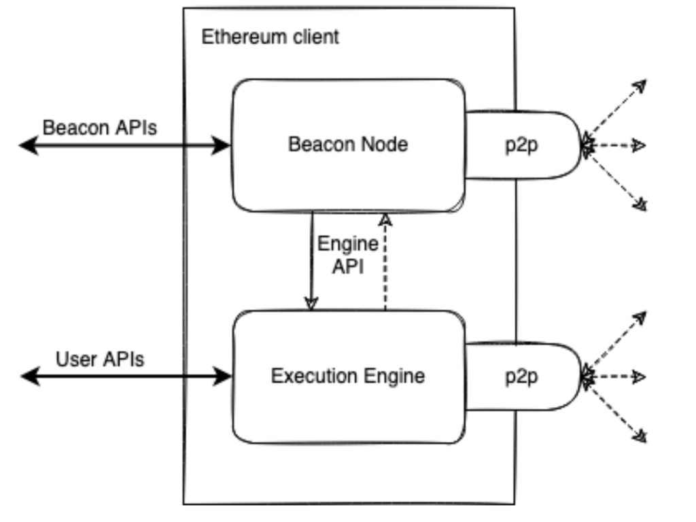
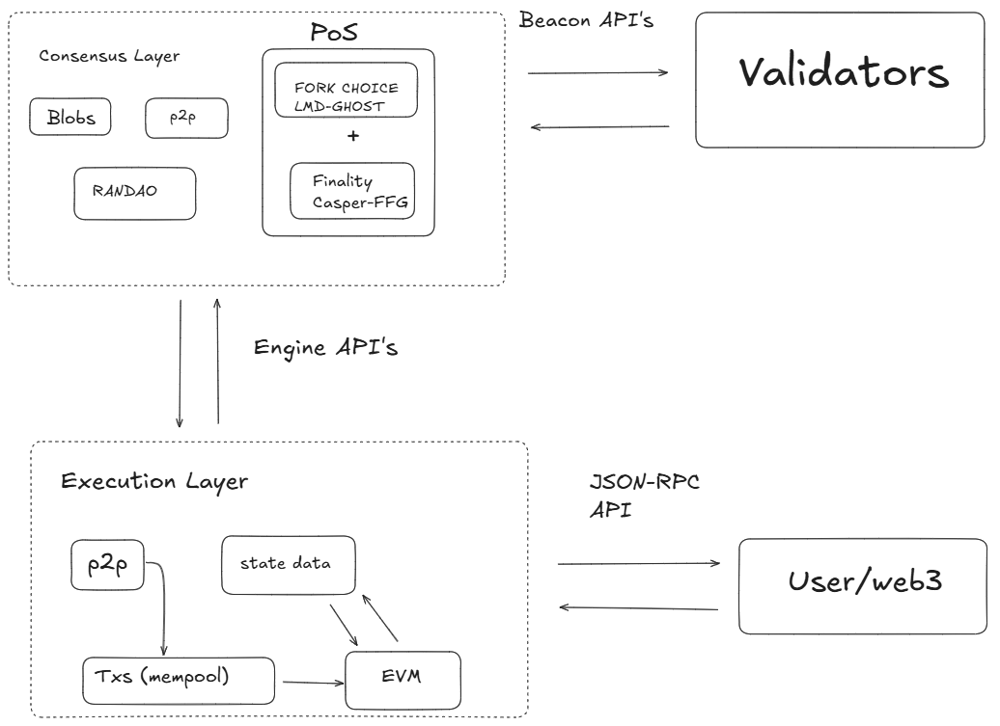
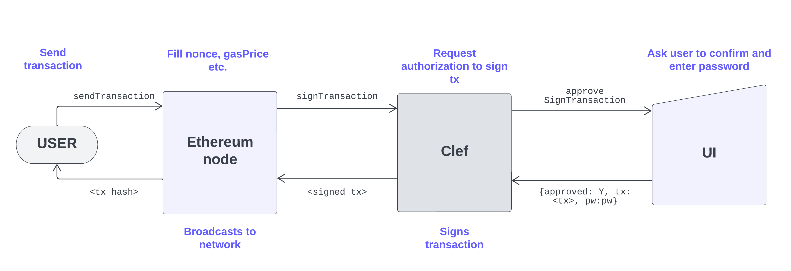

参考文档:
- [Welcome to go-ethereum](https://geth.ethereum.org/docs)
- [Getting started with Geth](https://geth.ethereum.org/docs/getting-started)
- [Protocol Architecture Overview](https://epf.wiki/#/wiki/protocol/architecture)
- [Node architecture](https://geth.ethereum.org/docs/fundamentals/node-architecture)
- [Execution client](https://ethereum.org/glossary/#execution-client)
- [Execution client](https://ethereum.org/developers/docs/nodes-and-clients/#execution-clients)
- [Consensus client](https://ethereum.org/glossary/#consensus-client)
- [Consensus client](https://ethereum.org/developers/docs/nodes-and-clients/#consensus-clients)
- [Client diversity](https://ethereum.org/developers/docs/nodes-and-clients/client-diversity/)
- [Account Management with Clef](https://geth.ethereum.org/docs/fundamentals/account-management)
- [Introduction to Clef](https://geth.ethereum.org/docs/tools/clef/introduction)

### 协议架构

以太坊节点由两个客户端组成: 执行客户端和共识客户端。Geth 是一个执行客户端。最初，仅一个执行客户端就足以运行一个完整的以太坊节点。然而，自从以太坊关闭工作量证明并引入权益证明以来，Geth 需要与另一个称为"共识客户端"的软件耦合才能跟踪以太坊区块链。

执行客户端(Geth)负责交易处理、交易广播(transaction gossip)、状态管理以及支持以太坊虚拟机(EVM)。然而，Geth 不负责区块构建、区块广播(block gossiping)或处理共识逻辑。这些都属于共识客户端的职责范围。

实际上，这些层分别在各自的客户端中实现，并通过 API 连接。每个客户端都有自己的 P2P 网络，处理不同类型的数据。

为了使这种双客户端结构正常工作，共识客户端必须能够将交易包传递给 Geth 执行。通过在本地执行交易，执行客户端可以验证交易是否违反任何以太坊规则，以及对以太坊状态的提议更新是否正确。同样，当节点被选为区块生产者时，共识客户端必须能够从 Geth 请求交易包以包含在新区块中。客户端间的通信由使用[engine API](https://github.com/ethereum/execution-apis/tree/main/src/engine)的本地 RPC 连接处理。

深入分析每个客户端，它们都由许多基本功能组成:

### 执行端

Geth 是一个用 Go 编写的以太坊执行客户端，它是原始、最流行的以太坊客户端之一。

Geth 使用每个区块中提供的信息来更新其"状态"——以太坊上每个账户的以太币余额以及每个智能合约存储的数据。账户分为两种类型: 外部拥有账户(EOA)和合约账户。合约账户在收到交易时会执行合约代码。EOA 是用户在本地管理的账户，用于签署和提交交易。每个 EOA 都是一对公私钥，其中公钥用于为用户生成唯一的地址，私钥用于保护账户并安全地签署消息。因此，要使用以太坊，首先需要生成一个 EOA。

作为执行客户端，Geth 负责创建执行负载——交易列表、更新的状态 trie 以及其他与执行相关的数据——共识客户端会将这些数据包含在其区块中。Geth 还负责重新执行新区块中到达的交易，以确保其有效性。交易的执行是在 Geth 的嵌入式计算机(称为以太坊虚拟机(EVM))上完成的。

Geth 还通过公开一组[RPC 方法](https://geth.ethereum.org/docs/interacting-with-geth/rpc)为以太坊提供用户界面，使用户能够查询以太坊区块链、提交交易并部署智能合约。通常，RPC 调用由[Web3js](https://web3js.readthedocs.io/en/v1.8.0/)或[Web3py](https://web3py.readthedocs.io/en/v5/)等库抽象出来，例如在 Geth 的内置 JavaScript 控制台、开发框架或 Web 应用程序中。

### 共识端

Geth 是一个执行客户端。历史上，仅一个执行客户端就足以运行一个完整的以太坊节点。然而，自从以太坊从工作量证明(PoW)转换为基于权益证明(PoS)的共识机制以来，Geth 还需要连接到共识客户端才能作为以太坊节点运行，否则无法追踪链头。

共识客户端处理所有使节点与以太坊网络保持同步的逻辑。这包括从对等节点接收区块，并运行分叉选择算法，以确保节点始终遵循拥有最多见证信息的链(由验证者有效余额加权)。共识客户端拥有自己的对等网络，与连接执行客户端的网络相独立。共识客户端通过其对等网络共享区块和见证信息。共识客户端本身不参与见证或区块提议——这由共识客户端的可选附加组件验证者完成。没有验证者的共识客户端仅与链头保持同步，从而使节点保持同步。这使得用户能够使用其执行客户端与以太坊进行交易，并确信自己位于正确的链上。

目前有五种可用的共识客户端，它们都以相同的方式连接到 Geth:
- [Lighthouse](https://lighthouse-book.sigmaprime.io/): 用 Rust 编写
- [Nimbus](https://nimbus.team/): 用 Nim 编写
- [Prysm](https://prysm.offchainlabs.com/docs/): 用 Go 编写
- [Teku](https://consensys.io/teku) 用 Java 编写
- [Lodestar](https://lodestar.chainsafe.io/): 用 Typescript 编写

为了连接到共识客户端，Geth 必须公开一个用于客户端间 RPC 连接的端口(通常是`8551`)。RPC 连接必须使用`jwtsecret`文件进行身份验证，该文件由 Geth 创建并默认保存在`<datadir>/geth/jwtsecret`中。Geth 和共识客户端都需要`jwtsecret`文件。

此外还必须将授权应用于特定的地址/端口。这可以通过将地址传递给`--authrpc.addr`并将端口号传递给`--authrpc.port`来实现。也可以安全地将`localhost`或通配符`*`传递给`--authrpc.vhosts`，这样 Geth 就会接受来自虚拟主机的传入请求，因为它只适用于使用`jwtsecret`进行身份验证的端口。

共识客户端还需要 Geth 的`jwt-secret`路径，以便对它们之间的 RPC 连接进行身份验证。每个共识客户端都有一个类似于`--jwt-secret`的选项(例如 Lighthouse 为`--execution-jwt`)，该命令以文件路径作为参数。这必须与提供给 Geth 的`--authrpc.jwtsecret`路径一致。

所有共识客户端都公开了一个[Beacon API](https://ethereum.github.io/beacon-APIs/)，可用于检查 Beacon 客户端的状态，或通过使用[Curl](https://curl.se/)等工具发送请求来下载区块和共识数据。更多信息请参阅每个共识客户端的文档。

在连接的共识客户端同步之前，Geth 无法同步。这是因为 Geth 需要一个目标头来同步。同步共识客户端的最快方法是使用检查点同步。为此，可以在启动时向共识客户端提供检查点或检查点提供程序的 URL。这些检查点有多个来源。理想的情况是从受信任的节点运营商处获取一个，以带外方式组织，并针对第三个节点、区块浏览器或检查点提供程序进行验证。一些客户端还允许通过 HTTP API 访问现有的 Beacon 节点来同步检查点。此外，还有几个[公共的检查点同步端点](https://eth-clients.github.io/checkpoint-sync-endpoints/)。

有关同步的更多详细信息，请参阅[同步页面](https://geth.ethereum.org/docs/fundamentals/sync-modes)。有关故障排除，请参阅[控制台日志消息页面](https://geth.ethereum.org/docs/fundamentals/logs)上的"同步"部分。

如果已向存款合约发送 32 ETH，即可将验证者添加到共识客户端。验证者客户端与共识客户端捆绑在一起，可随时添加到节点。验证者负责处理证明和区块提案。它们使节点能够累积奖励，或通过惩罚或削减损失 ETH。运行验证者软件还使节点有资格被选中来提议新的区块。

验证者负责保护以太坊区块链的安全。如果已向存款合约发送 32 ETH，即可将验证者添加到共识客户端。验证者客户端与共识客户端捆绑在一起，可随时添加到节点。验证者负责处理证明和区块提案，它们使节点能够累积奖励，或通过惩罚或削减损失 ETH。运行验证者软件还使节点有资格被选中来提议新的区块。处理质押和验证器密钥生成的最简单方法是使用以太坊基金会[质押启动板(Staking Launchpad)](https://launchpad.ethereum.org/en/)。启动板将指导用户完成生成验证器密钥以及将验证器连接到共识客户端的过程。

### 账户端

Geth 内置账户管理工具。然而，实际更推荐使用 Clef 作为外部账户管理和签名工具。

Clef 是一款在安全的本地环境中签署交易和数据的工具。它旨在成为 Geth 内置账户管理的更具组合性和安全性的替代品。Clef 将密钥管理与 Geth 本身分离，这意味着它可以作为独立的密钥管理和签名应用程序使用，也可以集成到 Geth 中。与 Geth 的账户管理器相比，这提供了一个更灵活的模块化工具。Clef 可以在通过远程和/或不受信任的节点访问以太坊的情况下安全地使用，因为签名是在本地进行的，可以手动进行，也可以使用自定义规则集自动进行。Clef 与节点本身的分离使其能够作为守护进程运行在与客户端软件相同的机器上，也可以运行在像[USB Armory](https://inversepath.com/usbarmory)这样的安全 U 盘上，甚至可以运行在类似[QubesOS](https://www.qubes-os.org/)的独立虚拟机上。

Clef 的主要优势之一是它与客户端软件分离，这意味着用户和 dApp 可以在安全的本地环境中使用它来签名数据和交易，并将签名后的数据包发送到任意以太坊入口点，例如，可能包含不受信任的远程节点。或者，Clef 也可以简单地用作独立的、可组合的签名器，作为去中心化应用程序的后端组件。这需要一个安全的架构，将加密操作与用户交互和内外部通信分离。

Clef 的安全模型如下:
- 一个独立的二进制文件控制所有加密操作，包括密钥库文件的加密、解密和存储，以及数据和交易的签名。
- 一个定义明确、特意精简的"外部"API 用于与 Clef 二进制文件进行通信 - Clef 将此外部流量视为不可信的。这意味着 Clef 不接受任何凭证，也不承认通过此通道接收的请求的权限。Clef 监听 http.addr:http.port 或 ipcpath（与 Geth 相同），并期望消息使用 JSON-RPC 2.0 标准进行格式化。某些外部 API 调用需要用户交互（手动批准/拒绝），如果未收到用户交互，响应可能会无限期延迟。
- Clef 使用 stin/stout 与调用二进制文件的进程通信。调用二进制文件的进程通常是基于控制台的原生用户界面(UI)，但也有一个 API 可以与外部 UI 通信。此功能必须在启动时使用 `--stdio-ui` 启用。此通道被视为受信任通道，用于在用户和 Clef 之间传递批准和密码。
- Clef 不存储密钥，用户负责安全地存储和备份密钥文件。如果用户明确向 Clef 提供账户密码以启用自动账户解锁功能，Clef 会将账户密码存储在其加密保管库中。

外部 API 不会直接处理任何敏感数据，但可以用来请求 Clef 对某些数据或交易进行签名。内部 API 控制签名并触发手动批准（自动批准符合已证明规则集的操作）和密码请求。

使用 Clef 和以太坊节点（如 Geth）进行基本交易签名操作的一般流程如下:

在上图所示的示例中，Geth 将使用`--signer <addr>:<port>`启动，并将请求转发到 eth.sendTransaction。沿箭头方向排列的单色字体文本显示了各个组件之间传递的对象。

大多数用户使用 Clef 的方式是通过 UI 手动批准交易，如上图所示，但也可以配置 Clef 来签署交易，而无需始终提示用户。这需要定义交易签署的精确条件。这些条件称为规则，它们是一些小的 JavaScript 代码片段，用户可以通过将代码片段的哈希值注入 Clef 的安全白名单来验证这些条件。然后，Clef 使用规则文件启动，以便自动签署满足白名单规则文件中条件的请求。[规则页面](https://geth.ethereum.org/docs/tools/clef/rules)详细介绍了这一点。
