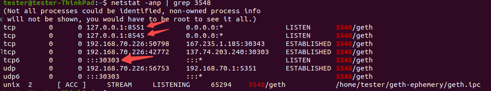

参考文档:
- [Introduction to Clef](https://geth.ethereum.org/docs/tools/clef/introduction)
- [JSON-RPC Server](https://geth.ethereum.org/docs/interacting-with-geth/rpc)
- [JavaScript Console](https://geth.ethereum.org/docs/interacting-with-geth/javascript-console)
- [Ethereum Beacon Chain checkpoint sync endpoints](https://eth-clients.github.io/checkpoint-sync-endpoints/)
- [Github:ephemery-resources](https://github.com/ephemery-testnet/ephemery-resources?tab=readme-ov-file)
- [Ephemery testnet](https://explorer.ephemery.dev/)

一个以太坊节点必须要包含执行端和共识端两个，所以 Geth 和 Lighthouse 是必须的。如果需要进行账户管理或交易签名动作，也需要将 Clef 添加进来。

> 测试网执行数据同步时，需要连接外网。

### 仅 Geth 和 Lighthouse 时的启动

[连接Sepolia测试网](初次运行.Sepolia.md)

[连接Ephemery测试网](初次运行.Ephemery.md)

[连接Hoodi测试网](初次运行.Hoodi.md)

geth 运行后，将会在 3 个端口上建立监听。其中 8545 是 RPC 的默认监听端口，用于用户交互。8551 监听来自共识客户端的连接，进行数据同步。30303 是连接到 P2P 网络的默认端口。



### 添加 Clef 时的启动

[连接Sepolia测试网](初次运行.Sepolia.md)

[连接Ephemery测试网](初次运行.Ephemery.md)

[连接Hoodi测试网](初次运行.Hoodi.md)

这里简单说明一下 Geth 与 Clef 的交互流程:
- 1.当一个 DApp 或脚本通过 Geth 提交一笔交易时，Geth 会将未签名的交易数据转发给 Clef。
- 2.Clef 接收到请求，首先检查你的规则集。
- 3.如果规则通过，Clef 会向你显示一个审批界面，展示交易详情。
- 4.你点击"approve"后，Clef 使用它存储的私钥对交易进行签名。
- 5.签名后的交易被返回给 Geth。
- 6.Geth 将已签名的交易广播到网络中。

### Javascript 控制台

Geth 是用户向以太坊发送交易的门户。Geth Javascript 控制台可用于此目的，并且大多数[JSON-RPC API](https://geth.ethereum.org/docs/interacting-with-geth/rpc)仍将通过 web3js 或 HTTP 请求(以 JSON 格式发送命令)提供。这些选项的详细说明请参阅[Javascript 控制台页面](https://geth.ethereum.org/docs/interacting-with-geth/javascript-console)。

使用者可以在单独的终端中使用以下命令启动 Javascript 控制台:
```s
  geth attach http://127.0.0.1:8545
```
