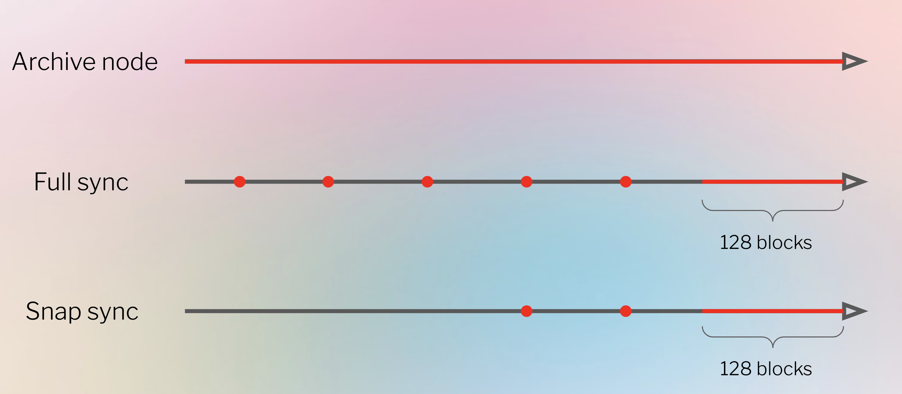

参考文档:
- [Sync modes](https://geth.ethereum.org/docs/fundamentals/sync-modes)
- [Optimistic Sync](https://github.com/ethereum/consensus-specs/blob/dev/sync/optimistic.md)
- [Ethereum Beacon Chain checkpoint sync endpoints](https://eth-clients.github.io/checkpoint-sync-endpoints/)

同步是 Geth 追赶最新以太坊区块和当前全局状态的过程。同步 Geth 节点的方法有多种，它们的速度、存储要求和信任假设(trust assumptions)各不相同。由于以太坊现在采用基于权益证明的共识机制，因此 Geth 需要共识客户端才能进行同步。

同步 Geth 节点有多种方法。默认使用 Snap 同步来创建完整节点。完整节点可以通过从创世区块开始逐块同步(full-sync)或从中间检查点区块开始同步(snap-sync)来创建。默认情况下，这些模式会删除超过 128 个区块的状态数据，仅保留那些能够按需重新生成历史状态的检查点。为了快速查询历史数据，需要一个存档节点。存档节点会保存自创世区块以来所有历史数据的本地副本——目前约为 12 TB，并且还在不断增长。部分存档节点可以通过 snap-syncing 创建并关闭状态修剪，从而创建一个保留自初始同步区块以来所有状态的节点。目前，由于向权益证明(PoS)的过渡，轻量级同步(Light-Sync)功能暂不可用(新的轻量级客户端协议正在开发中)。

> 测试网执行数据同步时，需要连接外网。

### 全节点(full nodes)

有两种类型的全节点，它们使用不同的机制来同步到链头:

1.Snap(默认)

Snap 同步从相对较新的区块开始，然后同步到链头，内存中仅保留最近的 128 个区块状态。要同步到的区块头由共识客户端提供。在初始同步区块和最近的 128 个区块之间，节点会存储一些快照，这些快照可用于"动态"重建任何中间状态。Snap 同步节点与逐块同步的全节点的区别在于，Snap 同步节点从比创世区块更新的初始检查点开始。Snap 同步比从创世区块开始的逐块同步要快得多。在启动时使用 `--syncmode snap` 参数执行 Snap 同步。

Snap 同步的工作原理是首先下载大量区块的区块头。区块头验证通过后，再下载这些区块的区块主体和收据(receipts)。与此同时，Geth 也会开始状态同步。在状态同步过程中，Geth 首先下载每个区块的状态树(不含中间节点)的叶子节点以及范围证明(range proof)，然后在本地重新生成状态树。

状态下载是 Snap 同步过程中耗时最长的部分，可以使用日志消息中的预计到达时间(ETA)值来监控进度。然而，区块链同时也在进行更新，并使一些重新生成的状态数据失效。这意味着还需要一个"修复"阶段来修复状态中的错误。由于在当前状态重新生成之前无法得知错误的严重程度，因此无法监控状态修复的进度。在状态修复过程中，Geth 会定期报告"Syncing, state heal in progress"——告知用户状态修复尚未完成。用户可以使用`eth.syncing` 来确认这一点 - 如果此命令返回 false，则表示节点已同步。如果返回 false 以外的值，则表示同步仍在进行中。

状态修复的速度必须超过区块链的增长速度，否则节点将永远无法达到当前状态。一些硬件因素(磁盘读写速度和网络连接速度)以及每个区块使用的总 gas 量(gas 量越大，需要处理的状态变化就越多)决定了状态修复的速度。

总而言之，Snap 同步按以下顺序进行:
- 下载并验证区块头
- 下载区块主体和收据。同时，下载原始状态数据并构建状态树
- 修复状态树以记录新到达的数据

> 注意: Snap 同步是默认行为，因此如果在启动时未将`--syncmode`值传递给 Geth，Geth 将使用 Snap 同步。使用 Snap 启动的节点在追上链头后将切换到逐块同步。

2.Full

完整的逐块同步通过从创世块开始执行每个区块来生成当前状态。完整同步通过重新执行整个历史区块序列中的交易来独立验证区块来源以及所有状态转换。全节点仅存储最近的 128 个区块状态——较旧的区块状态会定期修剪，并以一系列检查点的形式表示，任何先前的状态都可以根据请求从这些检查点重新生成。128 个区块大约相当于 25.6 分钟的历史记录，出块时间为 12 秒。

要创建全节点，需要在启动时输入`--syncmode full`。

### 存档节点(archive nodes)

存档节点是指保留自创世以来所有历史数据的节点。无需从检查点重新生成任何数据，因为所有数据都直接存储在节点自身的存储中。因此，存档节点非常适合快速查询历史状态。截至2022年9月，一个存储自创世以来所有数据的完整存档节点占用近 12 TB 的磁盘空间(与 Etherscan 上的当前大小保持一致)。通过配置 Geth 的垃圾回收机制创建存档节点，以确保旧数据永不被删除: `geth --syncmode full --gcmode archive`。

用户还可以创建一个部分/近期存档节点，该节点使用 Snap 同步，但状态永不被修剪。这将创建一个存档节点，保存自节点首次同步以来的所有状态数据。配置方法是使用`--syncmode snap --gcmode archive` 启动 Geth。

> 所有存档节点首先都是全节点，但并非所有全节点都是存档节点。全节点可以看作是存档节点的"修剪版"。

### 轻节点(light nodes)

Geth 目前不提供 EL 轻量级客户端作为同步模式。为了获得更轻量的设置，建议同时运行[Beacon Light 同步](https://geth.ethereum.org/docs/fundamentals/blsync)和 Snap 同步模式。

### 共识层同步

现在，以太坊已切换到权益证明(PoS)，所有共识逻辑和区块传播都由共识客户端处理。这意味着同步区块链是共识客户端和执行客户端共同完成的过程。**区块由共识客户端下载，并由执行客户端验证。**为了使 Geth 能够同步，它需要从连接的共识客户端获取区块头。Geth 只有在收到共识客户端的指令后才会导入任何数据。Geth 无法在未连接到共识客户端的情况下进行同步。这包括从创世区块开始逐块同步。共识客户端需要提供从链末端开始的区块头，以便 Geth 能够同步到该区块——如果没有它，Geth 就无法知道它是否遵循了正确的区块序列。

一旦某个区块头可用作同步目标，Geth 就会按时间倒序检索该目标区块头和本地区块头链之间的所有区块头。这些区块头表明区块序列是正确的，因为父哈希将一个区块链接到下一个区块，直到目标区块。最终，同步将到达本地数据库中保存的区块，此时本地数据和目标数据被视为"已链接"，并且节点同步正确链的可能性非常高。然后下载区块主体，再下载状态数据。共识客户端可以更新目标区块头——只要同步速度超过区块链的增长速度，节点最终就会同步。

共识客户端可以通过两种方式找到 Geth 可以用作同步目标的区块头: 乐观同步和检查点同步。

1.乐观同步

乐观同步会在执行客户端验证区块之前下载它们。在乐观同步中，节点假设在下载阶段从其他节点收到的数据是正确的，但随后会追溯验证每个下载的区块。节点在"乐观"状态下不允许证明或提议区块，因为它们尚无法保证其对链头的理解是正确的。

更多信息，请参阅[乐观同步规范](https://github.com/ethereum/consensus-specs/blob/dev/sync/optimistic.md)。

2.检查点同步

或者，共识客户端可以从可信来源获取检查点，该来源提供要同步的目标状态，然后切换到完全同步并依次验证每个区块。在这种模式下，节点信任该检查点是正确的。此检查点的来源有很多——黄金标准是从另一个可信伙伴处以带外方式获取，但也可以来自区块浏览器或[公共 API/Web 应用](https://eth-clients.github.io/checkpoint-sync-endpoints/)。检查点同步速度非常快——共识客户端使用此方法应该能够在几分钟内完成同步。

### 全节点Snap同步+检查点同步实践

[Sepolia测试网数据同步](数据同步.Sepolia.md)

[Hoodi测试网数据同步](数据同步.Hoodi.md)

[Ephemery测试网数据同步](数据同步.Ephemery.md)
