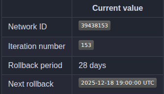
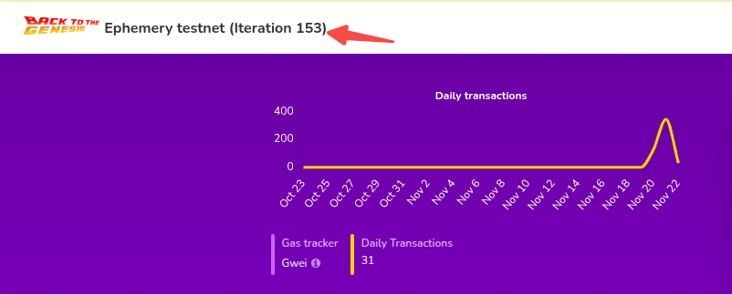

需要注意的时，Ephemery 每隔一段时间都要重置，所以 chainid 也会随着迭代(iteration number)，可以去[github](https://github.com/ephemery-testnet/ephemery-resources?tab=readme-ov-file)上查看当前的 chainid。



可以看到当前 ephemery 的迭代值是 153。再去[Ephemery testnet](https://explorer.ephemery.dev/)确认:



至此我们终于确认 Ephemery 测试网当前的 chainid 为 39438153。

### 初始化

目前，大多数官方客户端版本并未预置Ephemery测试网。请查看此[支持的客户端概览](https://github.com/ephemery-testnet/ephemery-resources/blob/master/client-implementations.md)。要将其他客户端连接到Ephemery网络，必须手动完成。

从 Ephemery 的[最新发布版本](https://github.com/ephemery-testnet/ephemery-genesis/releases/)中下载最新参数，并像使用任何自定义网络一样，将客户端指向它:
```s
  wget https://github.com/ephemery-testnet/ephemery-genesis/releases/latest/download/testnet-all.tar.gz
  mkdir ephemery && tar -xzf testnet-all.tar.gz -C ephemery
```

初始化 geth 创世段:
```s
  geth --datadir geth-ephemery init ephemery/genesis.json
```
打印信息如下:
```s
INFO [11-23|13:00:43.389] Maximum peer count                       ETH=50 total=50
INFO [11-23|13:00:43.391] Smartcard socket not found, disabling    err="stat /run/pcscd/pcscd.comm: no such file or directory"
INFO [11-23|13:00:43.398] Set global gas cap                       cap=50,000,000
INFO [11-23|13:00:43.398] Initializing the KZG library             backend=gokzg
INFO [11-23|13:00:43.403] Defaulting to pebble as the backing database
INFO [11-23|13:00:43.404] Allocated cache and file handles         database=/home/tester/geth-ephemery/geth/chaindata cache=512.00MiB handles=524,288
INFO [11-23|13:00:43.622] Opened ancient database                  database=/home/tester/geth-ephemery/geth/chaindata/ancient/chain readonly=false
INFO [11-23|13:00:43.622] Opened Era store                         datadir=/home/tester/geth-ephemery/geth/chaindata/ancient/chain/era
INFO [11-23|13:00:43.622] State schema set to default              scheme=path
INFO [11-23|13:00:43.622] Load database journal from disk
WARN [11-23|13:00:43.622] Head block is not reachable
INFO [11-23|13:00:43.706] Opened ancient database                  database=/home/tester/geth-ephemery/geth/chaindata/ancient/state readonly=false
INFO [11-23|13:00:43.706] State snapshot generator is not found
INFO [11-23|13:00:43.706] Starting snapshot generation             root=56e81f..63b421 accounts=0 slots=0 storage=0.00B dangling=0 elapsed="36.402µs"
INFO [11-23|13:00:43.707] Initialized path database                triecache=16.00MiB statecache=16.00MiB buffer=64.00MiB state-history="last 90000 blocks" journal-dir=/home/tester/geth-ephemery/geth/triedb
INFO [11-23|13:00:43.707] Writing custom genesis block
INFO [11-23|13:00:43.707] Resuming snapshot generation             root=56e81f..63b421 accounts=0 slots=0 storage=0.00B dangling=0 elapsed="592.68µs"
INFO [11-23|13:00:43.707] Generated snapshot                       accounts=0 slots=0 storage=0.00B dangling=0 elapsed="756.728µs"
INFO [11-23|13:00:43.721] Successfully wrote genesis state         database=chaindata hash=7b3c37..1f4aa5
```

查看 getn-ephemery 目录，有如下文件生成:
```s
  geth  keystore
```

### Geth+Lighthouse

1.启动执行端
```s
  source ephemery/nodevars_env.txt
  cd ~
  geth --datadir geth-ephemery --syncmode snap --http --http.port 8545 --http.api eth,net --authrpc.addr localhost --authrpc.port 8551 --authrpc.vhosts localhost --authrpc.jwtsecret geth-ephemery/jwtsecret --bootnodes $BOOTNODE_ENODE --networkid $CHAIN_ID
```
在上面的命令中，开启了两个监听端口。其中 8545 监听 HTTP 请求，允许外部程序通过向 Geth 发送 http 请求与 Geth 交互；8551 监听共识客户端，`--authrpc.addr`、`--authrpc.port`、`--authrpc.vhosts`、`--authrpc.jwtsecret`选项均用于与共识客户端连接时的认证。

执行该命令后，geth-ephemery 目录下的文件如下:
```s
  geth  geth.ipc  jwtsecret  keystore
```

2.启动共识端
```s
  source ephemery/nodevars_env.txt
  cd ~
  lighthouse bn -t ephemery --execution-endpoint http://localhost:8551 --execution-jwt geth-ephemery/jwtsecret --boot-nodes=$BOOTNODE_ENR_LIST --checkpoint-sync-url https://checkpointz.bordel.wtf
```
在上面的命令中，使用了检查点同步方式进行同步。

执行该命令后，会在家目录下创建一个 .lighthouse 目录，里面有一个 custom 目录。

### Geth+Lighthouse+Clef

1.初始化 Clef

首次使用 Clef 时，需要使用一个用于解锁 Clef 安全库的主种子(master seed)以及库的路径进行初始化。Clef 将使用库来存储密钥库的密码、JavaScript 自动签名规则以及规则文件的哈希值。

执行`clef init`初始化，默认库路径为`~/.clef`，也可以通过`--configdir`指定库路径。这里使用默认库路径:
```s
  clef init
```

执行上面的命令后，Clef 将开始在终端中运行，首先出现免责声明并提示单击"ok":
```s
WARNING!

Clef is an account management tool. It may, like any software, contain bugs.

Please take care to
- backup your keystore files,
- verify that the keystore(s) can be opened with your password.

Clef is distributed in the hope that it will be useful, but WITHOUT ANY WARRANTY;
without even the implied warranty of MERCHANTABILITY or FITNESS FOR A PARTICULAR
PURPOSE. See the GNU General Public License for more details.

Enter 'ok' to proceed:
>
```
输入'ok'后，提示继续输入密码用于生成主种子:
```s
The master seed of clef will be locked with a password.
Please specify a password. Do not forget this password!
Password: 
Repeat password: 

A master seed has been generated into /home/tester/.clef/masterseed.json

This is required to be able to store credentials, such as:
* Passwords for keystores (used by rule engine)
* Storage for JavaScript auto-signing rules
* Hash of JavaScript rule-file

You should treat 'masterseed.json' with utmost secrecy and make a backup of it!
* The password is necessary but not enough, you need to back up the master seed too!
* The master seed does not contain your accounts, those need to be backed up separately!
```
主种子文件默认路径为`~/.clef/masterseed.json`。记住主种子并妥善保管至关重要，它允许访问 Clef 管理的账户。

Clef 和 Geth 应该分别启动，但配置要互补，以便它们能够通信。这需要让 Clef 知道 Geth 将要连接的网络的`--chainid`，以便将此信息包含在任何签名中。Clef 还需要知道存储账户的密钥库的位置(或将要存储的位置)。该位置通常位于 Geth 数据目录的子目录中。Clef 还提供了一个数据目录，该目录通常也放置在 Geth 数据目录中。为了使用 Curl 与 Clef 通信，可以传递`--http`参数，这将默认在`localhost:8550`上启动一个 HTTP 服务器。

2.启动账户端

Clef 作为签名者的时候，会在`~/.clef`路径下生成一个名称为`clef.ipc`的文件，Geth 执行端会用到它，所以 Clef 必须要先于 Geth 启动:
```s
  source ephemery/nodevars_env.txt
  clef --keystore ~/geth-ephemery/keystore --configdir ~/.clef --chainid $CHAIN_ID --http
```

3.启动执行端

执行如下命令:
```s
  source ephemery/nodevars_env.txt
  cd ~
  geth --datadir geth-ephemery --syncmode snap --http --http.port 8545 --http.api eth,net --authrpc.addr localhost --authrpc.port 8551 --authrpc.vhosts localhost --authrpc.jwtsecret geth-ephemery/jwtsecret --bootnodes $BOOTNODE_ENODE --networkid $CHAIN_ID --signer=.clef/clef.ipc
```
这个命令中，Geth 通过`--signer`指定了 Clef 作为签名者。

4.启动共识端

共识端的启动命令没有变化:
```s
  source ephemery/nodevars_env.txt
  cd ~
  lighthouse bn -t ephemery --execution-endpoint http://localhost:8551 --execution-jwt geth-ephemery/jwtsecret --boot-nodes=$BOOTNODE_ENR_LIST --checkpoint-sync-url https://checkpointz.bordel.wtf
```
