参考文档:
- [ephemery dev](https://ephemery.dev/)

[这个水龙头网站](https://faucet.bordel.wtf/)报错:

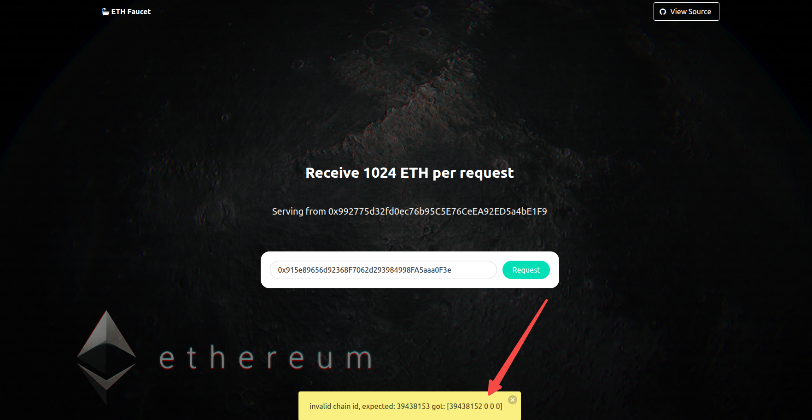

这里采用另外一种办法，通过[这个网站](https://ephemery-faucet.pk910.de/)以挖矿的形式将 ETH 存入 metamask 钱包中，再将 metamask 钱包中的 ETH 转入 Clef 生成的账户中。

### 挖矿到 clef 账户地址

打开 JavaScript 控制台(`geth attach http://127.0.0.1:8545`)，确认同步完成，查看创建第一个账户的信息:
```s
Welcome to the Geth JavaScript console!

 modules: eth:1.0 net:1.0 rpc:1.0

To exit, press ctrl-d or type exit
> eth.syncing
false
> web3.fromWei(eth.getBalance('0x915e89656d92368F7062d293984998FA5aaa0F3e'), 'ether');
0
```
确认已经同步，余额为 0。

按照下面的步骤执行挖矿:

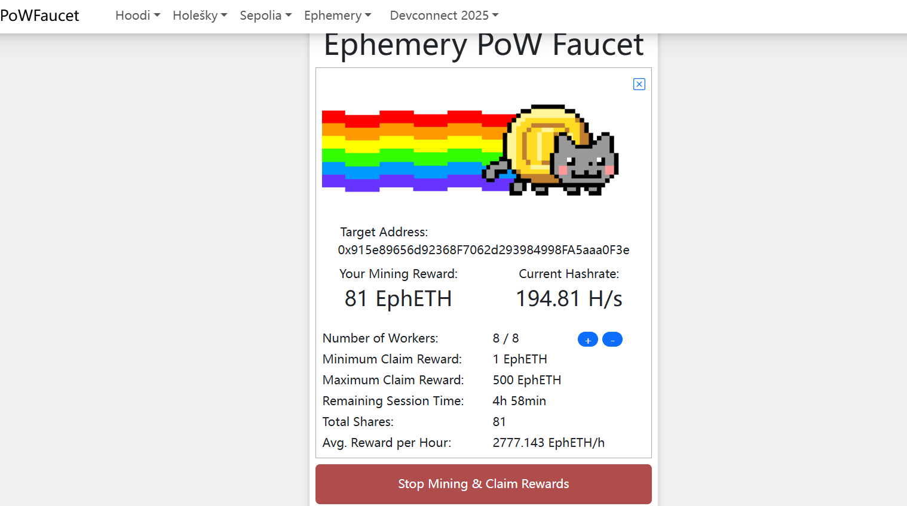

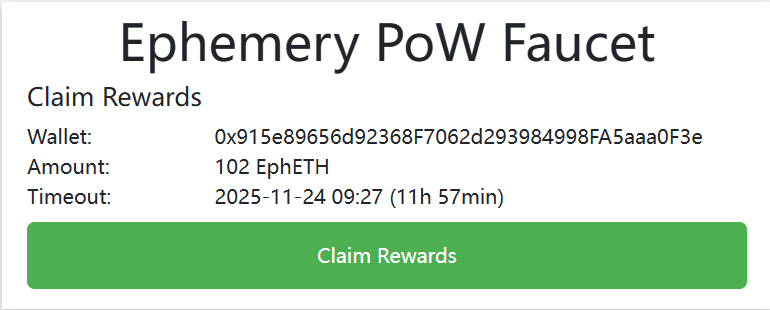

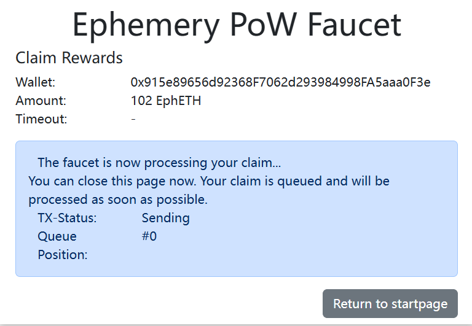

通过[浏览器](https://otter.bordel.wtf)查看已充入:

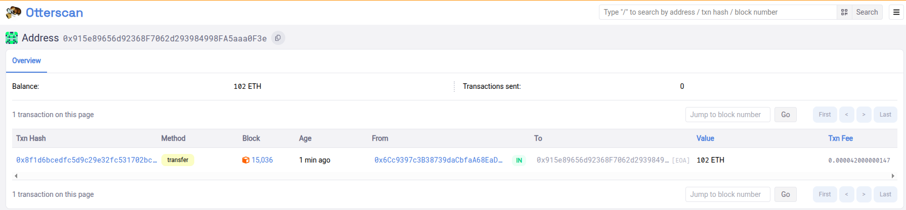

需要等待一会儿，才能从 JavaScript 控制台查看到结果。如下:

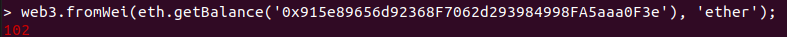

### 挖矿到 metamask 钱包

Ephemery 测试网地址格式与以太网主网地址格式相同，选择其使用:

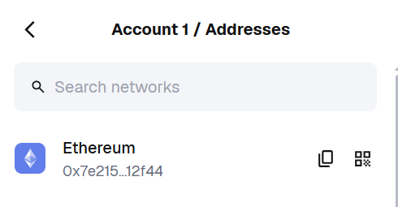

挖矿完成后，将 ETH 存入钱包中:

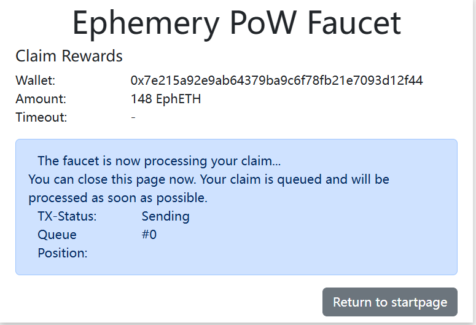

打开钱包，发现并没有找到相关的 ETH。这是因为还需要为 metamask 添加 ephemery 网络。

根据[这个网站](https://ephemery.dev/)中的一些信息添加:

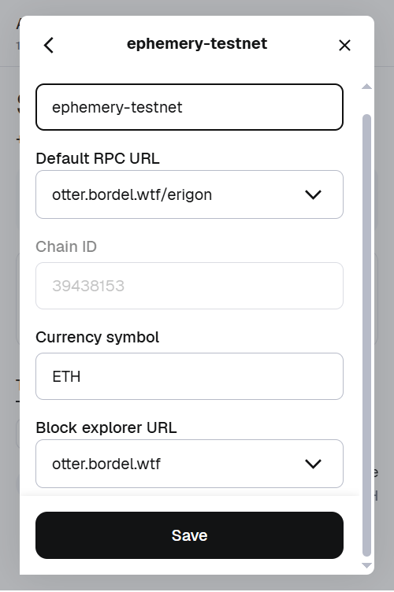

打开钱包，显示如下:

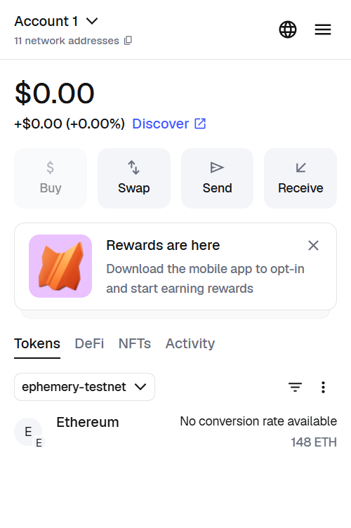

### 将 metamask 中的 ETH 转入 clef 账户中

在钱包中执行如下动作:

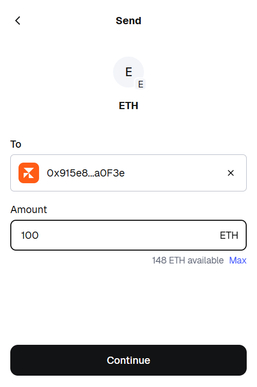

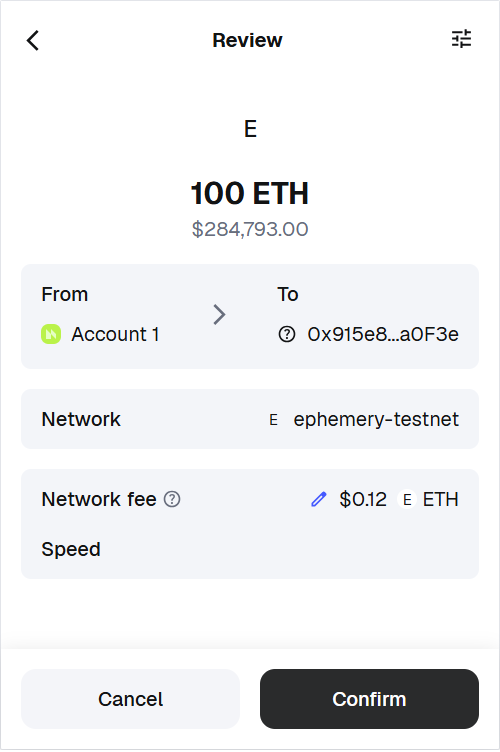

浏览器确认有一笔新的交易:

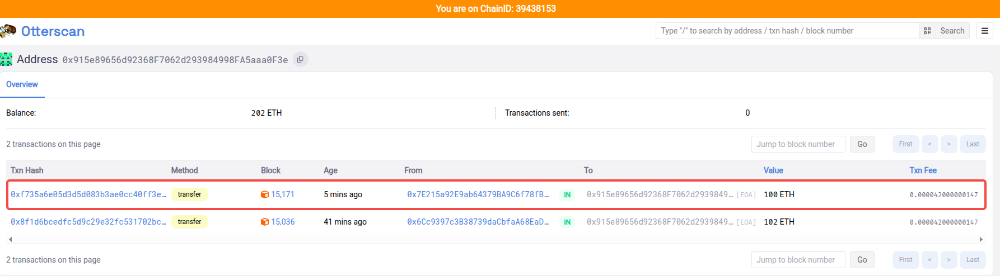

通过 JavaScript 控制台查看，结果如下:

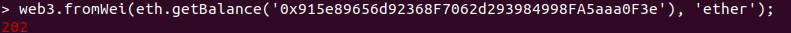