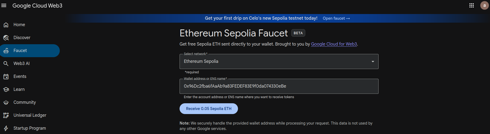
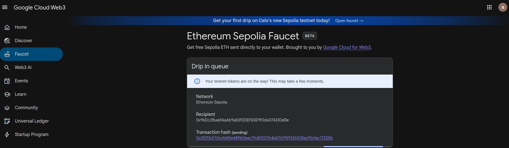
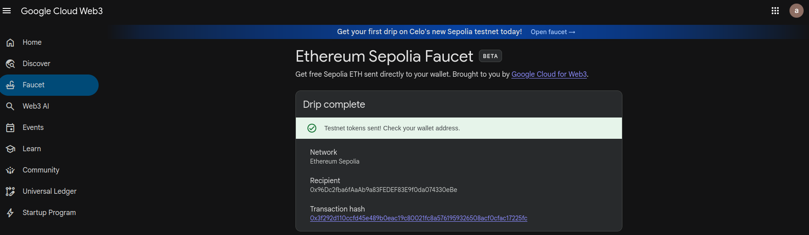
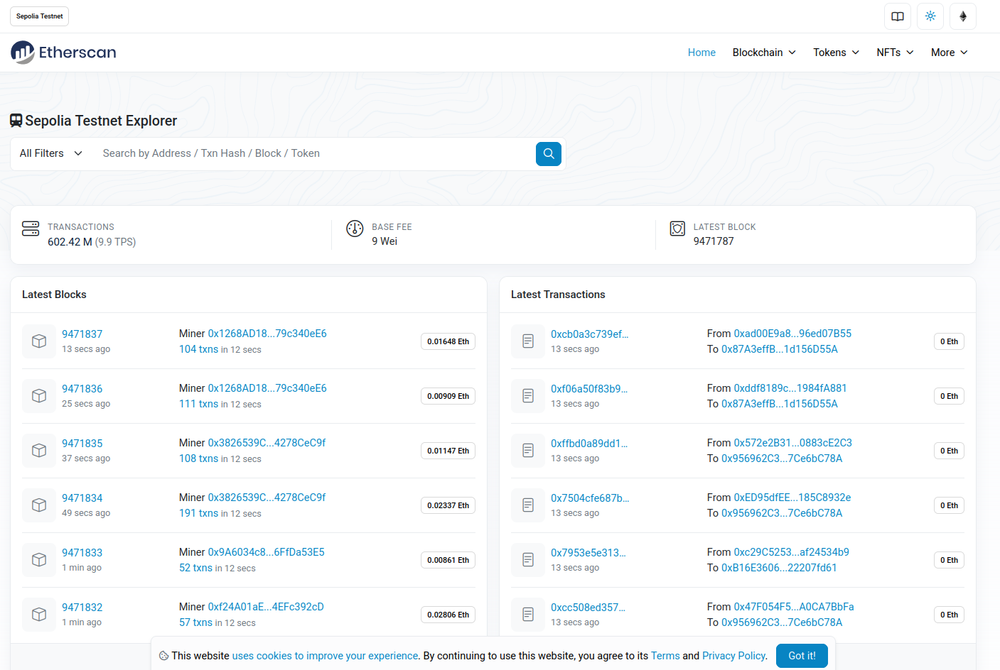
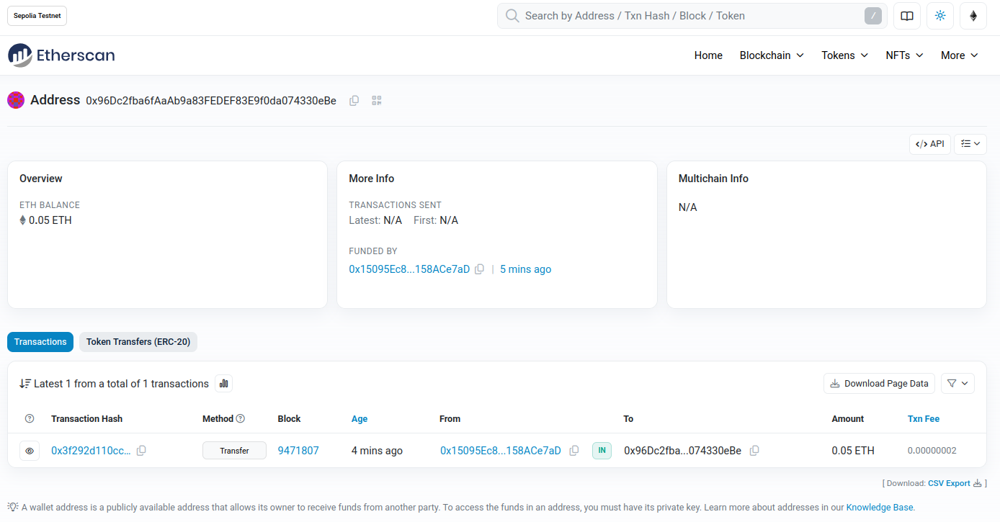

通过[这个页面](https://cloud.google.com/application/web3/faucet/ethereum/sepolia)完成 ETH 充入(注意，需要登录账号之后才能操作)。

将账户地址(例如 0xb41B73fE5F4112329dD14EaD6132b7B481FCd2B3)粘贴到方框中:

点击`Receive 0.05 Sepolia ETH`按钮，可以看到如下页面，提示我们正在操作:

稍等一会后，会显示如下页面，提示我们充入成功:

我们可以通过浏览器进入如下[页面](https://sepolia.etherscan.io/)查询这笔充入:

同样将上面的账户地址粘贴到搜索栏中，点击搜索，就可以看到这笔充入了:

