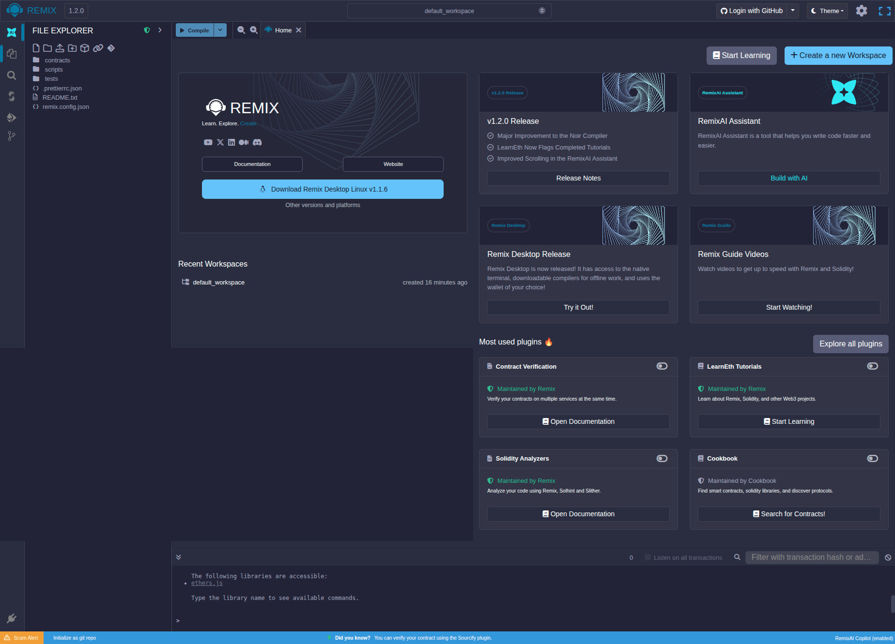
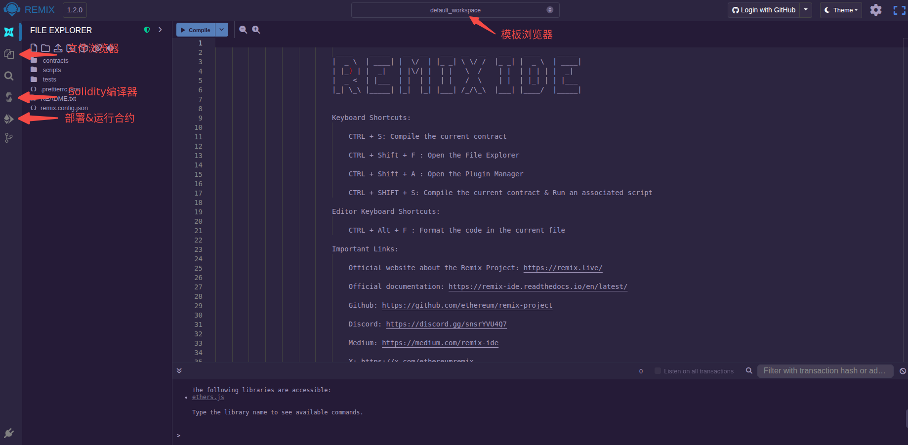
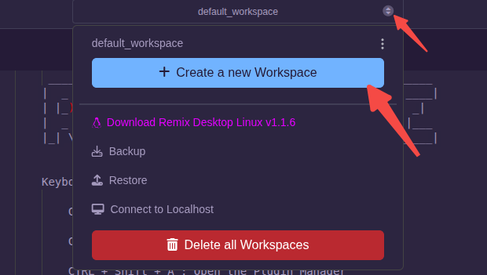
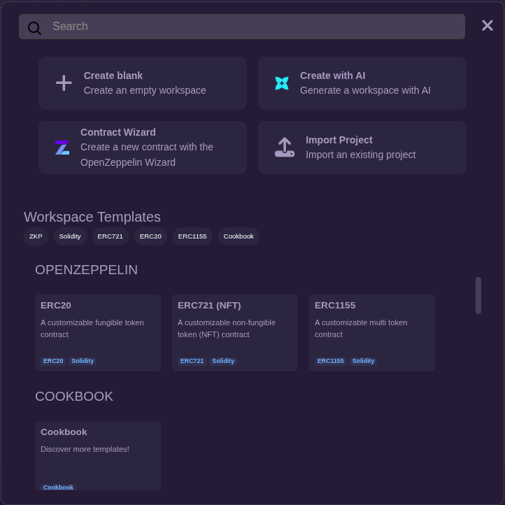
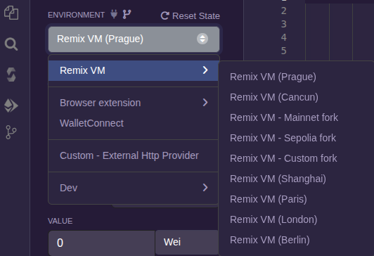
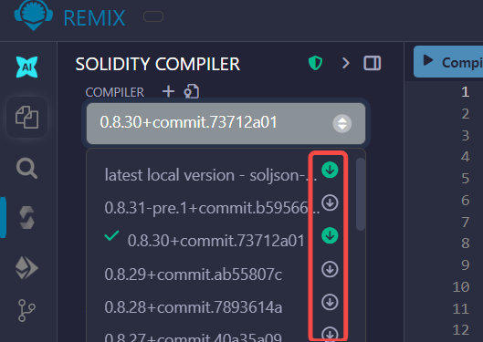
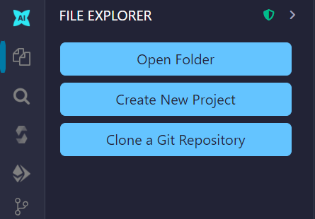
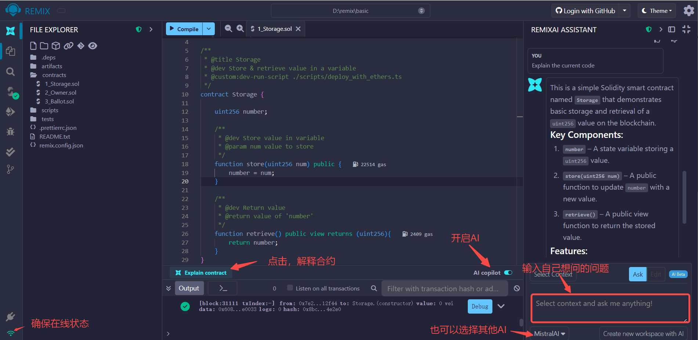

参考:
- [Remix IDE](http://remix.ethereum.org/)

Remix 是 Solidity 智能合约的在线开发平台，它不仅可以编译智能合约，还可以部署到自定义的区块链节点。此外，它还可以连接浏览器内嵌的钱包软件，如Metamask。通过钱包软件连接的网络，用户可以将智能合约部署到以太坊主网或其他网络。

Remix 环境是一个在线平台，该平台环境可以自动加载，并且会不定期更新。本测试开始时使用的版本:
- 网页版本: 1.2.0
- 桌面版本: 1.2.0(Ubuntu20.04上安装后打不开，这里用的是Windows平台)

打开[Remix IDE](http://remix.ethereum.org/)，可以看到如下home界面:

关掉 home 页面，以下是对几个主要功能按钮的介绍:

上图即处于文件资源管理器(File Explorer)页面。

### 模板资源管理器

接下来看一下模板资源管理器(Template Explorer)，模板可以快速启动一个新的项目。上面的页面使用的是默认工作区模板(default_workspace)，点击后面的按钮，弹出下拉框:

点击"Create a new Workspace"，弹出新的对话框，向下滚动可以看到很多用例模板:

### 部署

智能合约编译完成后通过 Providers 连接到区块链上，连接到区块链上的方法可以通过钱包(如Metamask)或者区块链API。

打开"部署&运行合约"(Deploy & run transactions)，ENVIRONMENT下展示的下拉框即是 Providers 列表(当前为"Remix VM(Prague)")。点击展开后鼠标移动到"Remix VM"会自动弹出一个列表，列表中展示了可以连接到的主网、测试网(如 Sepolia)等内容。如下:

### 插件

在"插件管理"(Plugin manager)中，搜索"LearnEth"和"Remix Guide"，可以选择激活这两个插件。

### 桌面版本

桌面版本支持离线模式、对本地文件系统的访问，以及编译终端。

下载自己需要的编译器，这样即使离线也可以使用:

用户可以点击对应选项打开工程、创建工程、克隆github:

桌面版本还可以使用AI助手(网页版本我试了一下，没办法使用):

