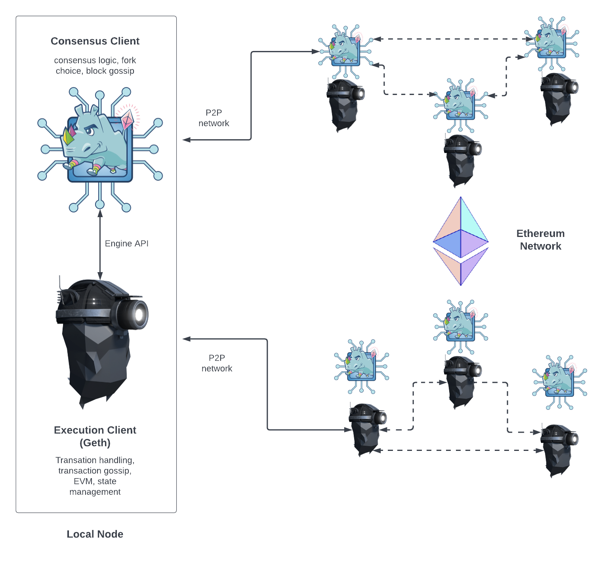

主要参考:
- [Node architecture](https://geth.ethereum.org/docs/fundamentals/node-architecture)

更新于 2023/08/04。

其他参考:
- [Proof of Stake](https://ethereum.org/developers/docs/consensus-mechanisms/pos/)

以太坊节点由两个客户端组成: [执行客户端](https://ethereum.org/developers/docs/nodes-and-clients/#execution-clients)和[共识客户端](https://ethereum.org/developers/docs/nodes-and-clients/#consensus-clients)。Geth 是一个执行客户端。最初，仅一个执行客户端就足以运行一个完整的以太坊节点。然而，自从以太坊关闭工作量证明并引入权益证明以来，Geth 需要与另一个称为"共识客户端"的软件耦合才能跟踪以太坊区块链。

执行客户端(Geth)负责交易处理、交易广播(transaction gossip)、状态管理以及支持以太坊虚拟机(EVM)。然而，Geth 不负责区块构建、区块广播(block gossiping)或处理共识逻辑。这些都属于共识客户端的职责范围。

两个以太坊客户端之间的关系如下图所示。这两个客户端分别连接到各自的点对点(P2P)网络。这是因为执行客户端通过其 P2P 网络广播交易，从而管理其本地交易池。共识客户端通过其 P2P 网络广播区块，从而实现共识和链的增长。

为了使这种双客户端结构正常工作，共识客户端必须能够将交易包传递给 Geth 执行。通过在本地执行交易，客户端可以验证交易是否违反任何以太坊规则，以及对以太坊状态的提议更新是否正确。同样，当节点被选为区块生产者时，共识客户端必须能够从 Geth 请求交易包以包含在新区块中。客户端间的通信由使用 [engine API](https://github.com/ethereum/execution-apis/tree/main/src/engine) 的本地 RPC 连接处理。

### Geth 是做什么的？

作为执行客户端，Geth 负责创建执行负载——交易列表、更新的状态 trie 以及其他与执行相关的数据——共识客户端会将这些数据包含在其区块中。Geth 还负责重新执行新区块中到达的交易，以确保其有效性。交易的执行是在 Geth 的嵌入式计算机(称为以太坊虚拟机(EVM))上完成的。

Geth 还通过公开一组 [RPC 方法](https://geth.ethereum.org/docs/interacting-with-geth/rpc)为以太坊提供用户界面，使用户能够查询以太坊区块链、提交交易并部署智能合约。通常，RPC 调用由 [Web3js](https://web3js.readthedocs.io/en/v1.8.0/) 或 [Web3py](https://web3py.readthedocs.io/en/v5/) 等库抽象出来，例如在 Geth 的内置 JavaScript 控制台、开发框架或 Web 应用程序中。

### 共识客户端做什么？

共识客户端处理所有使节点与以太坊网络保持同步的逻辑。这包括从对等节点接收区块，并运行分叉选择算法，以确保节点始终遵循拥有最多见证信息的链（由验证者有效余额加权）。共识客户端拥有自己的对等网络，与连接执行客户端的网络相独立。共识客户端通过其对等网络共享区块和见证信息。共识客户端本身不参与见证或区块提议——这由共识客户端的可选附加组件验证者完成。没有验证者的共识客户端仅与链头保持同步，从而使节点保持同步。这使得用户能够使用其执行客户端与以太坊进行交易，并确信自己位于正确的链上。

### 验证者

如果已向存款合约发送 32 ETH，即可将验证者添加到共识客户端。验证者客户端与共识客户端捆绑在一起，可随时添加到节点。验证者负责处理证明和区块提案。它们使节点能够累积奖励，或通过惩罚或削减损失 ETH。运行验证者软件还使节点有资格被选中来提议新的区块。