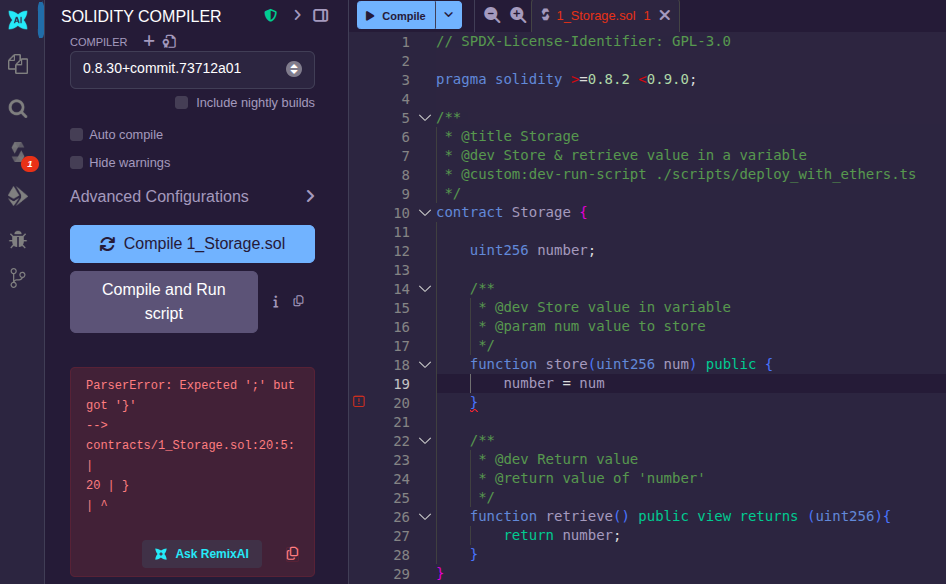
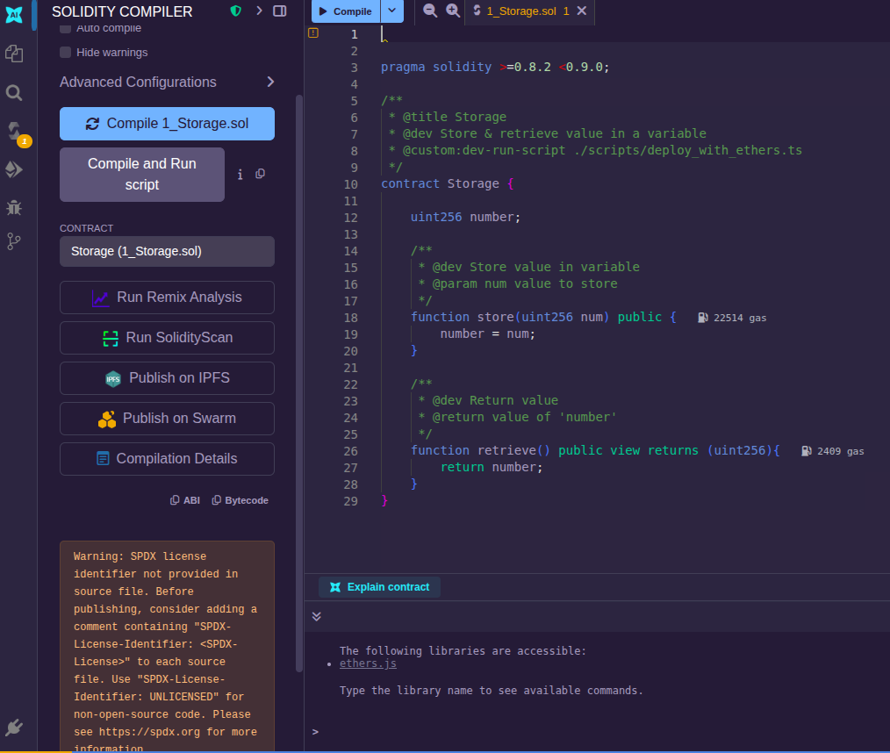
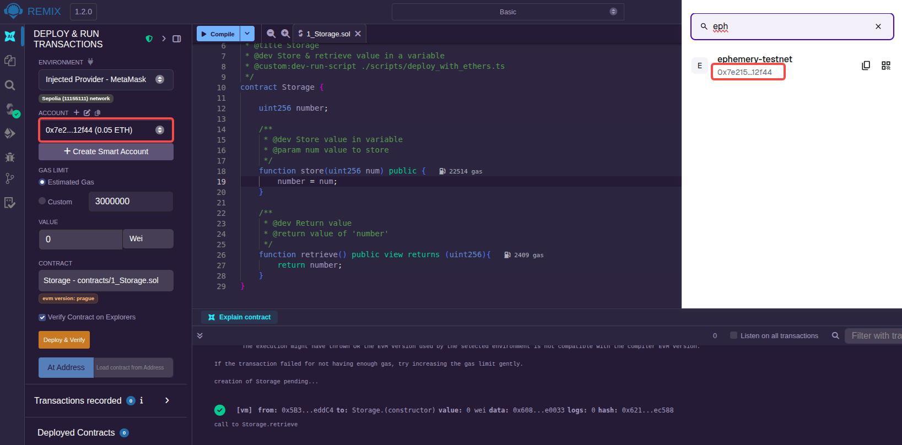
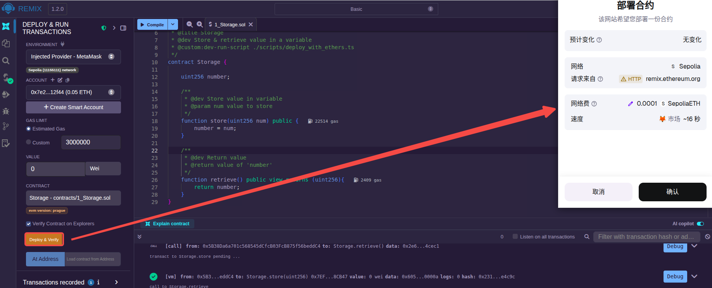
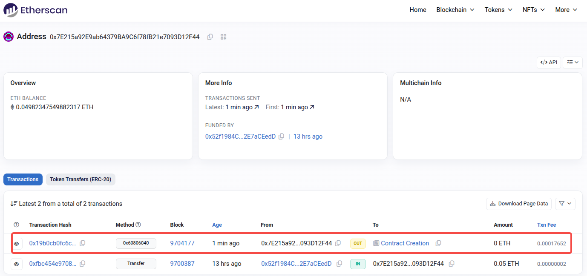
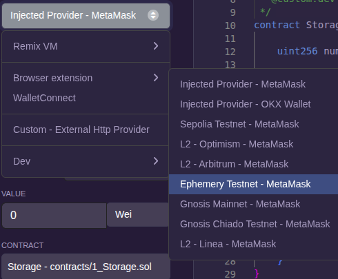
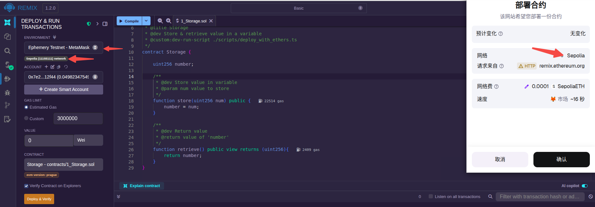

### 编译


按照上面的步骤，创建一个基本工作区(Basic)，可以看到左侧文件资源管理器发生了变化:


文件资源管理器的 contracts 目录下包含一些智能合约示例，这里选择 1_Storage.sol 打开:


跳转到编译界面(Solidity compiler)，可以看到当前使用的编译器版本为"0.8.30+commit.73712a01"，满足 1_Storage.sol 中对 Solidity 版本(>=0.8.2 <0.9.0)的要求。

点击"Compile 1_Storage.sol"或者编辑区左上角"Compile"按钮，即可完成编译，当侧边栏"Solidity compiler"处出现一个绿色图标时，表示编译成功:


如果编译错误会显示为红色，并给出一些错误信息:



警告信息是非关键错误，但建议进行处理:



### ABI 抓取

ABI 允许用户从区块链外部与智能合约进行交互。例如如果用户使用 Ether.js 或 Web3.js 等，则需要智能合约的 ABI。

ABI 是一个描述智能合约接口的 JSON 文档，由 Solidity 编译器每次编译智能合约时生成。单击上面的"Compile_1_Storage.sol"按钮，然后在下面找到 "ABI" 标识，点击拷贝后将内容粘贴到文档中就是了。


当前示例的 ABI 信息如下:
```json
[
	{
		"inputs": [],
		"name": "retrieve",
		"outputs": [
			{
				"internalType": "uint256",
				"name": "",
				"type": "uint256"
			}
		],
		"stateMutability": "view",
		"type": "function"
	},
	{
		"inputs": [
			{
				"internalType": "uint256",
				"name": "num",
				"type": "uint256"
			}
		],
		"name": "store",
		"outputs": [],
		"stateMutability": "nonpayable",
		"type": "function"
	}
]
```

### 部署智能合约

编译没问题后，跳转到部署界面(Deploy & run transactions)。

选择好环境(ENVIRONMENT)后，点击"Deploy"按钮，即可以看到部署到本地的智能合约:


展开部署的(Deployed)智能合约，可以看到智能合约的地址、对应每个外部函数的按钮("store"和"retrieve")以及参数输入框(if have)。


在"store"按钮后输入10，点击"store"按钮，之后再点击"retrieve"按钮，可以看到下面正确地获取了值10。

### 通过 MetaMask 将合约部署到测试网 Sepolia

仍然在部署界面，在 ENVIRONMENT 列表中选择 "Browser extension"，选择"Injected Provider - MetaMask"点击选入(前提必须是浏览器已安装 MetaMask 扩展，这个要涉及到连接钱包。而且钱包中有关于 Sepolia 的 ETH)。可以看到Metamask账户地址与Remix中的ACCOUNT下的地址是对应的，ACCOUNT上还标识了"Sepolia(11155111) network"用于提示要部署到的测试网络:



这个时候部署界面的"Deplay"按钮变成了"Deploy & Verify"按钮，点击它:



通过 Sepolia 的[区块链浏览器](https://sepolia.etherscan.io/)也确实可以查看到这样的一笔合约创建交易:



但是，Sepolia 测试网的 ETH 获取是比较困难的，接下来选择部署到 Ephemery 测试网。

### 部署到测试网 Ephemery

按如下方式选入:



笔者虽已选入"Ephemery Testnet - MetaMask"，但是下面的测试网标示仍然是"Sepolia(11155111) network"，点击"Deploy & Verify"也是提示 Sepolia 网络。



暂时无法继续测试。
