### 编译

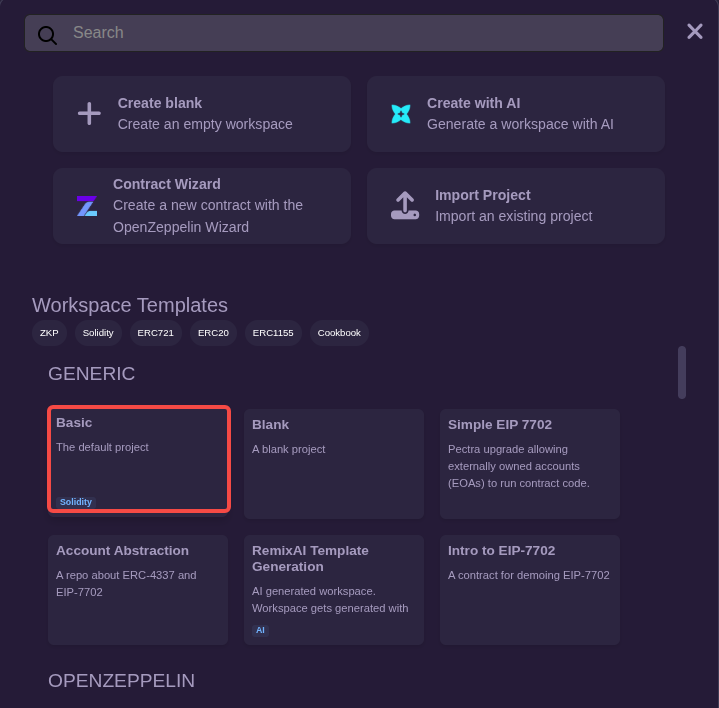

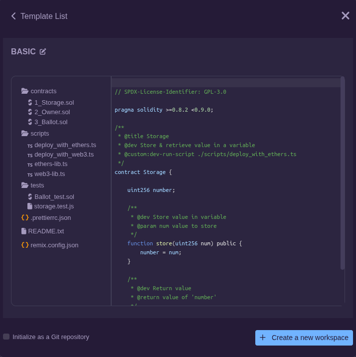

按照上面的步骤，创建一个基本工作区(Basic)，可以看到左侧文件资源管理器发生了变化:

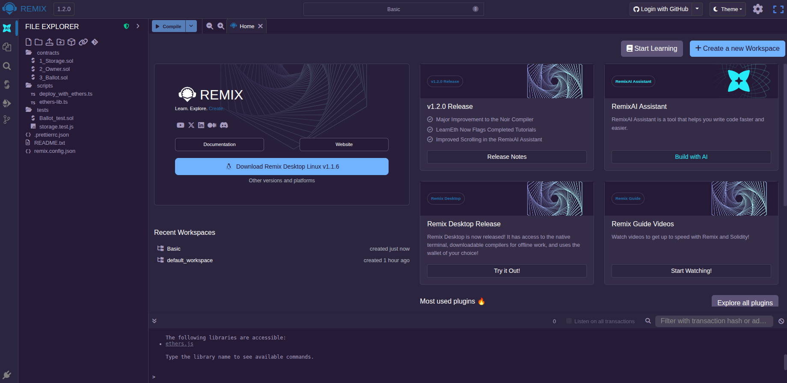

文件资源管理器的 contracts 目录下包含一些智能合约示例，这里选择 1_Storage.sol 打开:

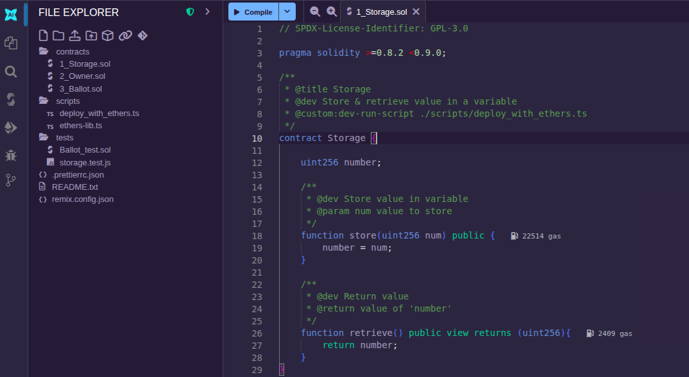

跳转到编译界面(Solidity compiler)，可以看到当前使用的编译器版本为"0.8.30+commit.73712a01"，满足 1_Storage.sol 中对 Solidity 版本(>=0.8.2 <0.9.0)的要求。

点击"Compile 1_Storage.sol"或者编辑区左上角"Compile"按钮，即可完成编译，当侧边栏"Solidity compiler"处出现一个绿色图标时，表示编译成功:

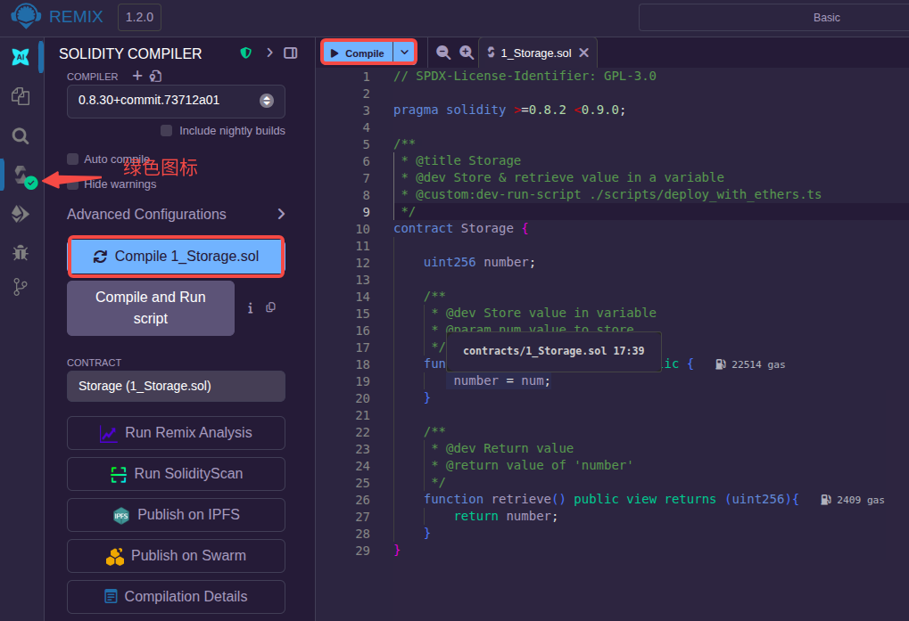

如果编译错误会显示为红色，并给出一些错误信息:


警告信息是非关键错误，但建议进行处理:


### ABI 抓取

ABI 允许用户从区块链外部与智能合约进行交互。例如如果用户使用 Ether.js 或 Web3.js 等，则需要智能合约的 ABI。

ABI 是一个描述智能合约接口的 JSON 文档，由 Solidity 编译器每次编译智能合约时生成。单击上面的"Compile_1_Storage.sol"按钮，然后在下面找到 "ABI" 标识，点击拷贝后将内容粘贴到文档中就是了。

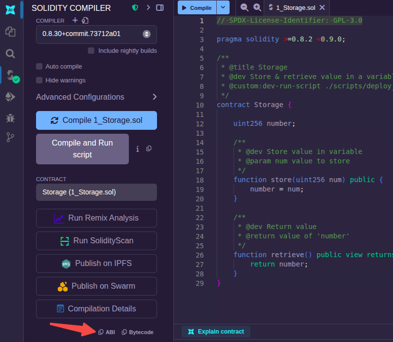

当前示例的 ABI 信息如下:
```json
[
	{
		"inputs": [],
		"name": "retrieve",
		"outputs": [
			{
				"internalType": "uint256",
				"name": "",
				"type": "uint256"
			}
		],
		"stateMutability": "view",
		"type": "function"
	},
	{
		"inputs": [
			{
				"internalType": "uint256",
				"name": "num",
				"type": "uint256"
			}
		],
		"name": "store",
		"outputs": [],
		"stateMutability": "nonpayable",
		"type": "function"
	}
]
```

### 部署智能合约

编译没问题后，跳转到部署界面(Deploy & run transactions)。

选择好环境(ENVIRONMENT)后，点击"Deploy"按钮，即可以看到部署到本地的智能合约:

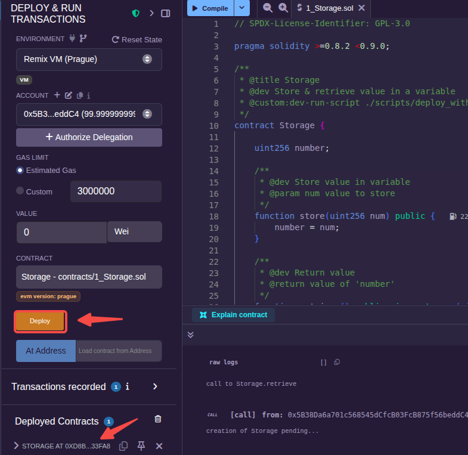

展开部署的(Deployed)智能合约，可以看到智能合约的地址、对应每个外部函数的按钮("store"和"retrieve")以及参数输入框(if have)。

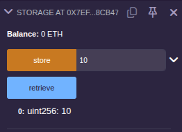

在"store"按钮后输入10，点击"store"按钮，之后再点击"retrieve"按钮，可以看到下面正确地获取了值10。

对于 ENVIRONMENT 的几种选择，这里简单说明一下。
- Remix VM: Remix 内置的虚拟机，运行速度快，无须挖矿，测试方便。
- Brower Wallet: 需要连接浏览器安装的 MetaMask 钱包扩展，可以通过 MetaMask 钱包将合约部署到主网或测试网。
- Custom - External Http Provider: 单击时，将代表要连接某个以太坊节点，例如本地 Geth 进程。

### 通过 MetaMask 将合约部署到测试网 Ephemery

> 前提必须是浏览器已安装 MetaMask 扩展，这个要涉及到连接钱包。而且钱包中有关于 Ephemery 的 ETH。

仍然在部署界面，在 ENVIRONMENT 列表中选择 "Browser extension"，选择"Ephemery testnet - MetaMask"点击选入。

这之后会弹出 MetaMask 扩展，选择"权限"，只选中"ephemery-testnet"网络(默认会选中多个网络，但这样的话Remix会只选中以太坊主网)，点击"更新"后再点击"连接":

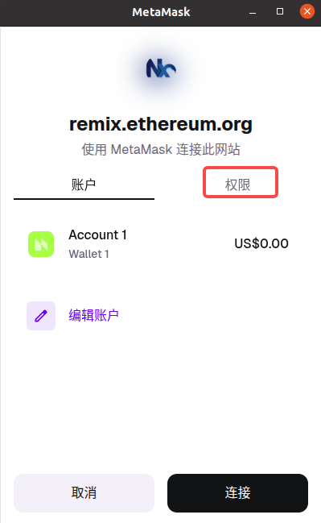

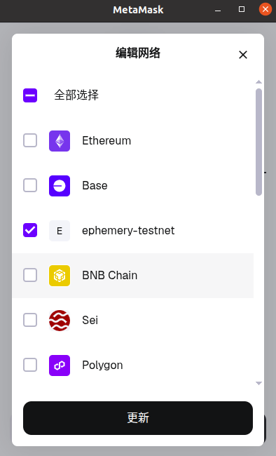

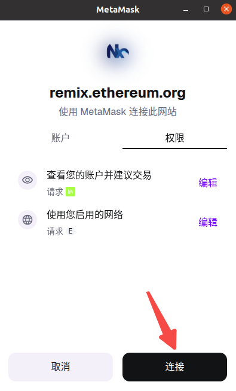

然后就可以在 Remix IDE 中看到已经显示正在连接到的网络了:

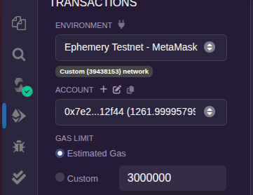

点击"Deploy"按钮，弹出 MetaMask 扩展，点击"确认":

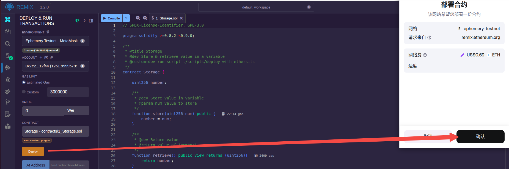

通过 Ephemery 的[区块链浏览器](https://otter.bordel.wtf/)输入账户地址也确实可以查看到这样的一笔合约创建交易:

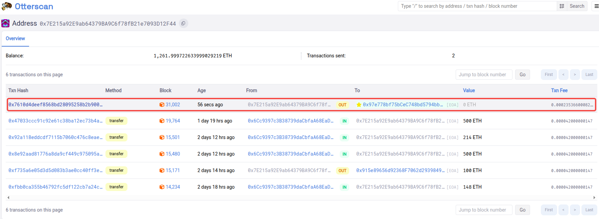

> 部署到其他测试网(如 Sepolia 的方式类同)。

如果要部署的测试网络在 Remix 上没有列出，可以尝试 "Browser extension" -> "Injected Provider - MetaMask"，之后在 MetaMask 上更新一下网络就可以了。

### 桌面版本部署合约到 Ephemery

这种方式部署合约也需要连接到 MetaMask 钱包，另外还要连接一个本地网页代理。

打开桌面版进入部署页面，选择"Browser Wallet"，将打开到本地Web浏览器:

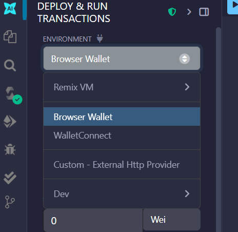

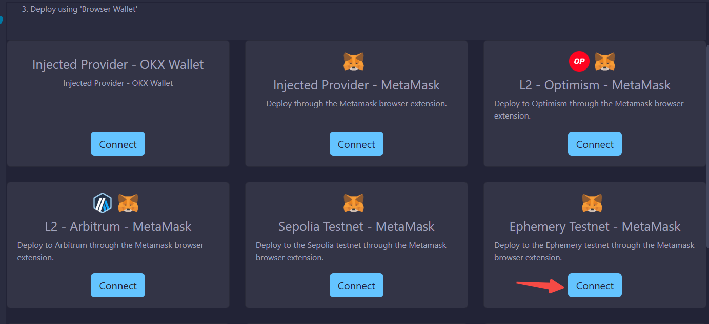

选择"Ephemery Testnet - MetaMask"点击，之后会弹出 MetaMask 钱包的扩展，像上面一样点击权限，选中网络后确认，就可以看到状态是"Connected"了:

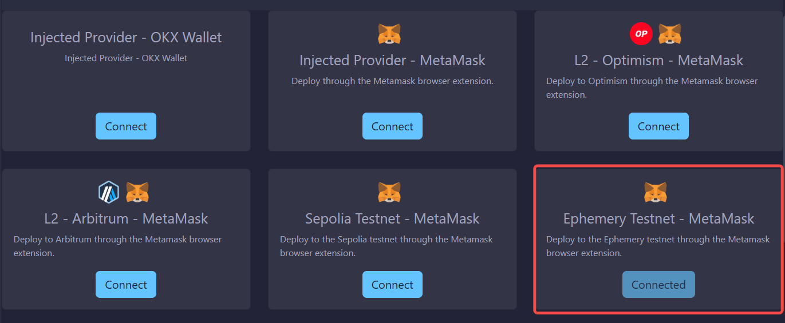

回到 Remix IDE 中，显示的当前网络也正是 Ephemery 了(通过 networkid)了:

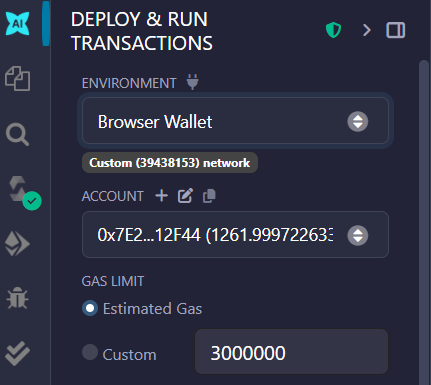

接下来就可以部署智能合约了，这里不再演示。

### 调用智能合约

根据上面创建合约的交易哈希，拿到合约地址:

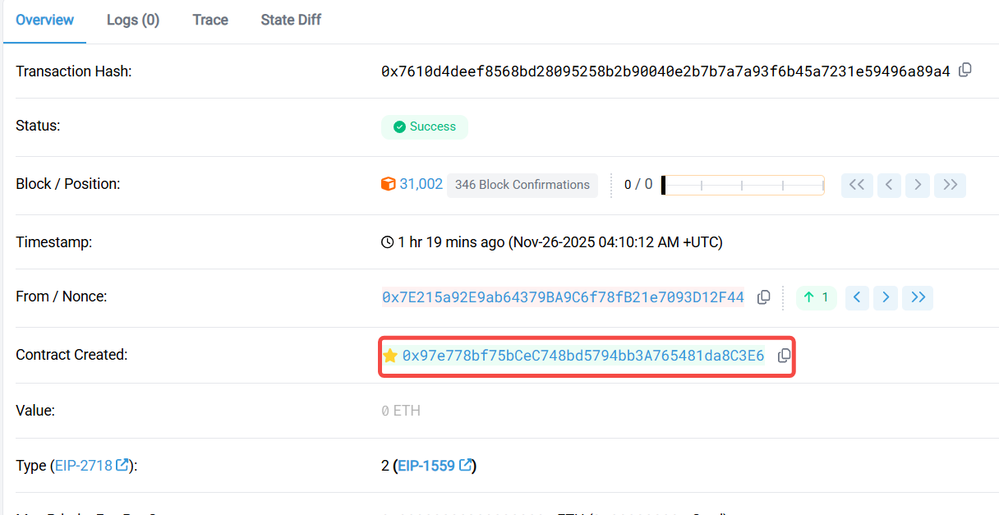

将地址拷贝到 Remix 中，点击"At Address"，就可以看到部署过的合约了:

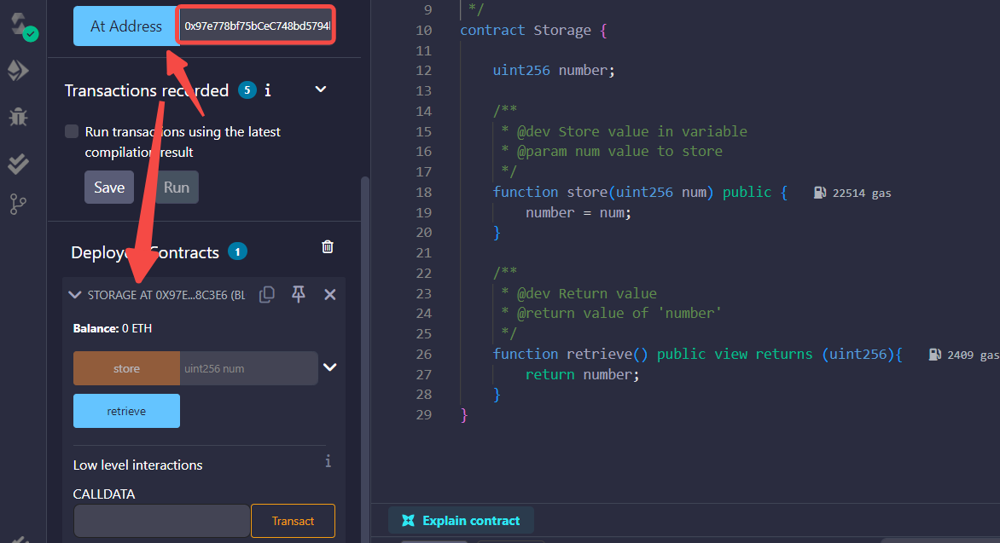

输入测试值，点击"store"，在 MetaMask 点击"确认"，一笔合约调用交易就完成了:

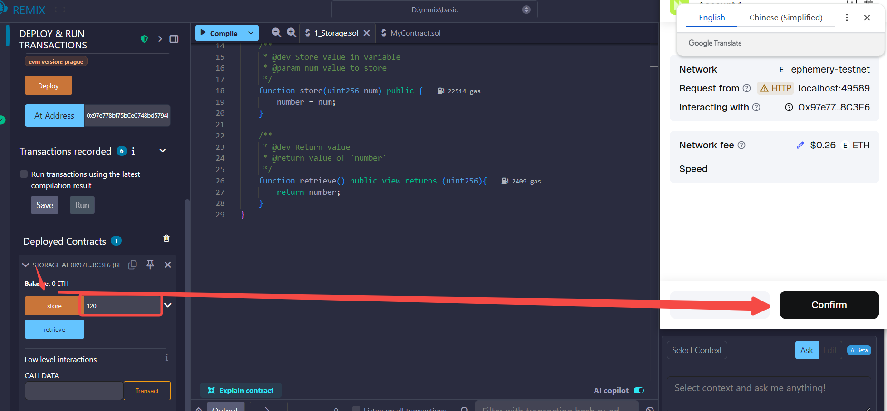

通过区块链浏览器查看确认交易已上链:

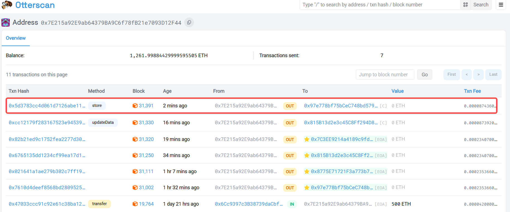

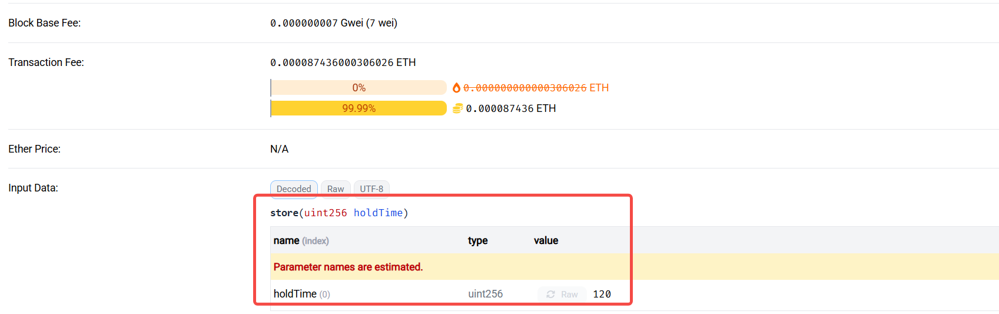

在调用 retrieve 函数时，发现并没有创建交易并上链。可以通过 Remix AI 助手询问原因。