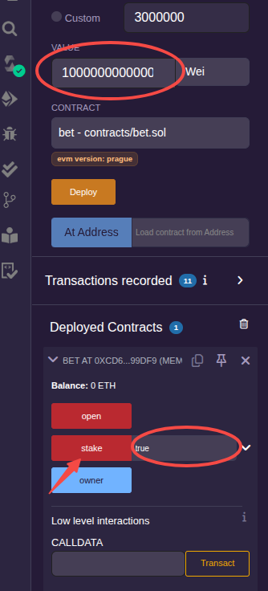
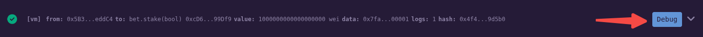
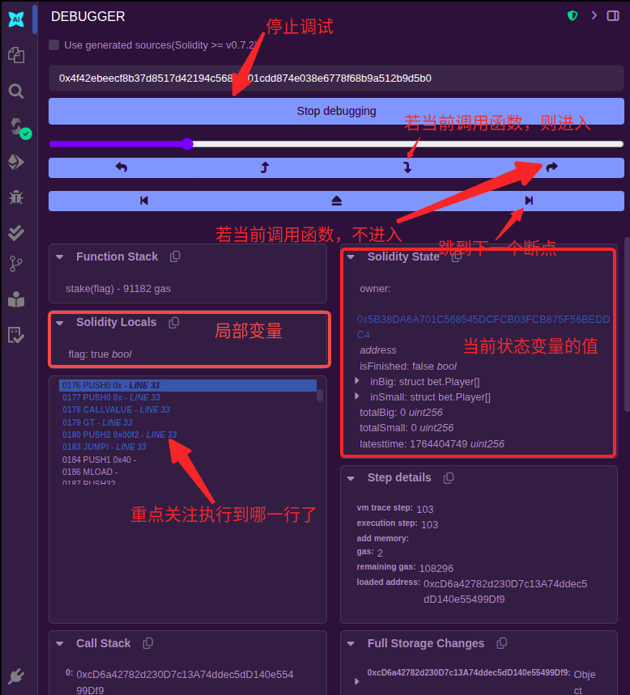
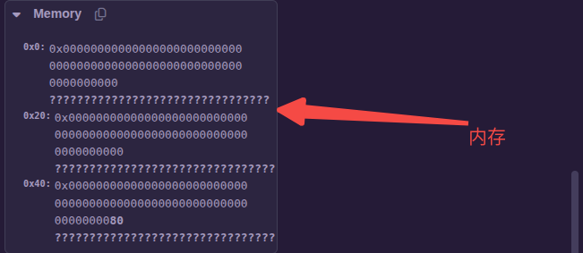
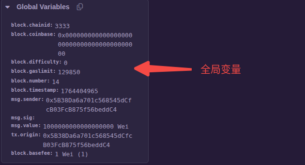
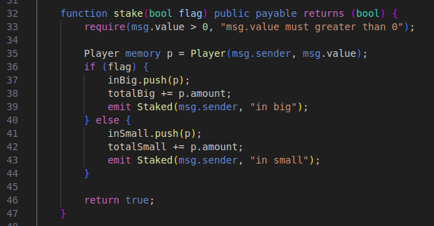
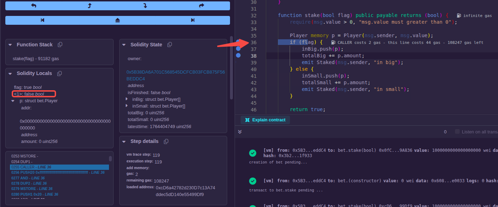
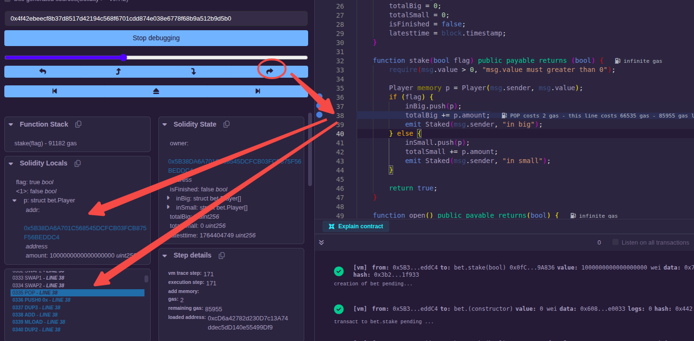
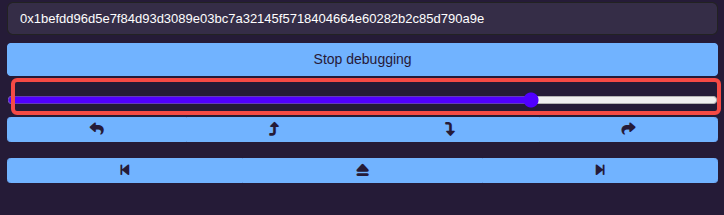
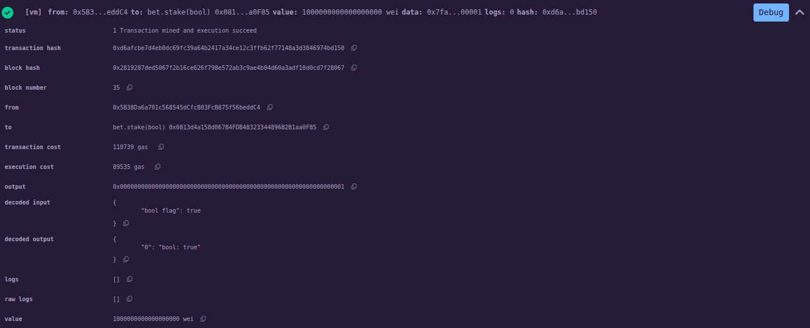

### 调试器

**程序调试最好在 ENVIRONMENT 为 Remix VM 的环境下进行。**

以[这个合约](sol/debugger.sol)为例，点击"Deploy"部署后，将 VALUE 设置为 1000000000000000000，stake 后的输入框设置为 true，点击"stake"执行该交易。



"stake"被点击后，可以看到在右下方的终端(terminal)中弹出一条信息，点击"Debug"按钮会在左铡打开对"stake"的调试信息页面:









以点击"stake"为例，在关注运行数或设置断点时注意，由于 stake 代码在 32~47 之间，所以我们只需要关注这之前的代码或函数调用(if have)就可以了，设置断点时也同样如此。



在 36、37、38 行各设置一个断点，然后点击"Jump to the next breakpoint"就跳到了 36 行，在"Solidity Locals"区域可以看到 flag 的值为 true:



然后点击"Step over forward"在函数内进行单步调试，并在左侧区域观察自己要观测的变量值的变化就可以了。



如果想要停止调试，只需要点击最上面的"Stop debugging"按钮就可以了。

另外，测试发现拉动这个滑块，好像比断点、单步之类的按钮更方便，可以多试试。



### 日志

由于智能合约运行环境比较特殊，到目前为止，还是很难做到分步调试，好在日志的问题还是可以解决的。

智能合约中并没有直接打印日志的函数，但 Solidity 中提供了另外一种机制，`event`函数接口可以像日志那样显示智能合约运行时的数据问题，开发者可以将关注的数据通过 event 接口调用的方式来显示在调用返回信息中。

event 接口的声明如下:
```js
  event eventname(paramlists ...);
```

event 只是接口，不需要实现，调用的时候和普通函数调用类似，在前面多加一个`emit`就可以了。

仍以上面的合约程序为例，在 Remix VM 上部署后，点击"stake"按钮，在右下方的终端(terminal)会弹出一条信息，点击"Debug"按钮后的展开("↓")图标，可以看到如下日志信息:


