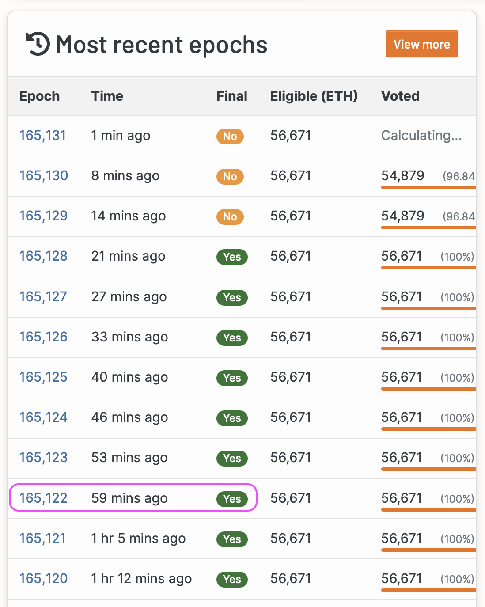
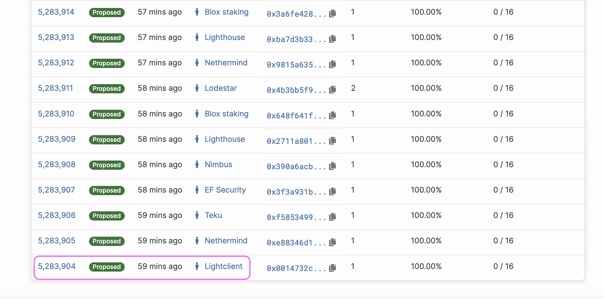
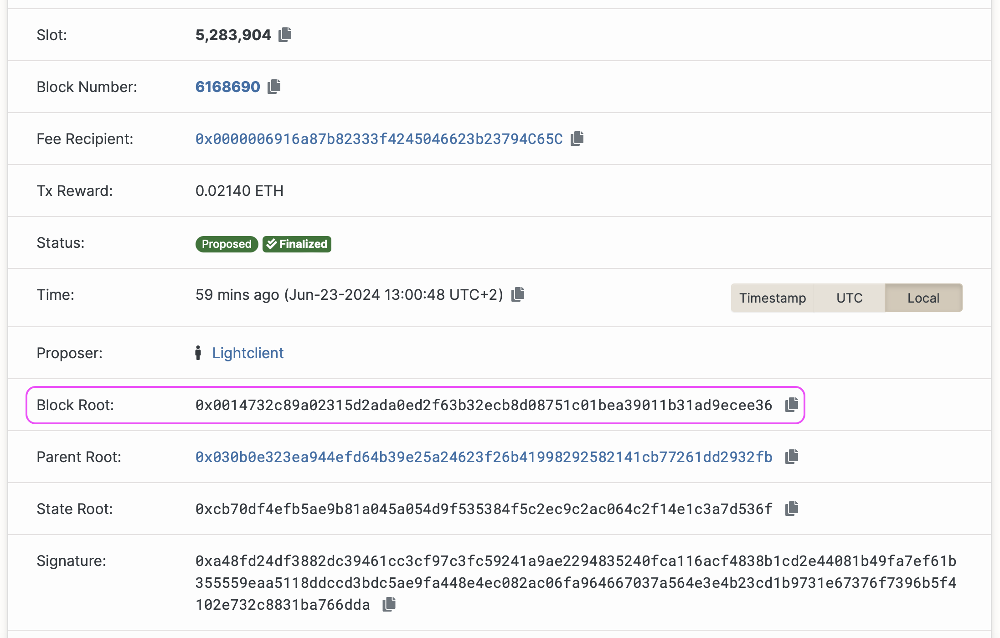

主要参考:
- [Beacon light client](https://geth.ethereum.org/docs/fundamentals/blsync)

更新于 2025/06/24。

其他参考:
- [Ethereum Beacon Chain light sync endpoints | A list of community maintained public Beacon Chain light sync endpoints](https://s1na.github.io/light-sync-endpoints/)
- [Checkpointz](https://beaconstate-sepolia.chainsafe.io/)
- [Slot和Epoch](Slot和Epoch.md)

`blsync` 是一款 beacon 链轻客户端。它集成在 Geth 中，无需运行单独的共识客户端，非常适合不需要完整验证功能的用例。它对资源的要求非常低，可以在几秒钟内同步 beacon 链。blsync 可以以两种模式运行: 集成模式(integrated)和独立模式(standalone)。在独立模式下，它可以用于驱动其他执行客户端。

> 重要提示: blsync 不适合运行验证器。由于其安全性保障低于运行完整共识客户端，因此不建议将其用于处理任何金额的节点或生产环境。

### 集成模式

要将 blsync 作为 Geth 的一部分运行，您需要指定一个公共 HTTP 端点和一个检查点:
- 选择端点: 从 [Light Sync 端点](https://s1na.github.io/light-sync-endpoints/)列表中选择一个可靠且可用的端点。这些节点由社区维护。
- 指定检查点: 从可信节点运营商处获取弱主观性检查点。该检查点应在 2 周内生成。某些 Light Sync 提供商仅支持过去约 1 小时内的检查点。

```s
  geth --beacon.api=<endpoint> --beacon.checkpoint=<checkpoint>
```

> 检查点是最终确定的 beacon 周期中第一个提议时隙(proposed slot)的区块根。您可以根据自己的信任需求手动或自动找到检查点。

#### 自动获得检查点

检索检查点并同时启动 Geth 的操作如下。

将 `<endpoint>` 替换为从[端点列表](https://s1na.github.io/light-sync-endpoints/)中选择的受信任的轻量级同步提供商。以下命令将运行集成了 blsync 的 Geth。请确保已安装 jq。
```s
  BEACON=<endpoint> geth --beacon.api=$BEACON --beacon.checkpoint=$(curl -s $BEACON/eth/v1/beacon/headers/finalized | jq -r ".data.root")
```

#### 手动寻找检查点

您也可以手动获取检查点。最简单的方法是使用 [beaconcha.in](https://beaconcha.in/)，并与其他提供商（例如 [beaconscan](https://beaconscan.com/)）进行交叉验证:
- 访问 beaconcha.in。
- 导航至最新的最终确定的纪元（最好是 1 小时前）。



- 打开纪元(epoch)详情并在页面末尾找到第一个提议时隙。



- 将时隙的区块根与另一个源进行比较。验证它们是否相等。
- 复制区块根字段。



- 使用块根填写 `--beacon.checkpoint` 标志的参数。

例如:
```s
  geth --beacon.api=<endpoint> --beacon.checkpoint=<block root>
```

### 将 blsync 作为独立工具运行

如前所述，blsync 可以以独立模式运行。这类似于运行一个资源需求较低且同步速度更快的共识客户端。在大多数情况下，Geth 用户为了方便起见，可以使用集成模式。独立模式可以用于例如驱动 Geth 以外的执行客户端。

#### 安装

根据您的[安装方法](https://geth.ethereum.org/docs/getting-started/installing-geth)，您可以访问 blsync 二进制文件，也可以通过以下方式从源代码构建它:
```s
  go build ./cmd/blsync
```

#### 运行

Blsync 使用与上述相同的参数来配置 HTTP 端点和检查点。此外，它还需要一些参数来连接到执行客户端。具体来说，`--blsync.engine.api` 用于配置 Engine API 的 URL，`--blsync.jwtsecret` 用于配置 JWT 身份验证令牌。

要在此模式下同步 Sepolia 网络，请首先运行 Geth:
```s
  geth --sepolia --datadir light-sepolia-dir
```

日志会显示 Engine API 的路径（默认为 `http://localhost:8551`）以及创建的 JWT 密钥的路径（本例中为 `./light-sepolia-dir/geth/jwtsecret`）。现在可以运行 blsync 了:
```s
  blsync --sepolia --beacon.api https://sepolia.lightclient.xyz --beacon.checkpoint 0x0014732c89a02315d2ada0ed2f63b32ecb8d08751c01bea39011b31ad9ecee36 --blsync.engine.api http://localhost:8551 --blsync.jwtsecret light-sepolia-dir/geth/jwtsecret

  INFO [06-23|15:06:33.388] Loaded JWT secret file                   path=light-sepolia-dir/geth/jwtsecret crc32=0x5a92678
  INFO [06-23|15:06:34.130] Successful NewPayload                    number=6,169,314 hash=d4204e..772e65 status=SYNCING
  INFO [06-23|15:06:34.130] Successful ForkchoiceUpdated             head=d4204e..772e65 status=SYNCING
```

https://lodestar-sepolia.chainsafe.io/eth/v1/beacon/headers/finalized