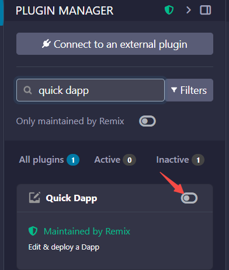
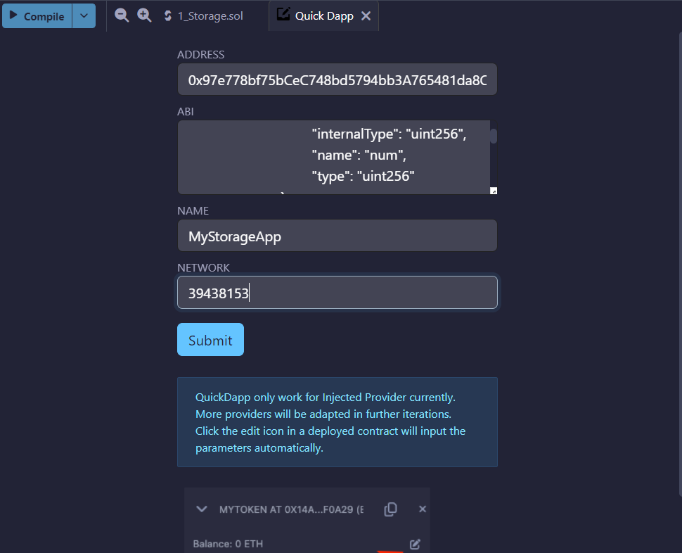
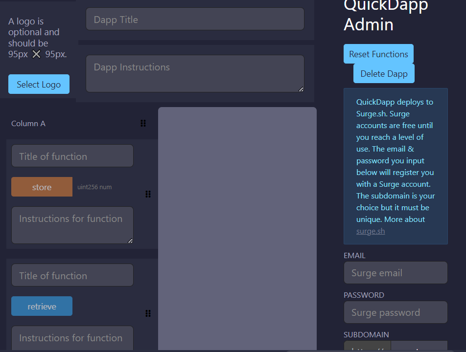
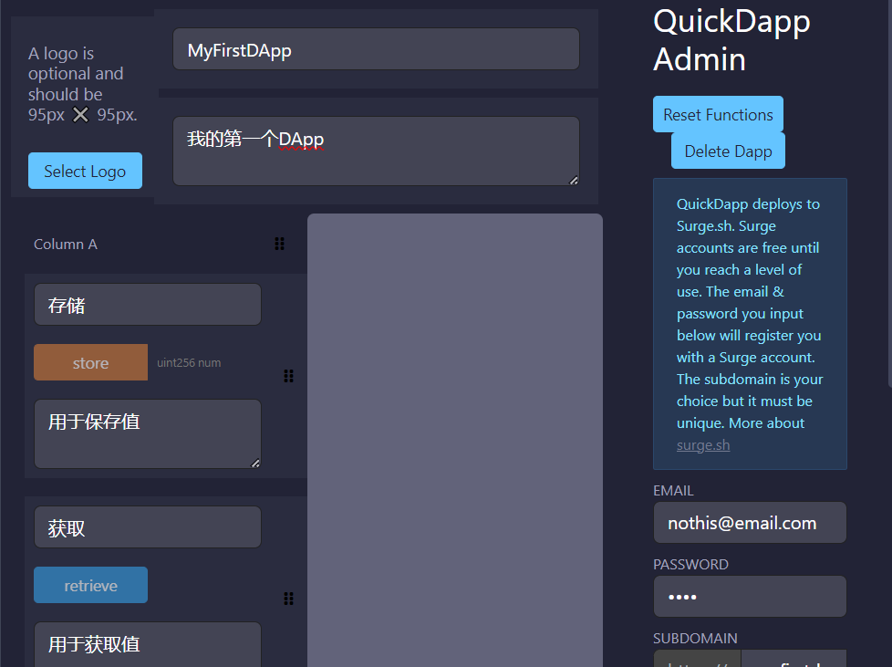
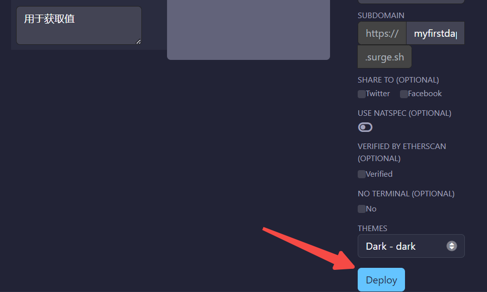

Quick Dapp 是一个可以自动为智能合约创建前端 UI 的工具。

首先要将合约部署到主网或测试网，因为 Quick Dapp 需要公共网络。这里选择 Ephemery 且认为合约已经部署完毕。

在插件管理中搜索"Quick DApp"，激活。

在弹出的信息框中填入相应信息，如合约地址、ABI等(不明白的问AI助手):

> 如果"Ephemery Testnet - MetaMask"代理不支持，可以切换到"Injected Provider - MetaMask"试试。

点击"Submit"提交，跳转到如下页面:

填上信息:

点击"Deploy"部署:

一直在转圈，转了好大会儿...