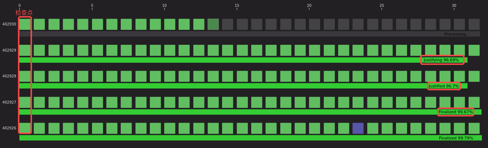
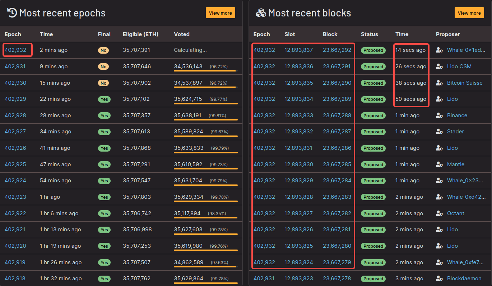

参考:
- [beaconcha.in](https://beaconcha.in/)

在以太坊的权益证明(PoS)共识机制中，`Epoch`(纪元)和`Slot`(时隙)是两个核心的时间概念，它们共同构成了区块链的时间组织和验证结构。

### 基本定义

Slot(时隙):
- 时长: 12秒
- 作用: 每个 Slot 是产生一个区块的机会窗口
- 验证者: 每个 Slot 会随机选择一个验证者来提议区块

Epoch(纪元):
- 组成: 32 个 Slots
- 时长: 1 Epoch = 32 × 12 = 384秒 = 6.4分钟
- 作用: 一个完整的工作周期，用于处理验证者职责轮换和最终确定性

下面表格是二者的详细功能对比:

| 特性 | Slot（时隙） | Epoch（纪元） |
|------|-------------|---------------|
| 时间长度 | 12 秒 | 6.4 分钟 |
| 区块生产 | 每个 Slot 可能产生一个区块 | 每个 Epoch 可能产生最多 32 个区块 |
| 验证者集合 | 单个验证者提议区块 | 整个验证者委员会参与 attestation |
| 主要功能 | 区块提议和打包交易 | 验证者职责轮换、最终确定性投票 |
| 随机数 | 使用当前 Epoch 的 RANDAO | 每个 Epoch 生成新的随机数 |

### 验证者职责

在 Slot 级别:
```python
# 伪代码：Slot 级别的验证者选择
def get_block_proposer(slot_number):
  # 基于 RANDAO 随机选择验证者
  total_validators = get_total_validators()
  random_index = RANDAO % total_validators
  return validators[random_index]
```

在 Epoch 级别:
```python
# 伪代码：Epoch 级别的委员会分配
def assign_committees(epoch_number):
  validators = get_active_validators()
  # 将验证者随机分配到 32 个 Slot 的委员会中
  shuffled_validators = shuffle(validators, epoch_seed)
  committees = split_into_32_committees(shuffled_validators)
  return committees
```

### 最终确定性(Finality)

Epoch 是最终确定性的关键单位:
- 1.检查点(Checkpoints): 每个 Epoch 的第一个 Slot 被称为检查点
- 2.合理化(Justification): 当 2/3 的验证者对检查点投票时，它成为"合理化"的
- 3.最终化(Finalization): 连续两个合理化的检查点会被"最终化"

```
Epoch N-1      Epoch N       Epoch N+1
[Slot 0] ────→ [Slot 0] ────→ [Slot 0]   ← 检查点
   │              │              │
合理化          合理化          合理化
   │              │              │
   └──────────────┴──────────────┘
             最终化
```

如下图所示，一共 5 个 epoch，每个 epoch 包含 32 个 slot。其中 402926 和 402927 纪元已经最终化(Finalized)，402925 已经是合理化(Justified)，402924 正在合理化(Justifying)，而 402923 正在进行处理(Processing)。每个 epoch 的第一个 slot 又称为检查点(checkpoint)。



如下图所示，正处于计算状态中的 402932 epoch，包含很多的 slot，每个 slot 对应一个区块(block)。slot 或 block 之间的间隔是 12 秒，epoch 之间的间隔是 6.4 分钟(图中可以看到显示不到 7 分钟)。



### 实际示例

假设当前是 **Epoch 100, Slot 15**:

```javascript
// 计算相关的 Epoch 和 Slot
const currentEpoch = 100;
const currentSlot = 15;

// 计算全局 Slot 编号
const globalSlot = currentEpoch * 32 + currentSlot; // 100*32 + 15 = 3215

// 计算所在 Epoch
const epochOfSlot = Math.floor(globalSlot / 32); // 100

// 计算下一个检查点
const nextCheckpointSlot = (currentEpoch + 1) * 32; // 101 * 32 = 3232

// 计算剩余 Slots 在当前 Epoch
const remainingSlots = 32 - (currentSlot % 32) - 1; // 16
```

### 在 Geth 日志中的体现

当你运行 Geth 时，可能会看到这样的日志:

```s
INFO [10-27|14:30:15] Imported new chain segment blocks=1 txs=15 mgas=12.45 slot=1234567 epoch=38580 finalized=1234500
```

这表示:
- Slot: 1,234,567
- Epoch: 38,580 (因为 1,234,567 ÷ 32 ≈ 38,580)
- 最终化区块: Slot 1,234,500

### 网络升级和硬分叉

Epoch 也用于协调网络升级:

```javascript
// 假设某个硬分叉在 Epoch 200,000 激活
const forkEpoch = 200000;
const forkSlot = forkEpoch * 32; // 6,400,000

// 节点会在达到这个 Epoch 时激活新功能
if (currentEpoch >= forkEpoch) {
  activateNewFeatures();
}
```
