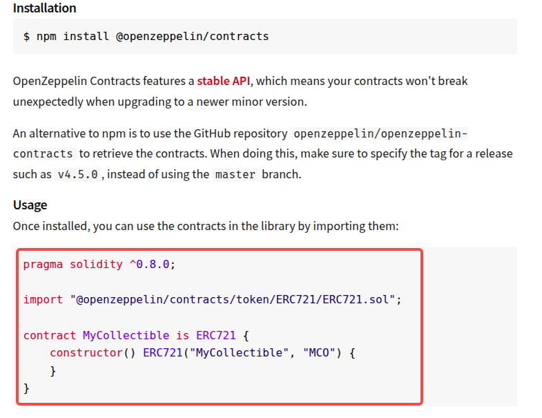

1.从本地导入
```js
...
import "other.sol";

contract mycontract {
  ...
}
...
```

2.从 github 中导入
```js
...
import "https://github.com/OpenZeppelin/openzeppelin-contracts/blob/master/contracts/token/ERC20/ERC20.sol";

contract Token is ERC20 {
  ...
}
...
```

3.导入 npm 包。去[这里](https://www.npmjs.com/)搜索"openzeppelin"，像下面这样导入:



如果没有指定版本号，默认会使用最新版本。建议包含版本号。

对于 npm 导入，如下:
```js
import "@openzeppelin/contracts@5.5.0/token/ERC721/ERC721.sol";
```

对于 github 导入，如下:
```js
import "https://github.com/OpenZeppelin/openzeppelin-contracts/blob/v5.5.0/contracts/token/ERC721/ERC721.sol";
```