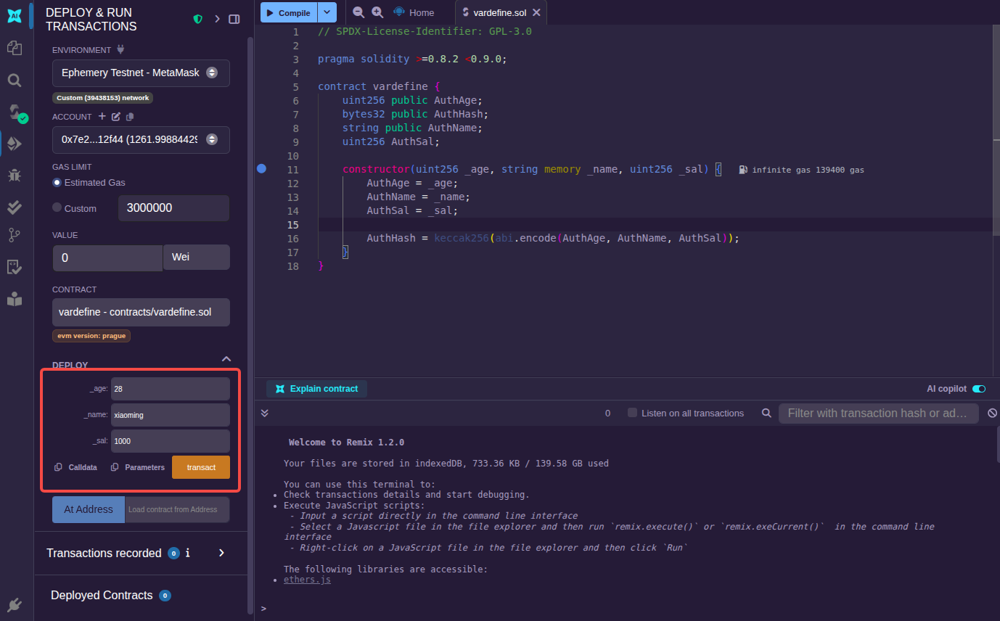
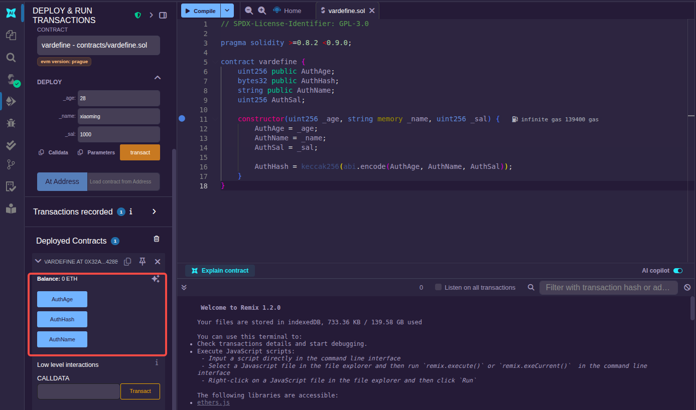
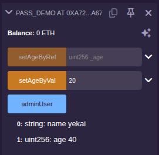
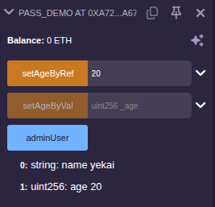

按照存储位置的不同，可将变量分为`状态变量`和`局部变量`。

所谓状态变量，是指存储在以太坊节点中的变量，这类变量的数据存储需要支付费用，这类变量其实也就是合约的`成员变量`。状态变量的定义语法如下:
```js
  Type [permission] identifier;
```
其中"permission"用来修饰变量的访问权限，可以使用`public`或`private`，如果不写默认为 private。如果成员变量是 public 访问权限的，合约部署后会自动提供该变量的查询方法。

局部变量主要就是在函数中使用，定义方式与状态变量类似。不过局部变量的修饰符主要强调的该值是`值传递`还是`引用传递`，有时候编译器要求显式地声明到底是值传递(`calldata`或`memory`)还是引用传递(`storage`)。它们之间的对比如下:

|   类型    | 存储位置 | 可修改性 | Gas成本 |   传递方式   |
|:---------|:--------|:--------|:-------|:------------|
| calldata | EVM data| 只读    | 最低    | 值传递(浅拷贝)|
| memory   | 内存     | 可读写  | 中等    | 值传递(深拷贝)|
| storage  | 链上存储 | 可读写   |最高(写操作)| 引用传递(直接操作原数据)|

> 当函数参数或返回值是变长数据类型时，需要加 memory 或 calldata。storage 也可以用作函数参数，但这也就意味着这个函数只能是内部访问的函数，而不可能从外部传入。

### 变量访问控制示例

创建一个[合约文件](sol/vardefine.sol)并部署。

由于本合约的构造函数是有参数的，因此在部署合约时需要传入参数，可以像下面这样在 Remix 部署界面上展开输入框后输入:



之后点击"transact"进行部署。通过区块链浏览器查看确认没有问题。

部署成功后，可以在 Remix 部署界面下的"Deployed Contracts"视图看到刚刚部署好的合约:



定义的4个状态变量，AuthAge、AuthHash、AuthName都是 public 权限，因此合约为我们提供了对应的查询函数。单击对应的按钮，可以看到对应的值。

### 变量传递方式示例

创建一个[合约文件](sol/pass_demo.sol)并部署测试。

点击"setAgeByVal"创建一笔合约交易，发现 adminUser 的 age 并没有改变:



点击"setAgeByRef"创建一笔合约交易，发现 adminUser 的 age 改变了:


