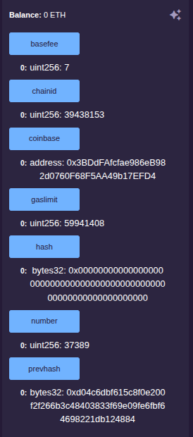
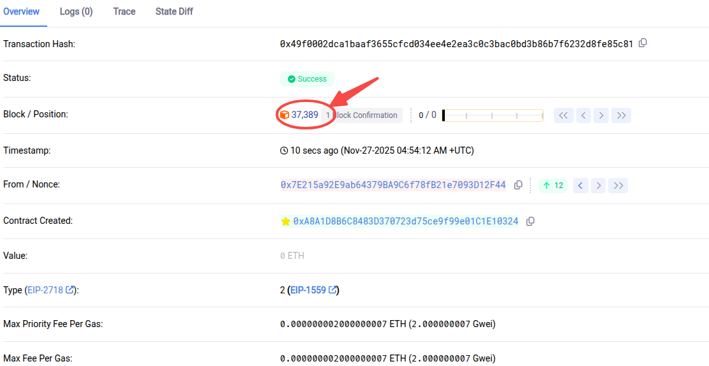
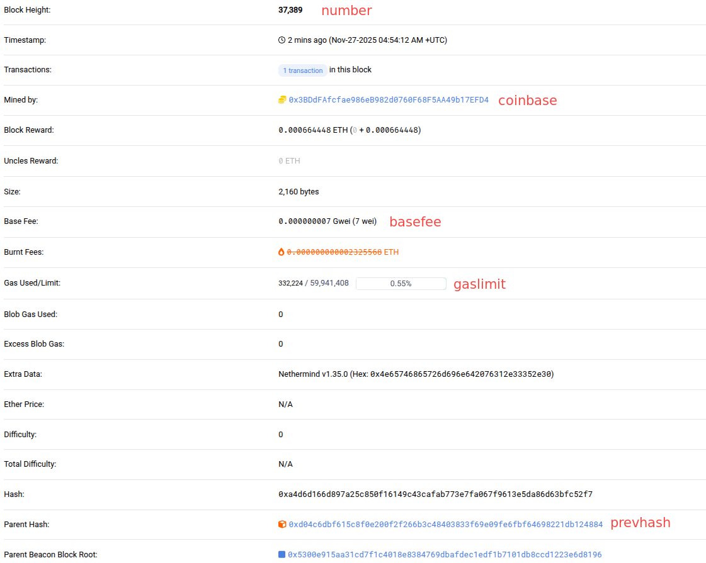
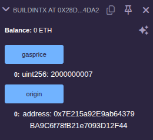
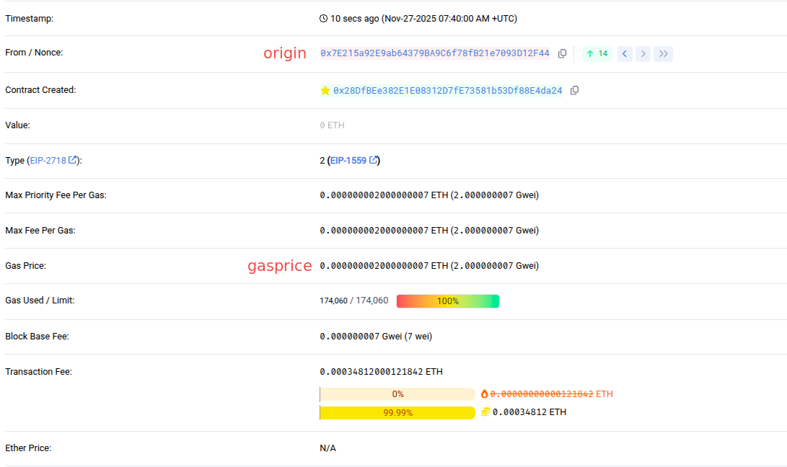
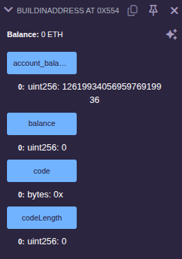

由于Solidity代码运行在以太坊虚拟机中，因此在合约代码中可以使用区块链系统本身的一些数据，如区块信息(block)及合约被调用时的交易信息(msg)，对于这类对象，无须声明就可以直接使用，这是区块链系统提供的内建对象，位于全局命名空间。

### 全局函数 && 全局变量

- function `blockhash`(uint) returns (bytes32): 返回指定区块的哈希值。
- function `gasleft()` returns (uint256): 能够在合约执行过程中监控和控制 gas 消耗。

### block 区块信息

- address `block.coinbase`: 当前块的矿工地址。
- uint `block.gaslimit`: 当前块 gas 的上限。
- uint `block.number`: 当前块编号。
- uint `block.timestamp`: 当前块的时间戳。
- uint `block.chainid`: 当前链ID。
- uin5 `block.basefee`: 当前区块基础费用(EIP-1559)

创建一个[合约文件](sol/buildinblock.sol)并部署。

打开 Remix 合约部署视图，查看每个值:



在区块链浏览器中找到这笔交易所在区块，点进去查看:





可以看到，除了 hash 值为 0，其他值都是一致的。hash 值之所以为 0，是因为执行这笔交易时，当前区块还没有被打包，交易状态信息还不完整，没有办法计算出当前区块的哈希值。

### msg 合约被调用时传递过来的调用信息

- address `msg.sender`: 消息的发送方(调用者)，非常重要。
- uint `msg.value`: 所发送的消息中 wei(以太坊最小的虚拟数字货币单位)的数量。
- bytes `msg.data`: 完整的 calldata。
- uint `msg.gas`: 剩余的 gas 量。
- bytes4 `msg.sig`: calldata 的前四个字节(函数标识符)。

以太坊一共有 4 个单位，从小到大分别是 wei、gwei、finney 和 ether，它们之间的换算关系是:
```s
  1 ether = 10 finney
  1 finney = 1000,000 gwei
  1 gwei = 1000,000,000 wei
```

创建一个[合约文件](sol/buildinmsg.sol)并部署测试。

### tx 交易信息

- uint `tx.gasprice`: 交易的 gas 价格。
- address `tx.origin`: 交易发送方(最原始调用者)。

创建一个[合约文件](sol/buildintx.sol)并部署测试。





### address 合约地址信息

- uint `addr(???).balance`: 地址余额。
- bytes `addr(???).code`: 地址的字节码。
- uint `addr(???).code.length`: 字节码大小。

创建一个[合约文件](sol/buildinaddress.sol)并部署测试。



可以看到，合约地址的余额为0，账户地址余额(account_balance)需要通过`msg.sender.balance`查询到。
