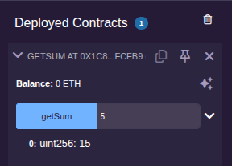
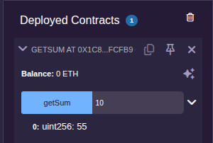

Solidity 程序没有传统的 main 函数入口，而是由外部调用方式来决定执行哪个功能，这个功能也就是函数。

### 函数类型

合约中存在两类函数，第一类是构造函数，它负责创建合约对象，一个合约内部只能有一个构造函数，当没有显式定义构造函数时，系统会使用缺省的构造函数来创建合约对象。构造函数语法如下:
```js
constructor(paramlist...) {
  ...
}
```

第二类是普通函数，语法定义如下:
```js
function func_name(paramlist...) [[modifiers] returns (returnlist...)] {
  ...
}
```
其中，paramlist表示参数列表，可以有0个或多个参数；modifiers表示函数修饰符；returnlist表示返回值类型列表，当返回值个数为空时可以省略returns关键字。

创建一个[合约文件](sol/getsum.sol)并部署测试。

这里依次传入 5 和 10 调用合约函数。结果如下:





### 修饰符

函数修饰符与函数是伴生的，函数修饰符的作用主要有三类，第一类是控制函数的被调用权限；第二类是限定状态变量的修改、读取权限；第三类是资产转移权限的控制。

各种修饰符及其使用要求如下:

|  关键字  |     类型      |       说明     | 是否可继承 |
|:--------|:-------------|:---------------|:---------|
| public  | 调用控制      | 公共的，内部、外部均可调用 | 是 |
| private | 调用控制      | 私有的，仅限内部调用      | 否 |
| external| 调用控制      | 外部的，仅限外部调用      | 是 |
| internal| 调用控制      | 内部的，仅限内部调用      | 是 |
| view    |状态变量访问限制| 可读取但不可修改状态变量   | - |
| pure    |状态变量访问限制| 不可读取也不可修改状态变量  | - |
| payable | 资产转移控制  | 函数内涉及 ETH 转移时使用  | - |

以太坊的合约部署后(通过 Remix)可以看到 3 种颜色，分别是蓝色、橘红色和红色，不同的颜色代表着函数不同的能力。
- 蓝色: 只读函数，使用`view`关键字，该类函数不允许修改状态变量，调用时不会消耗 gas。
- 橘红色: 写函数，该类函数会修改状态变量的值，调用时会消耗 gas。
- 红色: 可支付函数，该类函数涉及资产转移，必须加`payable`关键字，调用时会消耗gas，此类函数也可以修改状态变量。
