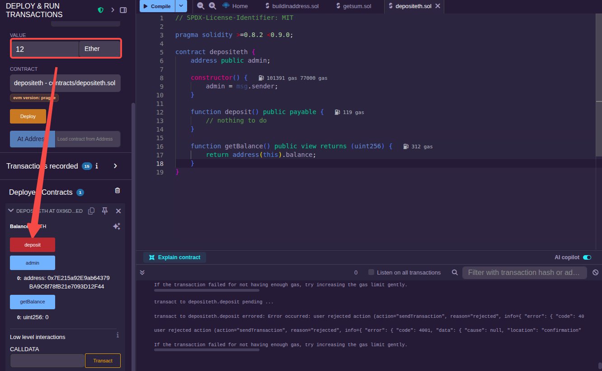
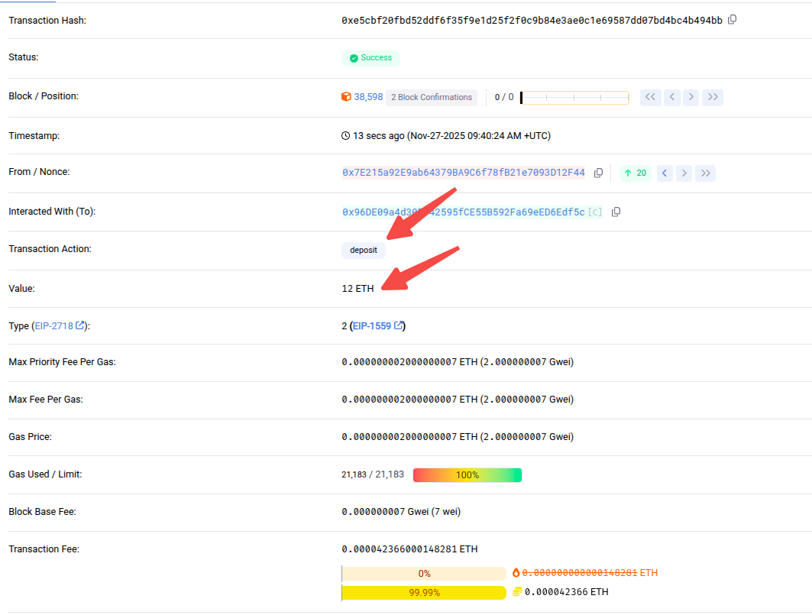
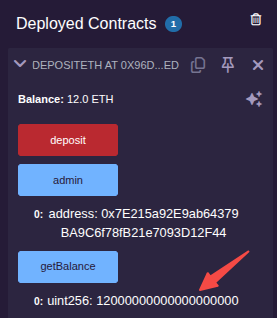

语法定义如下:
```js
function func_name(paramlist...) [[modifiers] returns (returnlist...)]
```
几个需要注意的地方:
- paramlist: 参数列表，可以有 0 个或多个参数。
- modifiers: 函数修饰符。
- returnlist: 返回值类型列表。

用于控制权限访问的修饰符有 4 个，分别是 public、private、external、internal。它们的区别如下:

| 关键字  | 外部访问 | 类内访问 | 子类继承 | 子类访问 |
|:-------|:--------|:-------|:--------|:--------|
| public | 能      | 能      | 能      | 能      |
|private | 不能    | 能      | 不能     | 不能    |
|external| 能      | 不能    | 能      | 能       |
|internal| 不能    | 能      | 能      | 能       |

> 状态变量默认 internal，但函数没有默认可见性。

以太坊的合约部署后可以看到 3 种颜色，分别是蓝色、橘红色和红色，不同的颜色代表着函数不同的能力。
- 蓝色: 只读函数，使用`view`关键字，该类函数不允许修改状态变量，调用时不会消耗 gas。
- 橘红色: 写函数，该类函数会修改状态变量的值，调用时会消耗 gas。
- 红色: 可支付函数，该类函数涉及资产转移，必须加`payable`关键字，调用时会消耗gas，此类函数也可以修改状态变量。

Solidity 还提供了`pure`关键字，该关键字比 view 还要严格，既不可以访问状态变量，也不能更改状态变量。

### 部署第一个函数

创建一个[合约文件](sol/getsum.sol)并部署测试。

这里依次传入 5 和 10 调用合约函数。结果如下:


### 涉及 ether 的操作

注意: 凡是涉及 ether 转移的，无论是函数或地址都要加`payable`修饰符，代表可以支付。

这里实现一个向合约账户充入 ETH 的函数:
```js
function deposit() public payable {
  // nothing to do
}
```
在以太坊网络中，合约地址是一种特殊的账户地址，它可以像普通账户那样接受转账交易。对于上面的 deposit 函数来说，虽然没做什么事情，但是 msg 携带的 value 已经被合约地址给接收了，也就是说合约是给"钱"就收的。

创建一个[合约文件](sol/depositeth.sol)并部署测试。



像上面，填入要充值的 ETH 数额，点击"Deposit"通过 MetaMask 钱包扩展执行交易，通过区块链浏览器查看交易信息:



在 Remix 视图点击"getBalance"按钮查看，确认已经将 ETH 充值到合约地址:



### 各种调用

```js
// 地址调用
function makeCalls(address target) public payable {
    // 低级call调用
    (bool success, bytes memory data) = target.call{value: msg.value}("");
    
    // 带gas限制的调用
    (success, data) = target.call{value: msg.value, gas: 50000}("");
    
    // 静态调用（不修改状态）
    (success, data) = target.staticcall("");
    
    // delegatecall（在当前合约上下文中执行目标代码）
    (success, data) = target.delegatecall("");
}
```