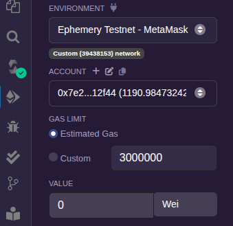
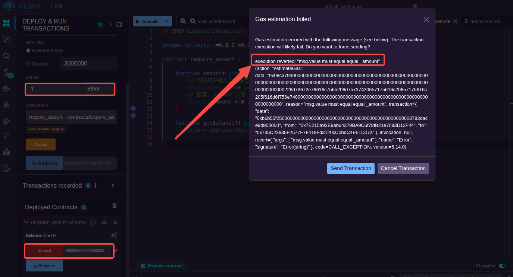
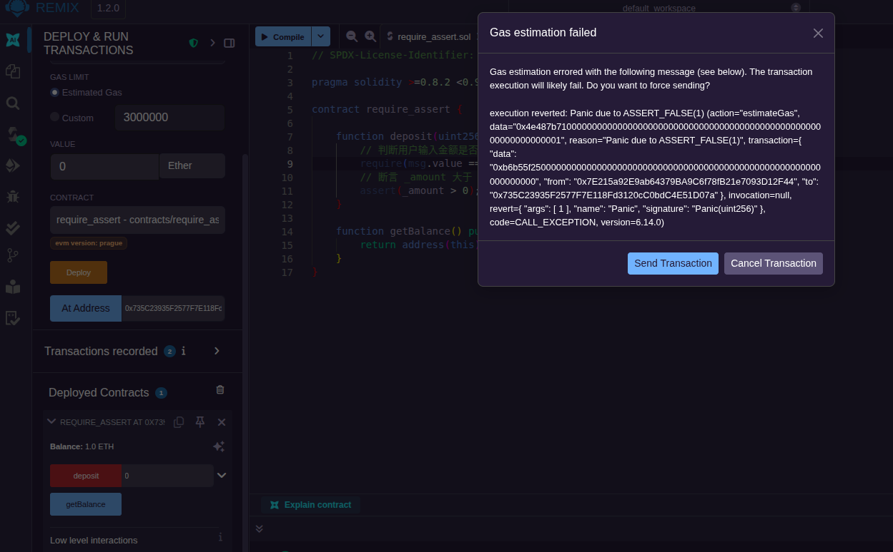

以太坊合约的运行需要 gas。对于非 view 的函数，执行每一个指令都需要消耗 gas，为此用户在执行合约时，需要指定执行此合约时允许消耗的 gas 上限。

系统为以太坊 EVM 中每个指令规定了对应的 gas 消耗数量。除了 gas，以太坊还设计了 gasprice，gas 与 gasprice 的乘积将作为最终的"金钱"消耗(以太坊的Wei)。在以太坊主网中，gasprice 需要由自己填写，系统会提供高、中、低三档的选择，gasprice 的高低将直接影响区块打包交易的快慢。

在 Remix 的部署界面，可以看到`Gas limit`输入框，输入的值就是在合约调用时指定的 gas 上限。



需要注意的是，这个值只是上限，并非一定要全部用光。合约在执行时，会将账户的余额自动转化为 gas 使用。

当 gas 充足，并且合约没有错误时，合约在执行时会顺利完成，但是当 gas 不足的时候或合约存在问题的时候，合约将不能顺利完成。

### revert

Solidity 提供`state-reverting`(状态恢复)机制来实现像数据库一样的事务逻辑。如果合约运行过程出现错误，可以主动调用`revert`来退回到合约调用前的状态。

### assert && require

不过使用 revert 方式相对麻烦，代码层面上可能需要添加判断条件。很多时候会使用`assert`或`require`进行断言判断，它们是合约的内置函数。
```js
  function assert(bool condexpr);
  function require(bool condexpr, string msg);
```

assert 和 require 都是断言函数，断定 condexprt 一定为真，否则合约就会发生回退。除了函数原型不同外，还有一点重要的区别是，虽然二者都会回退，但 assert 会通过扣光剩余 gas 的方式惩罚调用者(gas limit 是多少，就会扣掉多少)，require 则会把剩余的 gas 返回给调用者。

平时多是使用 require，assert 多是作内部判断，尤其是与状态变量无关的判断多使用 assert。另外 assert 可用作测试，在生产前可以用 assert 尽可能地测试合约错误。

创建一个[合约文件](sol/require_assert.sol)并部署。

测试时，指定 msg.value 为 1(单位为 Ether)，指定函数参数为 4000000000000000000(单位为 Wei，也就是 4 个 ETH)，点击"deposit"会弹出报错对话框，报错对话框中提示该笔交易进行了回退，原因是"msg.value must equal equal _amount"。而且这笔交易也不会上链:



将 msg.value 和函数参数均指定为 0，点击"deposit"也会弹出报错对话框，也是进行了回退，原因是 assert 判断为 False。这笔交易也不会上链:



### modifier

开发者可以通过自定义描述符`modifier`将一些断言封装、组合，方便在其他函数中使用。其语法如下:
```js
  modifier modifier_name() {
    require(cond, "sth error");
    ...
    _; // 占位符号，标识 modifier 的结束
  }
```

其他的函数如果使用该描述符，就会自动判断该修饰符内封装的断言语句。

创建一个[合约文件](sol/only_admin.sol)并部署。

上面合约的 setCount 方法只能由合约的部署者，也就是管理员才能够调用，其他人调用都会失败。
