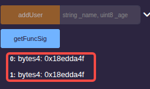
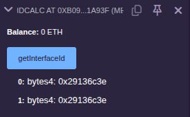
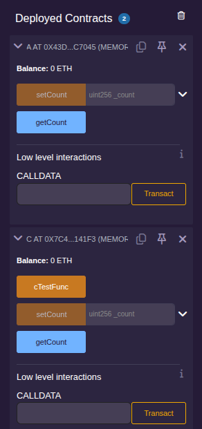
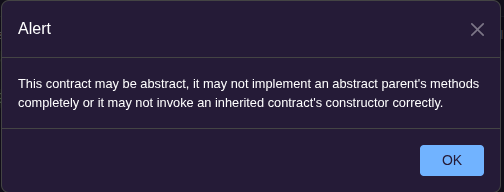

### 接口

Solidity 语言支持的多态是借助接口来实现的。接口使用`interface`关键字来定义，接口在定义时只需要声明对应的函数，无需实现逻辑。另外，接口内的函数只能声明为 external 类型。通常情况下，对外开放的接口不建议使用自定义结构类型作为参数或返回值。
```js
interface IUser {
    function addUser(string memory _name, uint8 _age) external;
    function getUser(string memory _name) external view returns (string memory, uint8);
}
```
若某一个合约想要支持该接口，它需要实现接口内的全部函数。

### 函数选择器与接口ID

智能合约的函数被执行是由外部账户调用产生的，那么外部调用时如何确定调用的是哪个函数呢？看上去是在 Remix 环境点击的那个函数，实际上点击时产生了一个输入数据(input)，系统会识别这个输入数据来执行合约。这个输入数据也就是内建对象 msg 的 data 成员，它的前 4 个字节决定了到底调用哪个函数，其余的数据是调用相关的其他参数。

msg 对象内有一个 sig 属性，它代表`函数签名`，也就是这前 4 个字节。函数签名的另一个名称叫`函数选择器`(selector)。

计算函数选择器时，可以使用"接口名称(合约名称).函数名称.selector"的方式，也可以直接计算该函数名称的哈希值后取前 4 个字节，计算时去掉函数中的参数名称，去掉多余的空格，再去掉修饰符及后面的部分，如函数`function setAge(uint256 _age) external;`应计算为`bytes4(keccak256("setAge(uint256)"))`。

这里创建一个[合约文件](sol/getfuncsig.sol)，里面 test_IUser 合约实现了 IUser 的接口，并通过 getFuncSig 函数提供了两种计算该函数签名的方法。

部署上面的合约后，点击"getFuncSig"按钮:



与接口和函数选择器有关的另一个术语是接口ID(InterfaceId)，它同样也是 4 个字节，用来区分不同接口。接口 ID 的计算方式是将接口所有函数选择器进行异或。除了异或这种计算方式，`type(IUser).interfaceId`也可以用来获取 IUser 的接口 ID。这里是用于测试的[合约文件](sol/idcalc.sol)，部署后点击"getInterfaceId"按钮:



### 继承

Solidity 没有某些语言公共继承、私有继承那套机制，它采用的是`is A`这样的句式，字面上理解就是"继承了它，便成了它"。

一旦继承，新合约就会具备之前合约的函数功能和属性。

创建一个[关于合约继承的文件](sol/c_inherit_a.sol)并部署，在Remix上观察两个合约部署后的交易，可以看到 C 具有 A 的所有函数功能。



一个合约同样可以继承多个合约，多个合约用逗号分隔开就行。如果被继承的合约构造函数是有参数的，那么新合约必须在构造函数执行前完成被继承合约的构造函数调用，这里有两种写法，第一种是在合约构造函数同时初始化被继承合约。

创建一个[被继承合约构造函数有参数的文件](sol/c_inherit_a_bparams.sol)。

在上面的合约文件中，C 继承 A 和 B，B合约是有构造函数的，在书写C合约构造函数时，直接书写B合约的构造函数初始化列表。

第二种方法是直接在合约声明时初始化B合约的构造函数参数列表。

创建一个[合约文件](sol/c_inherit_a_bparams_2.sol)用于测试另一种初始化方式。

此外，is 关键字除了继承合约，也可以继承接口。在继承接口后，合约就需要将接口内的全部函数都实现。(注意需要使用`override`关键字来覆写接口内的函数。)

创建一个[is关键字应用于继承接口的文件](sol/interface_use_is.sol)，并部署测试。

### abstract 关键字

智能合约在面向对象设计时，也可以将合约设计为抽象的，这个时候要使用关键字`abstract`。

抽象合约和普通合约的唯一区别是它不能直接创建合约对象，只能被其他合约继承使用。如果部署抽象合约，将会提示如下报错信息:



抽象合约[示例文件](sol/abstract_contract.sol)。
