参考文档:
- [Developer mode](https://geth.ethereum.org/docs/developers/dapp-developer/dev-mode)

智能合约并非是自动执行的，它内部的函数需要被调用才能够触发。

智能合约调用是实现一个 DApp 的关键，一个完整的 DApp 包括前端、后端、智能合约及区块链系统，智能合约的调用是连接区块链与前后端的关键。

智能合约的运行过程是后端服务连接某节点，将智能合约的调用(交易)发送给节点(一般以 RPC 方式，如发送到 Geth 的 8545 端口)，节点在验证了交易的合法性后进行全网广播，被验证者打包到区块中代表此交易得到确认，至此交易才算完成。

### 基本步骤

接下来就编写 go 代码调用 SDK 通过 Geth 节点完成智能合约的调用。

1.创建一个[合约文件](sol/calldemo.sol)，编译后拿到[它的ABI](abi/calldemo.abi)(它允许用户从区块链外部与智能合约进行交互)。

2.运行 Geth 节点，并将合约部署到 Geth 节点，获得合约地址。

运行 Geth 节点(这里连接到 Ephemery 测试网，并设置 Remix 可以访问到本地 Geth 节点，这样 Remix 就能将合约部署到 Geth 节点):
```s
  source ephemery/nodevars_env.txt
  cd ~
  geth --datadir geth-ephemery --syncmode snap --http --http.port 8545 --http.api web3,eth,net --http.corsdomain https://remix.ethereum.org --authrpc.addr localhost --authrpc.port 8551 --authrpc.vhosts localhost --authrpc.jwtsecret geth-ephemery/jwtsecret --bootnodes $BOOTNODE_ENODE --networkid $CHAIN_ID
```

Remix 的 Environment 选择 "Custom - External Http Provider"，点击"ok"确认:

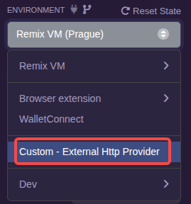

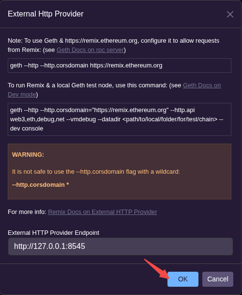

回到部署界面，可以看到关于当前 Geth 节点的账户列表，这里选择第一个账户进行测试:

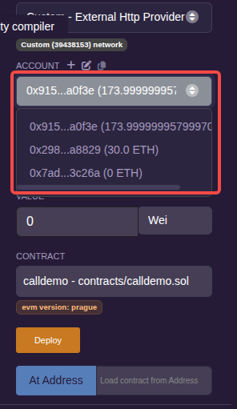

但是点击部署的时候，Remix 控制台报如下错误:

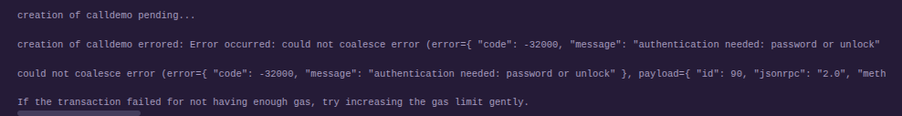

geth 运行端日志也有报警告:

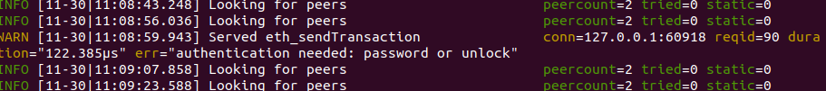

这是因为账户无法自动解锁。要解决此问题，需要运行 Clef 端。

停止 geth 程序。

先打开 Clef 端:
```s
  source ephemery/nodevars_env.txt
  clef --keystore ~/geth-ephemery/keystore --configdir ~/.clef --chainid $CHAIN_ID --http
```

使用下面的命令重新打开 Geth 端:
```s
  source ephemery/nodevars_env.txt
  cd ~
  geth --datadir geth-ephemery --syncmode snap --http --http.port 8545 --http.api web3,eth,net --http.corsdomain https://remix.ethereum.org --authrpc.addr localhost --authrpc.port 8551 --authrpc.vhosts localhost --authrpc.jwtsecret geth-ephemery/jwtsecret --bootnodes $BOOTNODE_ENODE --networkid $CHAIN_ID --signer=.clef/clef.ipc
```

这个时候配置 Remix 与 geth 的访问时，Remix 会阻塞，切到 Clef 端审批一下(可能要连续输入好几个"y")就可以在 Remix 上看到账户列表了。

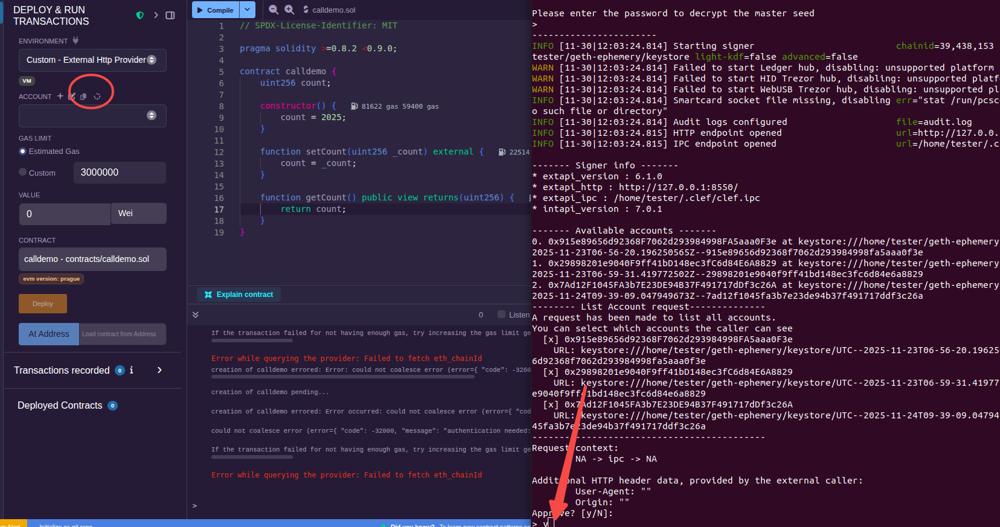

点击"Deploy"部署，再经过 Clef 的审批，并输入关于测试账户的保护密钥，Geth 也有了合约创建成功的信息了。

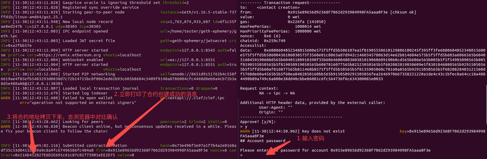

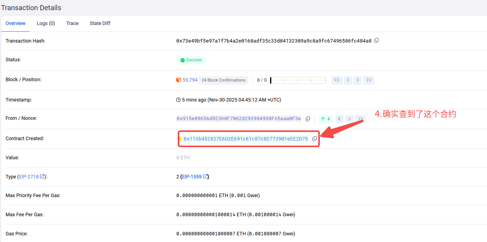

将上面的合约地址，拷贝到 Remix 的"At Address"中，在部署好的合约视图中，点击"getCount"获得数据(时间较长):

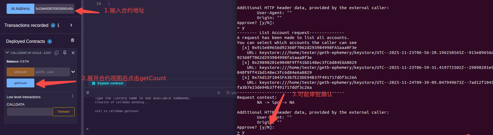

也可以测试"setCount"按钮，这个时候就需要输入测试账户的保护密钥了，这里不再演示。

3.利用 abigen 工具编译智能合约为 go 代码。

```s
  abigen -abi abi/calldemo.abi -type calldemo -pkg main -out go-getcount/calldemo.go
```

编写[main函数文件](go-getcount/main.go)。

4.运行 go 程序

进入当前的 go 目录下，执行如下命令:
```s
  go mod init calldemo
  go run *.go
```
然后就可以看到数据打印了。

> 也可以将连接的对象换成 "https://otter.bordel.wtf/erigon"，这个时候就不是从本地 Geth 节点拿数据了。

### 签名调用

在上面的例子中，由于不需要消耗 gas，因此调用的时候不明确身份信息是可以的。若想要明确身份，就要用私钥来签名。

编写[main函数文件](go-setcount/main.go)。

然后运行 go 程序，就可以创建这笔交易了。可以通过区块链浏览器查看这笔交易。

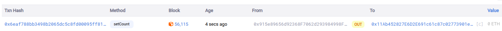

运行上面基本步骤中的程序，可能打印值还是"2026"，这可能是因为数据还没同步造成的。你可以直接在程序中访问"https://otter.bordel.wtf/erigon"查看，或者开启 Lighthouse 端进行同步。笔者测试过两种方式都是可以的(使用同步方式的话时间要久一些)。

### 订阅 event

event 除了帮助开发者进行合约调试外，在 DApp 中也可以通过监听 event 事件来获得合约内的状态变化。

想要进行事件订阅得有两个前提，其一是合约内必须写了 event，其二是 Geth 在启动时需要加参数`--ws`。ws是websocket的缩写，Geth 只有增加此参数才可以提供订阅服务。在`--wsaddr`和`--wsport`不填写的情况下，会默认使用"ws://localhost:8546"作为连接地址。

为了简化测试过程，这里不再经过 Geth 部署合约，而是由 Remix 直接连接到 Ephemery 测试网，将合约部署后启动 Geth 和 Lighthouse，将数据同步到本地，再通过 Remix 调用 Ephemery 测试网部署好的合约，并启动编写好的 go 程序监听来自"http://localhost:8545"上的事件。

> 区别是账户地址用的是另一个了，不过事件是只读，用不到密码，所以这种方式还是更方便一些。

创建一个[带事件的合约文件](sol/eventdemo.sol)，编译后拿到[ABI](abi/eventdemo.abi)，部署后拿到合约地址。

根据 abi 生成 go 代码，据此编写[main函数文件](go-event/main.go)。

启动 Geth 和 Lighthouse 客户端等待同步完成(需要一点时间，笔者这里大概15分钟左右)，之后运行 go 程序监听事件，在 Remix 上通过 "setAge" 设置为 223，观察 go 程序输出。

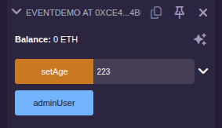

笔者这里输出如下:

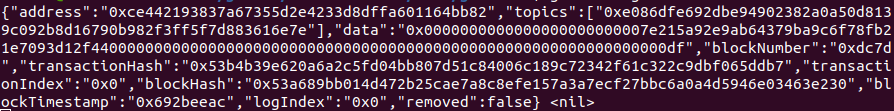

通过浏览器与Logs对比:

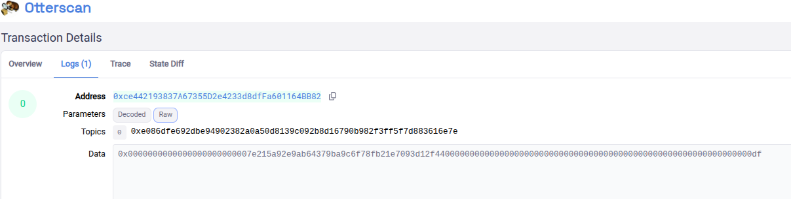

确认数据是一致的。

现在将 go 程序输出中的 data 字段中的数据拿出进行分析:
```s
0x0000000000000000000000007e215a92e9ab64379ba9c6f78fb21e7093d12f4400000000000000000000000000000000000000000000000000000000000000df
```
将0x以及这之后的一串0去掉(直到非0为止):
```s
7e215a92e9ab64379ba9c6f78fb21e7093d12f4400000000000000000000000000000000000000000000000000000000000000df
```
可以看到最前面的"7e215a92e9ab64379ba9c6f78fb21e7093d12f44"正是合约调用者的地址。将最后的数据"df"转换成十进制为"223"，正是测试时设置的数值。
