智能合约从开发到投入使用可以分为 4 步:
- 1.角色分析与业务分析: 角色分析是用来分析智能合约在使用中参与的角色。业务分析(功能分析)与角色分析往往要相互配合，根据业务情况，梳理参与角色，分析参与角色需要的业务功能。
- 2.合约设计: 合约设计主要是根据角色分析与业务分析得到结果，针对不同的业务设计不同的数据结构解决数据存储和使用的问题。
- 3.编码测试: 这一步主要是根据之前的分析和设计来编写智能合约，并测试功能。
- 4.安全审计: 由于智能合约开发对安全要求较高，所以除了开发者本身要提高安全素养外，往往在开发后也会将智能合约送交专门的安全审计公司来审计智能合约安全。安全审计的费用一般较高。

### 存入-取出

创建一个[合约文件](sol/deposit_withdraw.sol)并部署。

1.点击"deposit"存入 5 个 ETH，然后分别点击"getContractBalance"和"getUserBalance"(输入外部账户地址)查看合约中ETH数量及外部账户ETH数量，符合预期。

在浏览器中打开这笔交易的哈希信息:

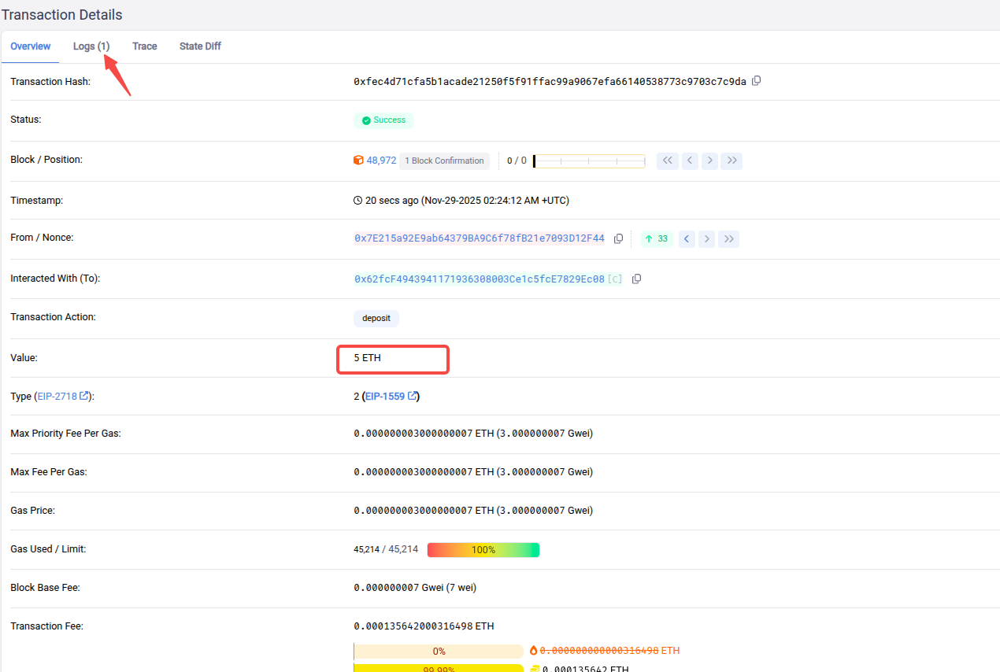

打开 Logs 选项卡，里面正是`emit Deposited(msg.sender, msg.value);`代码所打印出的信息:

2.点击"withdraw"取出 4000000000000000000Wei(4ETH)，然后分别点击"getContractBalance"和"getUserBalance"(输入外部账户地址)查看合约中ETH数量及外部账户ETH数量，符合预期。

在浏览器中打开这笔交易的哈希信息:

### 银行业务

模拟银行的存款、取款、转账业务操作。

创建一个[合约文件](sol/bankdemo.sol)并部署。

向一个账户存入 4000000000000000000 后查询:

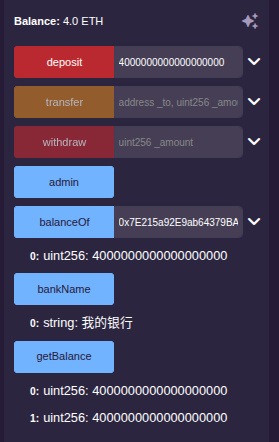

这个账户向另一个账户转账 3000000000000000000 后查询:

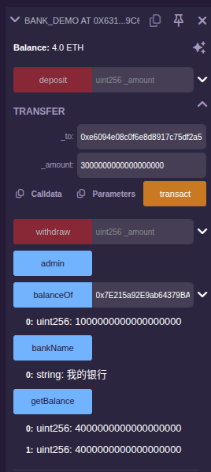

Remix ACOUNT 列表选择另一个账户，从账户中取出 1700000000000000000 后查询:

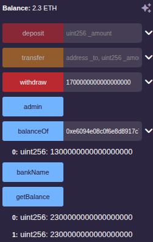

### 发红包

由合约创建者在创建合约时存入一笔资金作为红包，提供抢红包函数供合约调用者调用。

创建一个[合约文件](sol/redpacket.sol)。

将 msg.value 设置为 1000000000000000000，将红包数量设置为 2，点击"transact"部署合约。

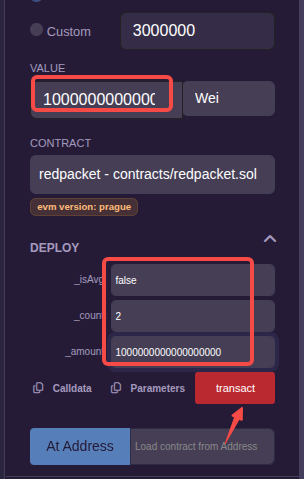

部署完成后，查看当前视图中的按钮:

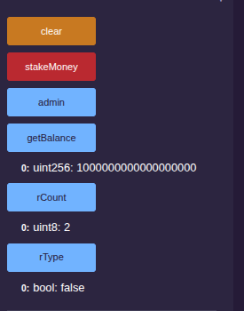

点击"stakeMoney"交易后，可以看到 rCount 由原来的 2 变成了 1，balance 也发生了变化(由 1 ether 变成了 0.7 ether，减少了 0.3 ether)。通过区块链浏览器查看这笔交易，可以看到减少的 ether 去向:

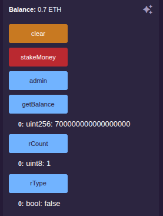

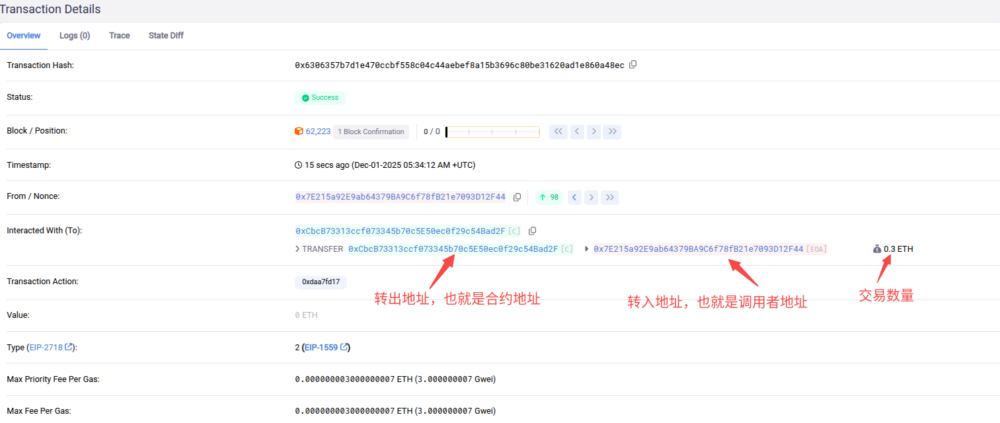

切换另一个账户，再次点击"stakeMoney"交易，可以看到 rCount 变成了 0，balance 也被取走了:

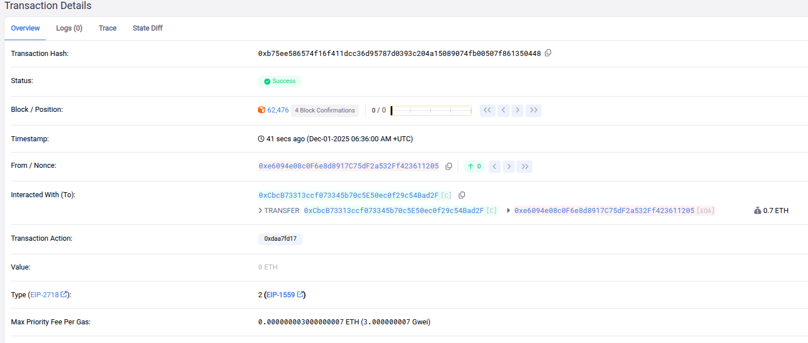

另外部署一个合约，点击"clear"，将会看到 rCount、balance 都被清空，资产被转到了合约创建者的地址。这里不作演示。

### 押大小

在这个合约中，存在两类角色，合约管理员和玩家，合约管理员部署合约类似于平台方，玩家又分为两个阵营，一部分人选大，另一部分人选小。

创建一个[合约文件](sol/bet.sol)。

在点击"stake"测试时，务必要大、小各至少"stake"一次，否则会产生除零错误。下图是押小的示意:

大、小各有押注后，就可以点击"open"开奖了。

### 拍卖

在这个合约中，存在四类角色，分别是:
- 拍卖师(Auctioneer): 合约的创建者(也就是竞拍的发起者)、竞拍的结束者
- 委托人(Seller): 拍卖利益的所得者
- 竞买人(Bidder): 竞价的人
- 买受人(Buyer): 在时限内，出最高价的竞买人

一共实现有三个函数，除了构造函数外，还有bid(竞买人调用)和auctionEnd(拍卖师调用)。

这里以外部账户地址为 0x915e89656d92368F7062d293984998FA5aaa0F3e 的作为 Seller，在未执行拍卖前，账户的 balance 为:

创建一个[合约文件](sol/auction.sol)并按如下方式部署(以上面的账户地址为 Seller，有限竞拍期限为 90s):

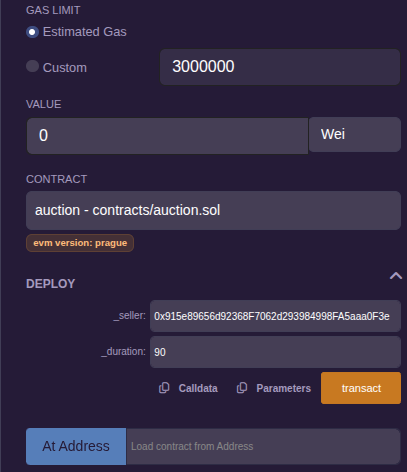

分别在合约创建约 40s 和 100s 后，点击"bid"按钮，发送的 msg.value 分别是 2000000000000000000(2 ether) 和 5000000000000000000(5 ether)，第一笔交易执行正确，第二笔交易会执行失败。

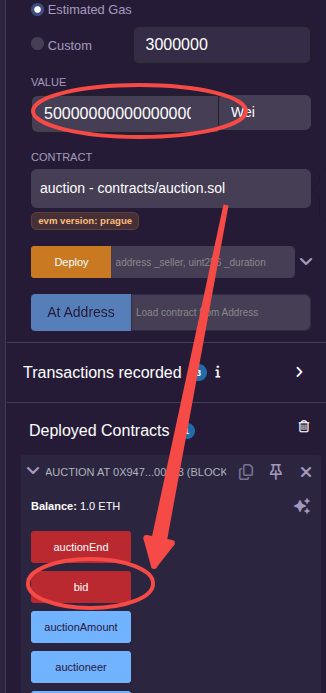

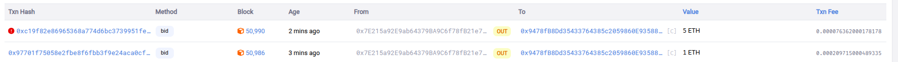

然后点击"auctionEnd"按钮，完成交易后再次查看 Seller 账户的 balance 信息(等待同步完成，可能需要一点时间):

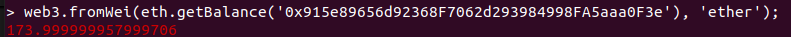

符合预期。

### gas 消耗

创建一个[合约文件](sol/sol_calc.sol)并部署。

内容很简单，就是输入不同的迭代次数，查看各自消耗的 gas。这里只在本地 Remix VM 进行简单测试。如下。

可以看出，计算量越大，消耗的 gas 越多。

### 合约升级

一个合约部署后地址是固定的，如果再部署一次，地址就变了。这里提供一种合约升级的方式，技术基础是要求合约之间互相能够调用。

所以谓合约升级是为了让用户无感知，也就是对外公布的地址是不能变的，是一种"伪升级"。

将合约拆分为代理合约、逻辑合约、存储合约三部分。
- 代理合约: 负责对外提供调用，调用内部的逻辑处理合约。
- 逻辑合约: 负责完成数据处理的工作。
- 存储合约: 负责存储实际要存储的数据。

接下来创建一个代理合约和一个数据合约来进行简单的合约升级示例。

为了方便测试，将代理合约和数据合约放到[同一个文件](sol/data.sol)中，先部署数据合约(data_demo)，再根据部署得到的数据合约地址部署代理合约(call_demo)。

部署第一个数据合约(data_demo)后，拿到合约地址:

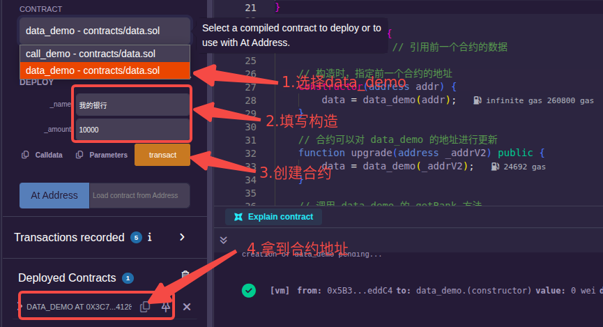

部署代理合约(call_demo):

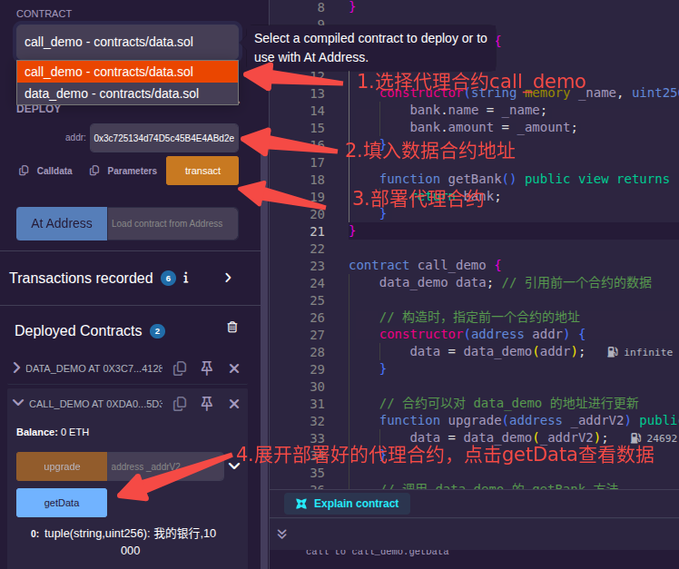

部署第二个数据合约(data_demo)后，拿到合约地址，打开先前部署好的代理合约，将新的合约地址填写到输入框，点击"upgrade"更新，再次点击"getData"查看数据:

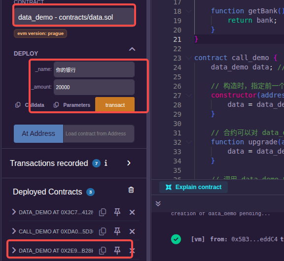

