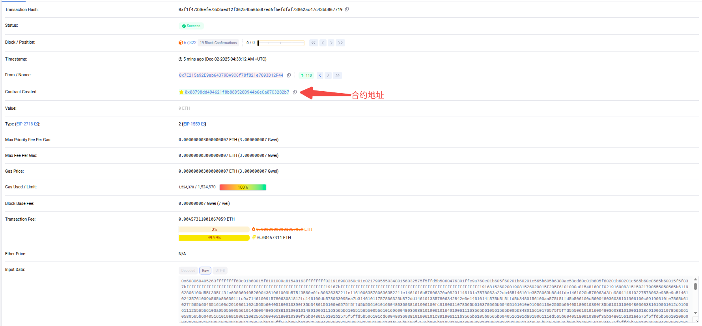
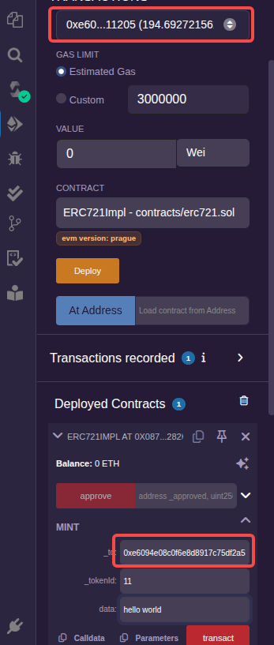
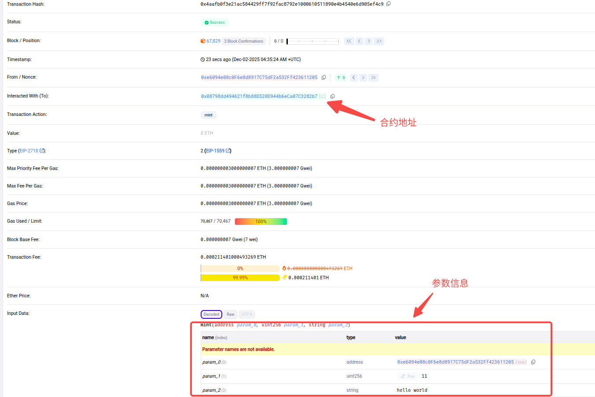
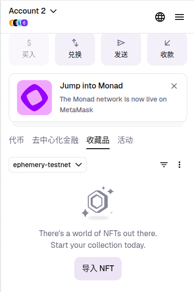
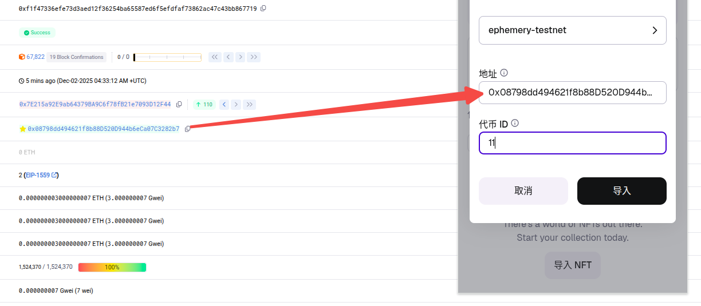
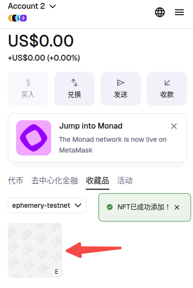
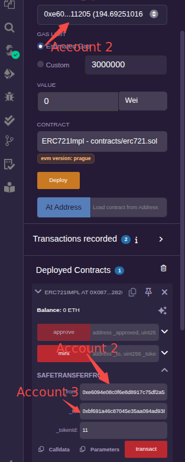
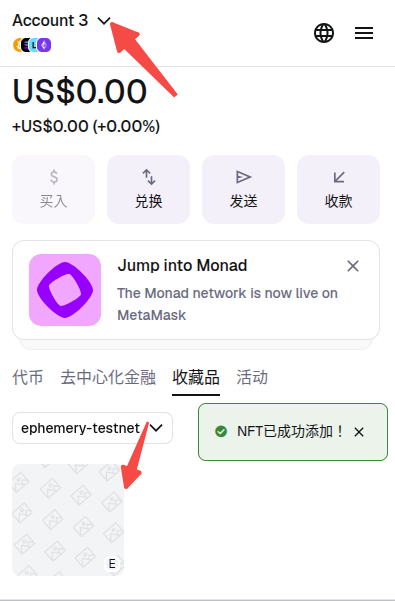

参考文档:
- [Ethereum Improvement Proposals](https://eips.ethereum.org/erc)
- [ERC-20: Token Standard](https://eips.ethereum.org/EIPS/eip-20)
- [ERC-165: Standard Interface Detection](https://eips.ethereum.org/EIPS/eip-165)
- [ERC-721: Non-Fungible Token Standard](https://eips.ethereum.org/EIPS/eip-721)

### ERC-20

ERC-20 是一种同质化代币标准，每一个同种 Token 所代表的价值是相同的，与之对应的是 ERC-721 这种非同质化代币标准。

ERC-20 标准可以理解为一个接口规范，凡是支持该接口规范的合约就相当于是一个符合 ERC-20 标准的代币。ERC-20 标准的接口内包含 3 个可选函数、6 个必选函数和 2 个事件。

3 个可选函数分别是 name、symbol、decimals，对应功能分别是名称、符号、精度。名称和符号就是表示代币的名称和代表符号，精度主要是用来表示小数点位数(由于Solidity语言不支持浮点数，因此需要单独定义一个精度来表示其小数点位数)。
```js
interface IERC20 {
  function name() external view returns (string memory);
  function symbol() external view returns (string memory);
  function decimals() external view returns (uint8);
}
```

6个必选函数是。

`totalSupply`函数: 用来返回 Token 的总发行量:
```js
function totalSupply() external view returns (uint256);
```

`balanceOf`函数: 用来获取某个账户的余额(代币的数量):
```js
function balanceOf(address _owner) external view returns (uint256);
```

`transfer`函数: 是转账函数，执行时将 msg.sender 持有的 Token 转移 _value 个给 _to 账户:
```js
function transfer(address _to, uint256 _value) external returns (bool successs);
```

`approve`函数: 是授权函数，msg.sender 将会授权 _spender 账户 _value 个 Token，这样 _spender 就拥有转移 msg.sender 持有代币的能力:
```js
function approve(address _spender, uint256 _value) external returns (bool success);
```

`allowance`函数: 用来查询授权的额度，可以查询 _owner 账户授权给 _spender 账户的额度:
```js
function allowance(address _owner, address _spender) external view returns (uint256 remaining);
```

`transferFrom`函数: 是授权转账函数，它执行的前提是 _from 账户已经授权给 msg.sender，并且额度在 _value 之上，_to 代表接收 Token 的账户:
```js
function transferFrom(address _from, address _to, uint256 _value) external returns (bool success);
```

approve、allowance、transferFrom 很明显是一套组合函数，在一些 Defi 项目中往往需要用户授权给 Defi 合约，这是因为在 Defi 合约内部往往需要转移用户持有的代币。值得注意的是，授权给一个未知账户地址是存在风险的。

2 个事件是。

当发生代币转账需要触发`Transfer`事件:
```js
event Transfer(address indexed _from, address indexed _to, uint256 _value);
```

当发生授权时需要触发`Approval`事件:
```js
event Approval(address indexed _owner, address indexed _spender, uint256 _value);
```

前端客户端可以订阅合约的事件，当代币发生变化时，钱包客户端会收到对应的推送，从而更新钱包页面显示的账户余额情况。

### ERC-165

ERC-165 是一个辅助类的标准化接口，用于检测智能合约是否完整支持某个接口。

ERC-165 只需要实现一个`supportsInterface`函数就可以了，该函数的参数 interfaceID 是接口ID。supportsInterface 函数的作用是输入一个接口ID，如果该接口已经实现，那么返回true，否则返回false。
```js
interface IERC165 {
  function supportsInterface(bytes4 interfaceID) external view returns(bool);
}
```

这里提供一个典型的`supportsInterface`的[使用示例](sol/supports_interface.sol)。说白了，就是在合约中实现接口函数`supportsInterface`。

> 需要注意的是，不允许注册值为 0xffffffff 的接口ID，如果使用 supportsInterface 验证时，若传入 0xffffffff 应返回假。

更复杂的[示例](sol/supports_interface2.sol)，分别传入"0x01ffc9a7"(IERC165接口ID)和"0x73b6b492"(Simpson接口ID)，都将返回 true。

### ERC-721

ERC-721 也是一个代币标准，通常被称为 NFT，通过 NTF-721 标准发行的每一个 NFT 都会有一个独立的编号，这一点与 ERC-20 标准是不同的。同质化代币适合用于积分类、量化数据类业务，而非同质化代币则更适合艺术品、独一无二类产品的业务场景。

整体上 ERC-721 接口一共分为 3 部分，分别是`ERC721`、`ERC721Metadata`、`ERC721Enumerable`。ERC721为必须实现的接口，ERC721Metadata代表元数据，是可选接口，ERC721Enumerable代表NFT的可统计，也是可选接口。

ERC721Metadata接口包含`name`、`symbol`、`tokenURI`。name和symbol是NFT的名称和符号，tokenURI则是用来获取某tokenId对应的资源地址，它的返回值通常指向一个JSON文件，用以描述该NFT的特性，包括标题、类型、属性等。
```js
interface ERC721Metadata /* is ERC721 */ {
  function name() external view returns (string _name);
  function symbol() external view returns (string _symbol);
  function tokenURI(uint256 _tokenId) external view returns (string);
}
```

ERC721Enumerable接口包含`totalSupply`、`tokenByIndex`、`tokenOfOwnerByIndex`。totalSupply代表NFT总的发行数量，tokenByIndex用于获取某个编号对应的NFT标识，tokenOfOwnerByIndex用于获取某个账户的某个编号的NFT标识。
```js
interface ERC721Enumerable /* is ERC721 */ {
  function totalSupply() external view returns (uint256);
  function tokenByIndex(uint256 _index) external view returns (uint256);
  function tokenOfOwnerByIndex(address _owner, uint256 _index) external view returns (uint256);
}
```

ERC721接口定义如下:
```js
interface ERC721 /* is ERC165 */ {
  event Transfer(address indexed _from, address indexed _to, uint256 indexed _tokenId);
  event Approval(address indexed _owner, address indexed _approved, uint256 indexed _tokenId);
  event ApprovalForAll(address indexed _owner, address indexed _operator, bool _approved);
  function balanceOf(address _owner) external view returns (uint256);
  function ownerOf(uint256 _tokenId) external view returns (address);
  function safeTransferFrom(address _from, address _to, uint256 _tokenId, bytes data) external payable;
  function safeTransferFrom(address _from, address _to, uint256 _tokenId) external payable;
  function transferFrom(address _from, address _to, uint256 _tokenId) external payable;
  function approve(address _approved, uint256 _tokenId) external payable;
  function setApprovalForAll(address _operator, bool _approved) external;
  function getApproved(uint256 _tokenId) external view returns (address);
  function isApprovedForAll(address _owner, address _operator) external view returns (bool);
}
```

[这个文件](sol/erc721.sol)简单示例了必选接口的实现过程。

查询接口实现。`balanceOf`用于返回某用户持有NFT的数量，`ownerOf`用于查询某NFT对应的属主，`getApproved`用于查询授权信息，`isApprovedForAll`用于查询全部授权情况。
```js
function balanceOf(address _owner) override external view returns (uint256) {
    return ercTokenCount[_owner];
}
function ownerOf(uint256 _tokenId) override external view returns (address) {
    return ercTokenOwner[_tokenId];
}
function getApproved(uint256 _tokenId) override external view returns (address) {
    return ercTokenApproved[_tokenId];
}
function isApprovedForAll(address _owner, address _operator) override external view returns (bool) {
    return ercOperatorForAll[_owner][_operator];
}
```

可授权和可转账修饰符实现。因为转账或授权时，涉及的因素较多，不仅仅是属主具备权限(具有授权或转账的能力)，被授权方也具备相关权限(具有转账的能力)。这里实现两个自定义修饰符，其中`canOperator`用于控制授权，授权者要么是NFT的属主，要么已经全部授权给了msg.sender。`canTransfer`用于控制转账的权限，NFT的持有者、NFT被授权者及全部信息授权者都有转账的资格。
```js
// 授权
modifier canOperator(uint256 _tokenId) {
    address owner = ercTokenOwner[_tokenId];
    require(msg.sender == owner || ercOperatorForAll[owner][msg.sender]);
    _;
}
// 转账
modifier canTransfer(uint256 _tokenId, address _from) {
    address owner = ercTokenOwner[_tokenId];
    require(owner == _from, "token's owner is not _from");
    require(msg.sender == owner || ercTokenApproved[_tokenId] == msg.sender || ercOperatorForAll[owner][msg.sender]);
    _;
}
```

授权实现。单个NFT的授权可以使用`approve`来完成，通过canOperator修饰符来控制权限，授权通过ercTokenApproved来记录，发生授权行为时，需要触发`Approval`事件。全部授权通过`setApprovalForAll`来设置，修改ercOperatorForAll结构的同时还要触发`ApprovalForAll`事件。
```js
function approve(address _approved, uint256 _tokenId) override canOperator(_tokenId) external payable {
    ercTokenApproved[_tokenId] = _approved;
    emit Approval(msg.sender, _approved, _tokenId);
}

function setApprovalForAll(address _operator, bool _approved) override external {
    ercOperatorForAll[msg.sender][_operator] = _approved;
    emit ApprovalForAll(msg.sender, _operator, _approved);
}
```

转账实现。转账也就是将NFT的归属权转移，这里先实现一个internal类型的内部转账函数 _transferFrom，通过canTransfer修饰符来限定转账权限。转账发生时，属主变更，同时转出方持有的NFT数量减少，转入方持有的NFT数量增加。转账完成时要取消掉之前关于该NFT的授权，否则该NFT仍然有被授权方转移的风险。转账结束后要触发`Transfer`事件。`transferFrom`的实现直接调用 _transferFrom 就可以了。
```js
function transferFrom(address _from, address _to, uint256 _tokenId) override external payable {
    _transferFrom(_from, _to, _tokenId);
}

function _transferFrom(address _from, address _to, uint256 _tokenId) internal canTransfer(_tokenId, _from) {
    ercTokenOwner[_tokenId] = _to;  // 更改属主
    ercTokenCount[_from] -= 1;
    ercTokenCount[_to] += 1;
    // 取消授权
    ercTokenApproved[_tokenId] = address(0);

    emit Transfer(_from, _to, _tokenId);
}
```

安全转账实现。与前面的转账相比，安全转账`safeTransferFrom`多了一层检验，当接收方地址是一个普通的外部钱包地址时，两者没有区别，当接收方地址是一个合约时，此时就需要验证对方的有效性。在这里，需要有两个判断，其一是判断接收方地址是否为合约地址，其二是判断接收方地址是否有资格。第二条需要通过`ERC721TokenReceiver`接口来检测，只要接收方地址实现了该接口就具备接收资格。接口定义如下，`onERC721Received`函数在接收方合约内必须实现，并且返回该函数的签名。
```js
interface ERC721TokenReceiver {
    function onERC721Received(address _operator, address _from, uint256 _tokenId, bytes memory _data) external returns (bytes4);
}
```
同样先实现一个内部函数 _safeTransferFrom 完成安全转账功能(内部先调用 _transferFrom，再检查资格):
```js
function _safeTransferFrom(address _from, address _to, uint256 _tokenId, bytes memory data) internal {
    // EOA 总是可以接收 NFT，因为用户可以通过钱包应用管理。所以如果 _to 是 EOA 地址，直接转账成功。
    _transferFrom(_from, _to, _tokenId);

    // 如果 _to 是不支持NFT(未实现ERC721TokenReceiver的onERC721Received接口)的合约账户地址，那么 NFT 会被永久锁定。所以需要检测。
    if (_to.code.length > 0) {
        // ERC721TokenReceiver(_to)表示将_to转换为ERC721TokenReceiver合约地址，从而可以调用该合约地址中的onERC721Received函数
        bytes4 retval = ERC721TokenReceiver(_to).onERC721Received(msg.sender, _from, _tokenId, data);
        require(retval == ERC721TokenReceiver.onERC721Received.selector, "retval not equal onERC721Received's interfaceID"); // 断言返回值是否正确
    }
}
```
接下来实现两个`safeTransferFrom`函数，其中参数 data 是一个字节数组类型的数据，可以在转账时携带一些信息传递给接收方，类似于在现实中转账时的附言。
```js
function safeTransferFrom(address _from, address _to, uint256 _tokenId, bytes memory data) override external payable {
    _safeTransferFrom(_from, _to, _tokenId, data);       
}

function safeTransferFrom(address _from, address _to, uint256 _tokenId) override external payable {
    _safeTransferFrom(_from, _to, _tokenId, "");
}
```

空投实现。这里实现一个 mint 函数空投 NFT 用来解决初始化流通问题。在编写时主要验证接收方地址的有效性和资格，同时变更属主信息。空投完成后，仍然要触发Transfer事件。
```js
function mint(address _to, uint256 _tokenId, bytes memory data) external payable {
    require(_to != address(0), "_to is a zero address");
    require(ercTokenOwner[_tokenId] == address(0), "_tokenId already exists");

    ercTokenOwner[_tokenId] = _to;
    ercTokenCount[_to] += 1;

    if (_to.code.length > 0) {
        bytes4 retval = ERC721TokenReceiver(_to).onERC721Received(msg.sender, address(0), _tokenId, data);
        require(retval == ERC721TokenReceiver.onERC721Received.selector, "retval not equal onERC721Received's interfaceID");
    }

    emit Transfer(address(0), _to, _tokenId);
}
```
至此实现了 NFT 标准的必选接口。

接下来通过 MetaMask 钱包进行测试。这里将 ERC721Impl 合约(使用Account 1)部署后选择 mint 接口进行测试。

在区块链浏览器上找到合约信息:



> 因为 ERC721 的实现比较简陋，所以在测试时需要遵守一些要求。

在填写时，需要保证 Remix 的 ACCOUNT 与 _to 一致，如果不一致，nft 的属主为 Remix 中的 ACCOUNT(这里使用Account 2)。另外，_tokenId 是独一无二的，如果之前有填写创建过，则必须更改成其他没有重复的。填好后，点击"transact"确认交易。



在区块链浏览器上通过账户2找到关于这一笔交易的信息:



打开 MetaMask 钱包，切换到 Account 2 下，切换到"收藏器"选项卡，点击"导入NFT":



在弹出的"导入NFT"框中，"选择网络"，将"地址"和"代币 ID"填入，点击"导入":



然后就可以看到自己的 nft 了:



接下来，测试一下转账。这里选择 safeTransferFrom 接口，将上面的 nft 转到 Account 3 中。

像下面这样填好后，点击"transact"交易:



查看 MetaMask 钱包，可以看到 Account 2 中已经没有那个 nft 了。切换到 Account 3，像上面一样填入nft信息(网络、地址、代币ID均不变)，就可以看到 nft 添加成功了:


