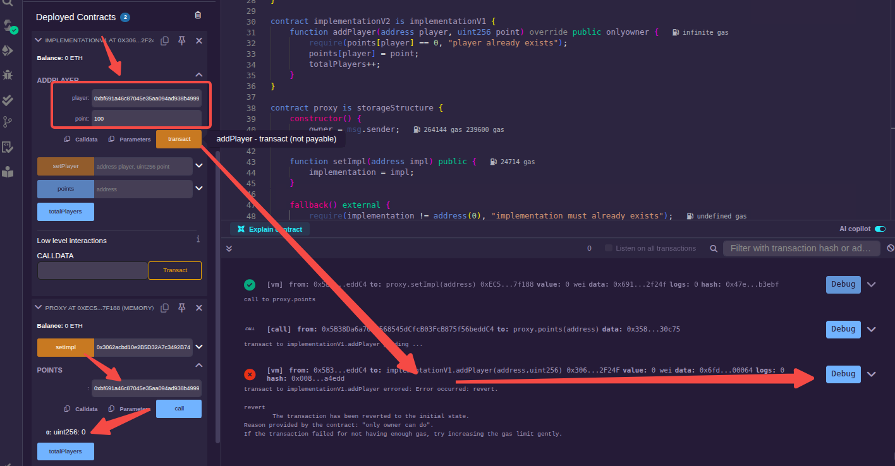
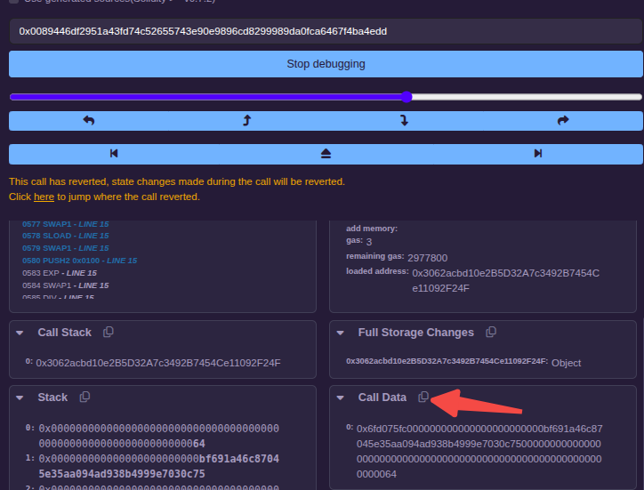
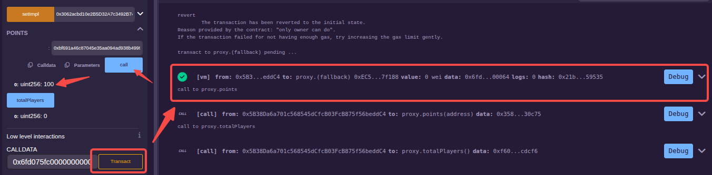
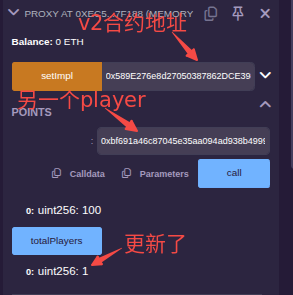
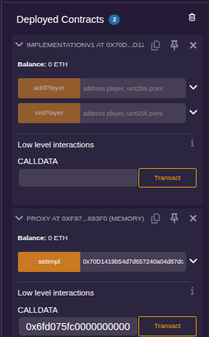

智能合约一旦发布后是不可变更的，如果修改了智能合约代码，那么就需要重新部署智能合约，部署后得到一个新的合约地址，这个新合约与原部署的合约其实是没关系的。从这个角度来说智能合约是不可升级的。但是，从技术角度出发，是可以做到让"表面"上的合约地址不变，其内部逻辑代码发生改变，这也正是智能合约升级的思路。

### 跨合约调用

由于区块链技术的限制，如果仅仅是一个独立的合约，无论如何也做不到可升级。若想实现可升级合约，必须将多个合约设计在一起，形成一个整体对外提供服务。对外服务的合约地址永远不变，内部逻辑合约可以代码升级。

通过智能合约调用另外一个合约，只要知道该合约接口(源码)和地址就可以很方便地调用。

这里创建一个[文件](sol/callA.sol)，里面包含两个合约，其中合约 A 作为被调用的合约，合约 callA 作为调用的合约。

将两份合约部署。将合约 A 部署后的合约地址作为参数传入 callA 合约中，测试并结合区块链浏览器观察。

一般情况下，写方法的返回值在外部调用时是拿不到的，但是在跨合约调用时，发起调用方是能够拿到返回值的，也正是因为这样，跨合约调用才能控制完整的事务。

### 通过底层函数调用合约

"跨合约调用"中靠接口调用的方式要求接口固定，而很多时候我们期望调用的合约，不一定完全知道被调方的接口情况。Solidity提供了更为底层的函数来处理这类情况。

通常情况下，人们会使用`call`或`delegatecall`来处理更为底层的跨合约调用，二者的区别是 call 会修改调用数据的 msg.sender，将其替换为当前合约，然后调用新合约的方法，delegatecall 则不会修改调用的数据，它属于完全委托调用。一般在编写跨合约调用代码时，会使用 call。call 函数的参数通常需要借助`abi.encodeWithSignature`函数对数据进行编码。两个函数的原型如下。
```js
addr.call(bytes calldata);
addr.delegatecall(bytes calldata);
```
两个底层调用函数的返回值都是两个，第一个参数是 bool 值，告知调用方是否执行成功，第二个参数是 bytes 数据，出错时会返回错误信息。在执行底层调用时，一定要检测返回值，尤其是第一个参数。

这里创建一个[文件](sol/callX.sol)，里面包含两个合约，其中合约 A 作为被调用的合约不变，合约 callX 作为调用的合约。可以看到 callX 合约在调用时没有了被调合约的名称(这里是"A")。

像上面一样部署后测试。

### 主-从式可升级合约

这种设计就是主合约部署后永远不变，在主合约内部可以记录从合约的地址，主要业务逻辑通过从合约来实现，可以是"一主一从"或"一主多从"。

这里创建一个[文件](sol/upgrade.sol)，IA定义了一组接口，upgrade是一个主合约，将一个实现了IA接口的合约(从合约)的地址，作为参数传递给upgrade的构造函数或通过update接口更新，实现合约的升级。

### 代理-存储式可升级合约

这种模式适合更复杂多变的业务场景，采用三层合约结构设计，包括代理合约、逻辑合约和存储结构合约。
- 代理合约: 永恒不变，提供永久存储并负责委托调用逻辑合约，对应用程序提供访问接口。
- 逻辑合约: 负责数据处理。
- 存储结构合约: 负责定义存储结构，并被逻辑合约和代理合约继承。

如何通过代理合约自动调用逻辑合约内的函数？一种简单直接的方式是在代理合约内把逻辑合约的函数调用依次实现，但这样太烦琐了，而且逻辑合约在未来会出现需要升级的情形，尤其是接口需要改变时，代理合约的代码也需要跟着变，显然以这种方式实现的代理合约是需要重新发布而不能保持永恒不变的。

这种情况下，可以借助`delegatecall`函数来传递调用信息去调用逻辑合约。另外结合Solidity语言提供的两个特殊的函数:`receive`和`fallback`，可以达到即使逻辑合约增加方法，代理合约的代码也无须改变的交易。两个函数的原型如下:
```js
receive() external payable;
fallback() external [payable];
```

当一个合约实现了 receive 函数时(即使为空)，可以接受外部钱包账户的ETH转入，就像一个普通的EOA地址一样，因此 receive 函数都是 payable 的。当 receive 函数未实现，但仍想接受外部账户转账时，此时可以实现 fallback 函数(即使为空)，并用 payable 修饰。

可以看出，fallback 函数的作用主要体现在兜底，当外部调用合约时传入的函数签名(msg.data的前4个字节)无法匹配到任何函数时，将会调用 fallback 函数。

在外部调用代理合约时，传入的调用数据是调用逻辑合约的某个函数，此时会调用代理合约内已经实现的 fallback 函数(如果已经实现)。在 fallback 函数内，通过 delegatecall 函数去完成逻辑合约的委托调用。这样处理起来，代理合约不必关心逻辑合约到底实现了什么方法，通通 delegatecall 就可以了。

接下来对流程做一个说明，合约文件在[这里](sol/proxy.sol)。

首先，定义一个结构存储合约。存储结构合约不需要实现具体的逻辑功能，只需要完成数据定义就可以了。在这个合约内定义一个管理员，用一个mapping结构的points来记录球员分数，使用totalPlayers来记录球员数量，implementation则是代表逻辑合约的地址。
```js
abstract contract storageStructure {
    address internal implementation; // 逻辑合约地址
    mapping(address => uint256) public points;
    uint256 public totalPlayers;
    address internal owner;
}
```

然后，实现第一个版本的逻辑合约。逻辑合约继承了存储结构合约，这样结构合约内的变量在逻辑合约内也存在。在逻辑合约内实现了一个仅限管理员操作的修饰符以及用于操作player的两个函数addPlayer和setPlayer。
```js
contract implementationV1 is storageStructure {
    modifier onlyowner() {
        require(msg.sender == owner, "only owner can do");
        _;
    }

    function addPlayer(address player, uint256 point) public onlyowner virtual {
        require(points[player] == 0, "player already exists");
        points[player] = point;
    }

    function setPlayer(address player, uint256 point) public onlyowner {
        require(points[player] != 0, "player must already exists");
        points[player] = point;
    }
}
```

最后，编写代理合约。代理合约也要继承存储结构合约，这样代理合约和逻辑合约就有相同的数据层。这就相当于，代理合约委托调用逻辑合约实际修改的是代理合约的数据层。代理合约在构造函数中对owner进行初始化，setImpl函数用来设置当前使用的逻辑合约，fallback函数内则是直接将msg.data数据委托给逻辑合约来处理。
```js
contract proxy is storageStructure {
    constructor() {
        owner = msg.sender;
    }

    function setImpl(address impl) public {
        implementation = impl;
    }

    fallback() external {
        require(implementation != address(0), "implementation must already exists");
        (bool success, ) = implementation.delegatecall(msg.data);
        require(success, "delegatecall failed");
    }
}
```

接下来进行测试。

将合约文件编译后，先部署implementationV1合约，得到该合约的地址。再部署proxy合约，然后将implementationV1合约的地址通过setImpl函数进行设置。

将用于测试的player地址(0xbf691a46c87045e35aa094ad938b4999e7030c75)在proxy合约的points中查询，可以看到值为0。在implementationV1合约视图的addPlayer函数中填入数据(0xbf691a46c87045e35aa094ad938b4999e7030c75,100)，点击"transact"按钮执行。由于implementationV1合约内的owner并未初始化，因此会发生错误。



点击错误后的"Debug"按钮，在DEBUGGER页面找到`Call Data`区域，点击拷贝:



将拷贝的数据粘贴到某处查看，如下:
```js
[
	"0x6fd075fc000000000000000000000000bf691a46c87045e35aa094ad938b4999e7030c750000000000000000000000000000000000000000000000000000000000000064"
]
```
这一串hex字符串即是编码后的input数据，也就是 msg.data。它的首端部分(0x6fd075fc)对应函数签名，中间部分(bf691a46c87045e35aa094ad938b4999e7030c75)是传入的player地址，末端部分(64)是分数100(100的十六进制是0x64)。

将上面的hex串拷贝后，填入proxy合约视图中"Low level interactions"下`CALLDATA`下的输入框内，点击"Transact"。在终端可以看到有成功的提示，再次通过player地址在proxy合约视图中查询，就可以看到分数为100了。



但是因为"疏忽"，totalPlayers并未增加，这里编写新的逻辑合约implementationV2进行升级。implementationV2继承implementationV1，只覆盖addPlayer函数。
```js
contract implementationV2 is implementationV1 {
    function addPlayer(address player, uint256 point) override public onlyowner {
        require(points[player] == 0, "player already exists");
        points[player] = point;
        totalPlayers++;
    }
}
```

测试时，部署implementationV2合约，获得合约地址，在之前部署好的proxy合约中设置新的逻辑合约地址，按照流程测试就可以了。



实际的合约应该做好对调用的控制以及状态变量的访问限制，这里将上面的合约文件修改后，完善成另一个[文件](sol/proxy2.sol)。部署后的合约视图如下:



可以看到，逻辑合约中的函数以及存储结构合约中的数据都不再公开了，所有的接口都使用"CALL DATA"进行委托调用。实际上，input数据就是函数签名与输入参数以一定格式编码后的结果。也就是说，input数据可以认为是已知的，因为函数签名(可计算得到)和输入参数都是已知的。

上面的addPlayer和setPlayer设置访问控制为public，而没有设置成internal。原因是声明为internal的函数没有外部 ABI 签名，不能被外部合约或者其他语言(如Go、Python、JavaScript)调用。也不能生成函数选择器，故而即便知道了函数签名也没用。
