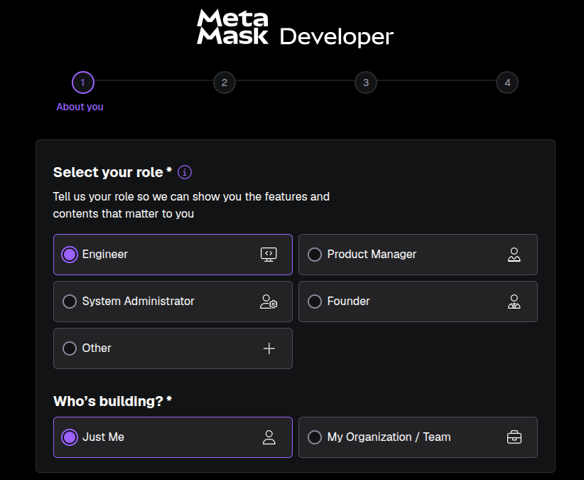
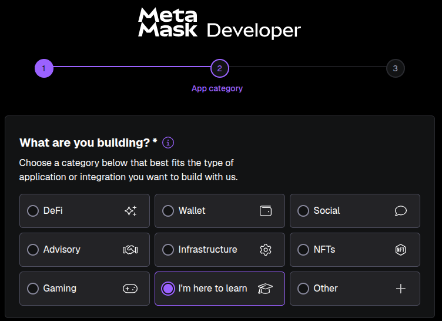
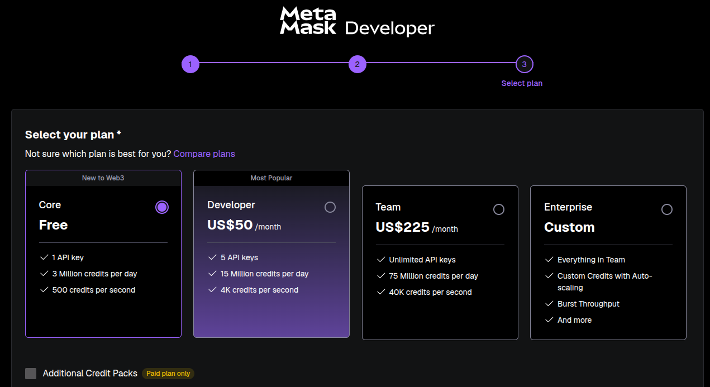
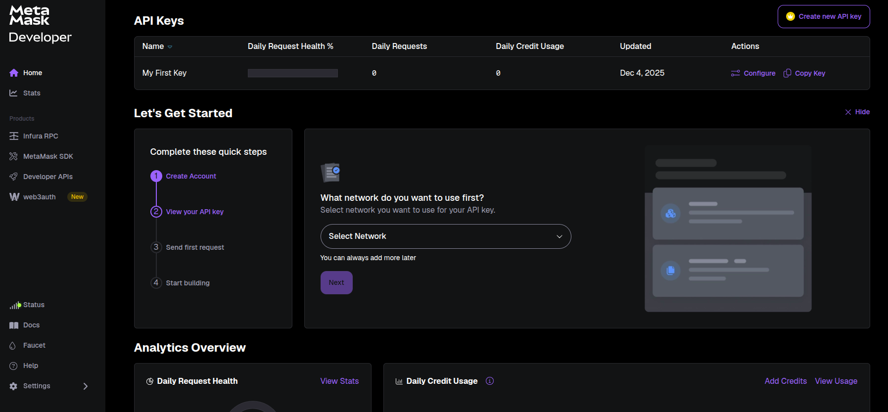
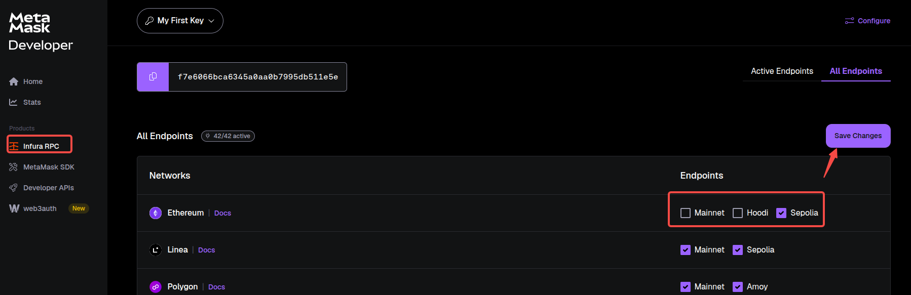
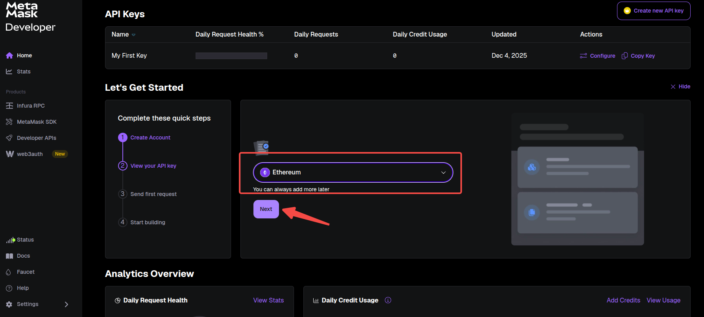
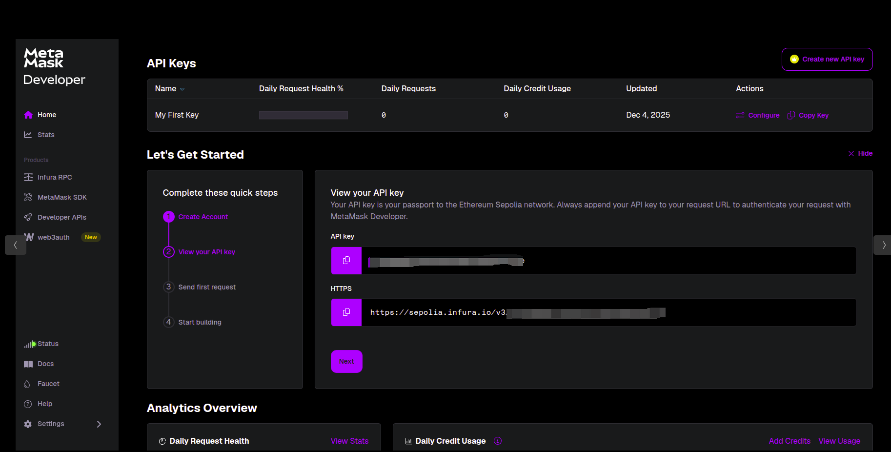
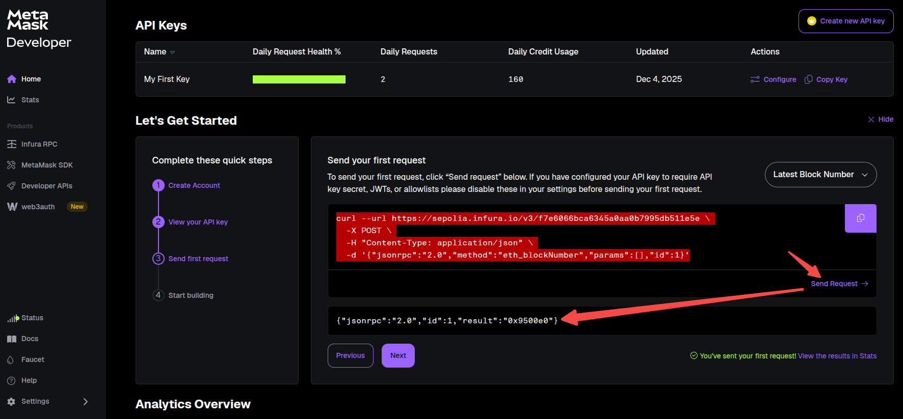
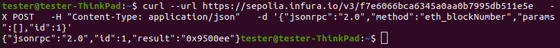
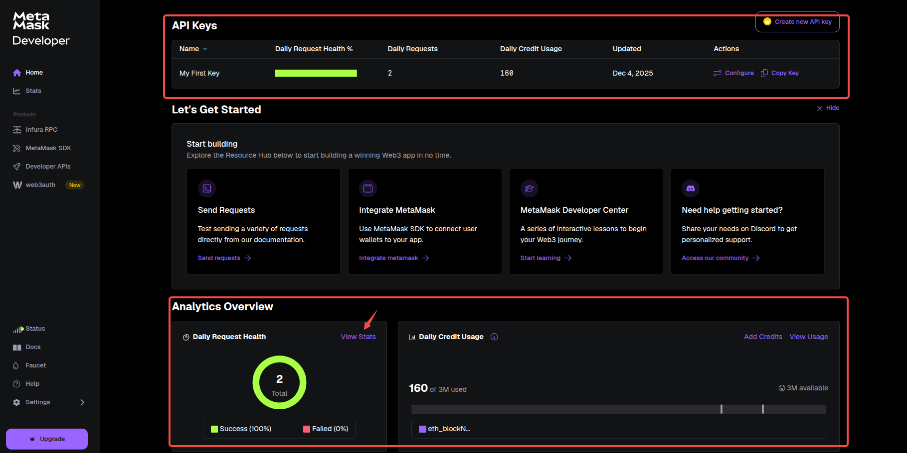

Infura 是一种 IaaS 产品，目的是降低开发者和用户访问以太坊数据的门槛。通俗地说，Infura 作为供应商，可以利用其背后庞大的负载均衡网络，让开发者的 DApp 快速接入以太坊网络，而不需要在本地运行昂贵的以太坊节点。包括 MetaMask、Uniswap 等著名的 Web3 应用都利用了 Infura 的 API 服务。

Infura 在使用时首先要到[Infura官网](https://www.infura.io/)注册，创建项目并获取"API KEY"。开发者可以将 Infura 提供的"API KEY"设置到环境变量中使用。

注册完成之后，在认证邮箱时需要填写一些信息:







这里选择免费版，只能获得一个"API KEY"填写完成点击创建后，会自动跳转到如下主页面。



点击左侧"Infura RPC"可以看到当前"Ethereum"支持主网、Hoodi、Sepolia三个网络，这里只选择 Sepolia 测试网。点击保存:



回到主页面，在这个下拉列表中选择"Ethereum"，点击"Next":



然后就可以看到 url(包含了 API KEY) 和 API KEY 了，点击"Next":



点击"Send Request"测试 url 连通性(也可以将命令行拷贝后在 linux 终端测试)。没问题后点击"Next"创建完毕。





创建完成后，可以在主页面上看到创建的"API KEY"以及关于"API KEY"的统计信息。免费版每天有 300,0000 信用值，当前只使用了 160 信用值。



更多统计信息可以点击"View Status"查看。

接下来，通过 Python Web3 简单测试连通性(在 HTTPProvider 中填入上面 url):
```py
tester$ python3
Python 3.8.10 (default, Mar 18 2025, 20:04:55) 
[GCC 9.4.0] on linux
Type "help", "copyright", "credits" or "license" for more information.
>>> from web3 import Web3
>>> w3 = Web3(Web3.HTTPProvider({url}))
>>> w3.is_connected()
```
当看到返回 True 时，就代表连接成功了。笔者这里测试是返回 True 的。
