创建和使用 MetaMask 钱包。

### 添加扩展程序

打开 Chrome 浏览器，通过搜索或`https://metamask.io/`进入官网:

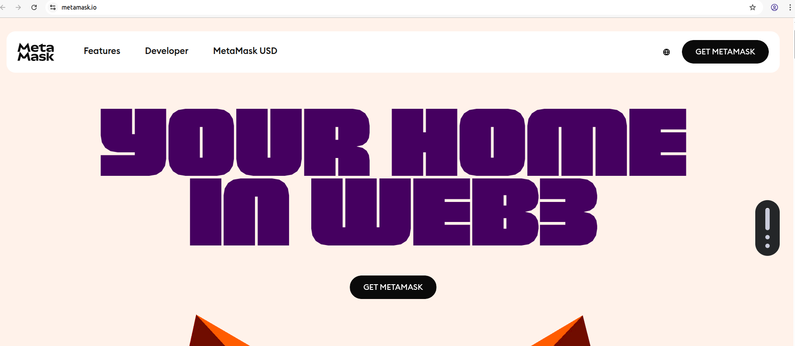

点击"GET METAMASK"跳转到谷歌商店。找到`Add to Chrome`点击:

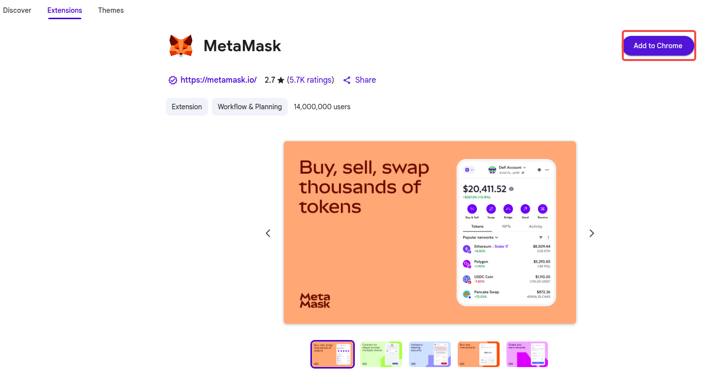

稍等片刻后会创建并跳转到如下的新页面，表示成功:

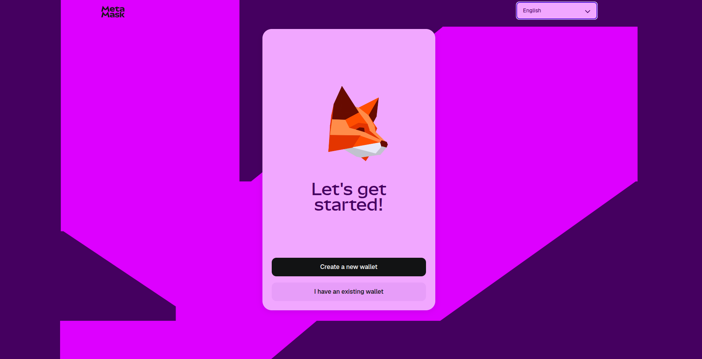

### 创建钱包

接着上面的步骤的新页面，切换到中文简体:

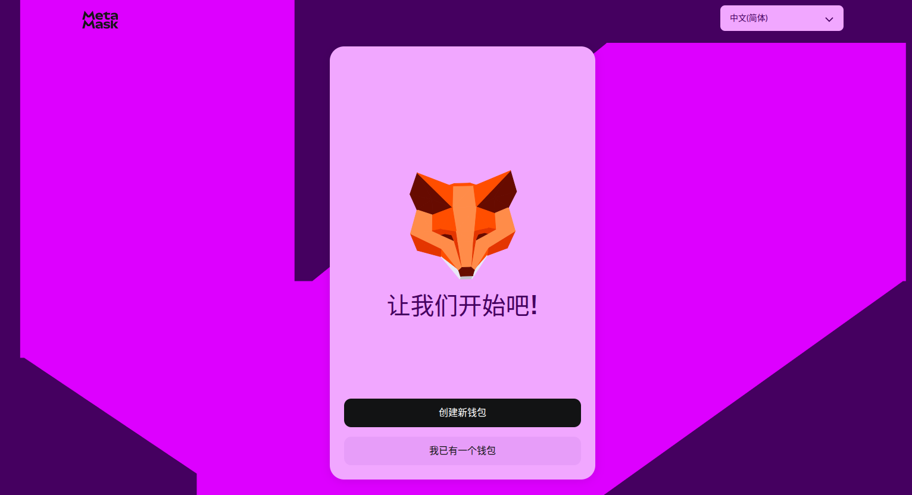

点击"创建新钱包"。选择"使用私钥助记词"点击:

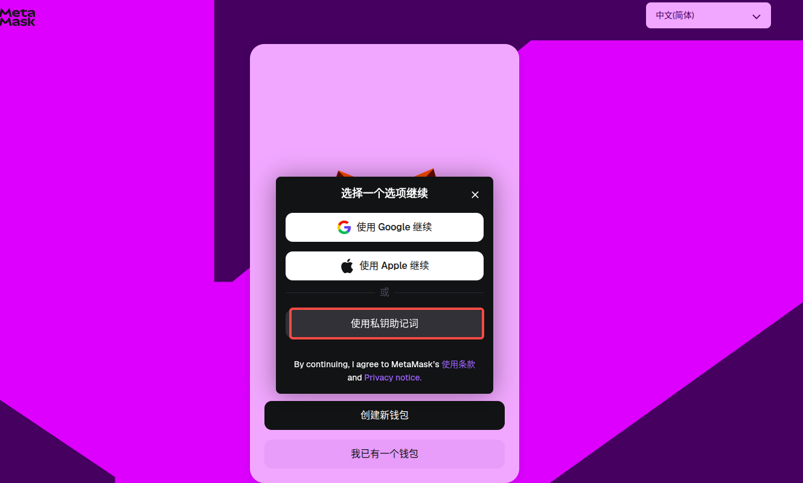

填写用于在当前设备上保护私钥的密码，点击"创建密码":

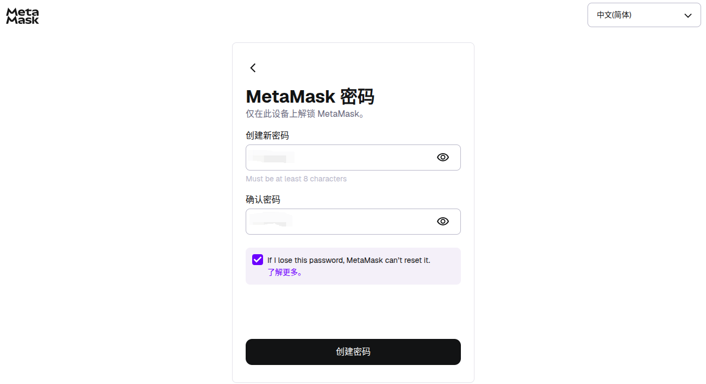

跳转到如下页面，点击模糊屏，保存好自己的助记词后，点击"继续":

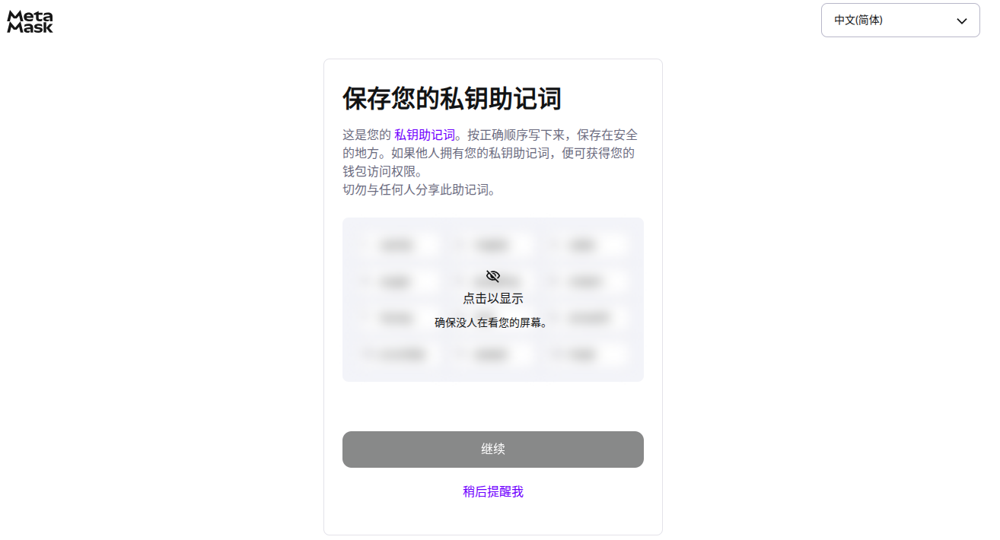

之后跳转到如下页面，选填助记词后点击"继续":

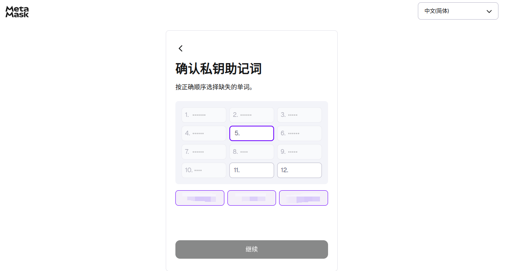

进入到如下页面，点击"完成":

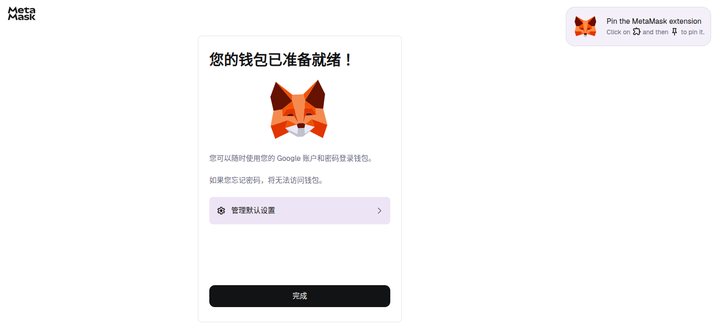

创建后的钱包，进入的页面:

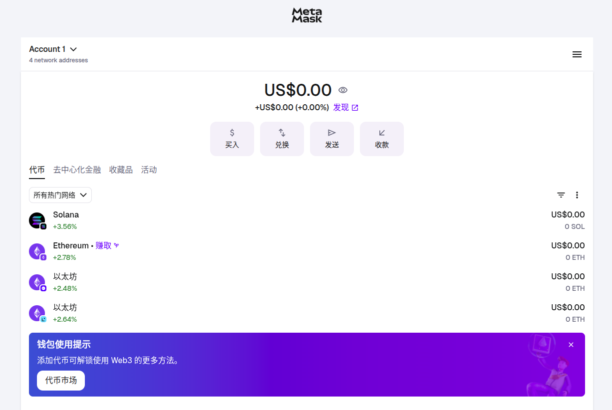

### 添加代币

以将 Tether 添加到 MetaMask 钱包为例。

打开[coin market cap](coinmarketcap)，找到 Tether:

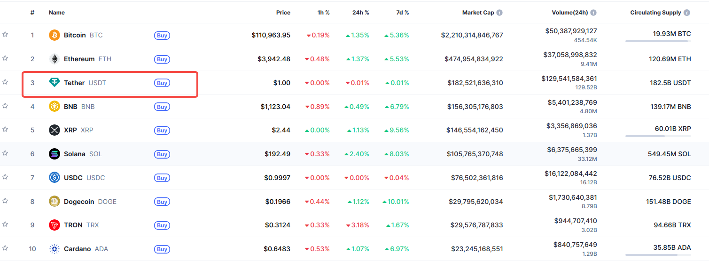

点击跳转页面后，点击 Wallet 后的下拉按钮，可以看到 Tether 是支持添加到 MetaMask 钱包中的:

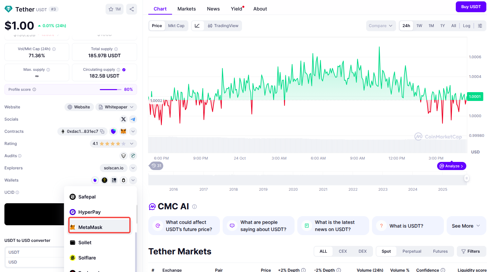

找到 Tether 的合约地址，复制:

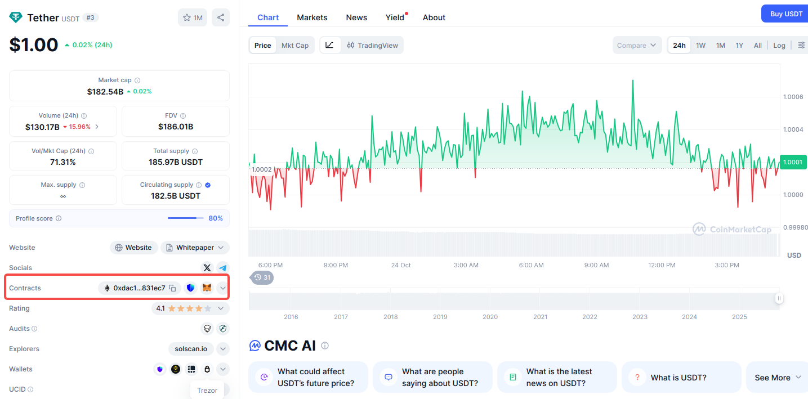

打开 MetaMask 钱包，点击三个点，点击"添加代币":

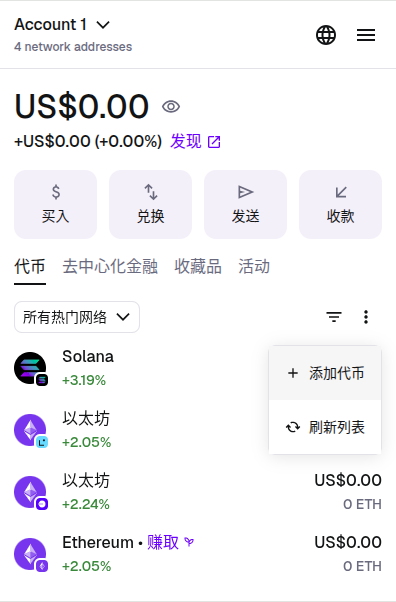

将合约地址粘入，选中复选框，点击"下一步":

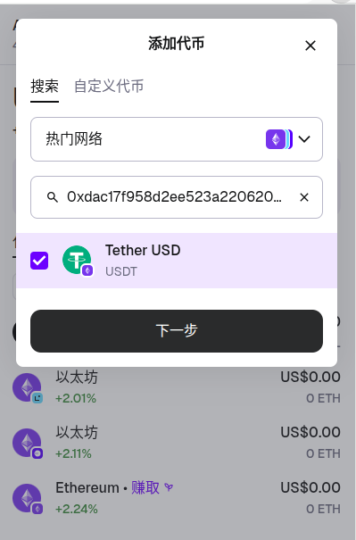

点击"导入":

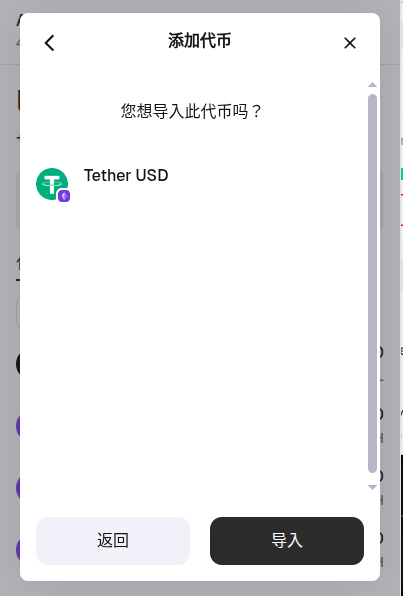

可以看到导入后的结果:

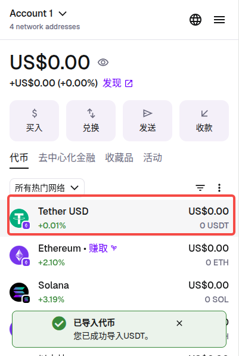

### 添加网络

