创建和使用 OKX Wallet 钱包。

### 添加扩展程序

打开 Chrome 浏览器，通过 Google 搜索找到 OKX wallet 官网点击进入:

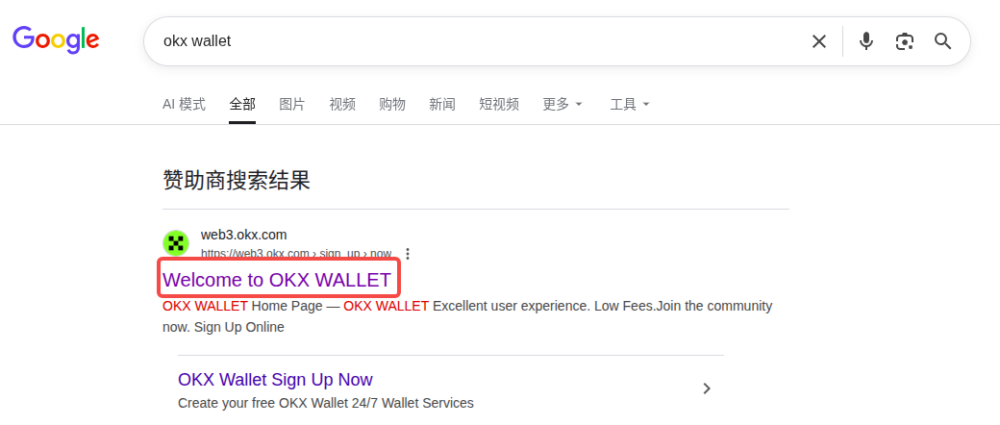

点击"join now":

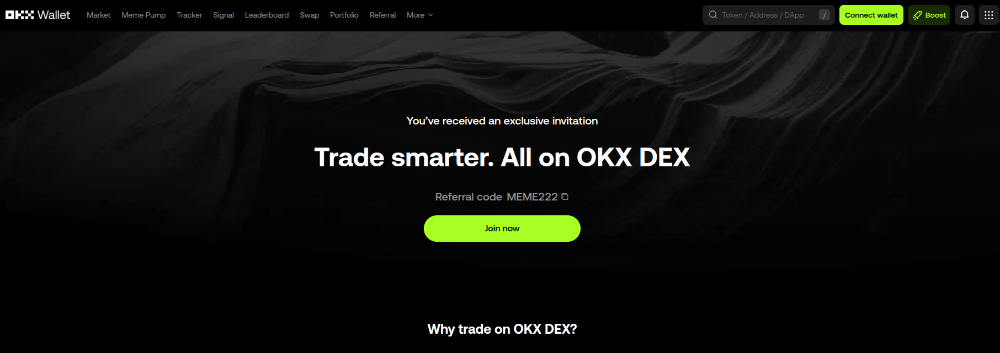

弹出临时对话框，点击"Add":

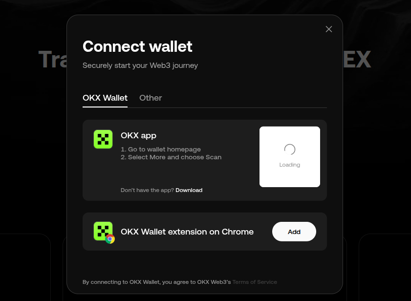

在新页面会打开如下页面，点击"添加至Chrome":

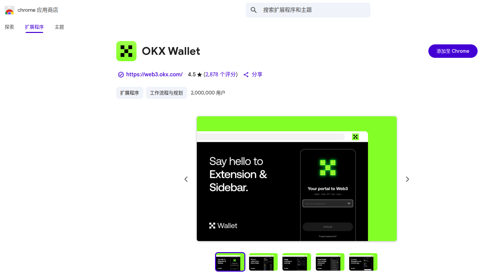

### 创建钱包

稍等后会在浏览器右上角弹出如下小页面，点击"Create wallet":

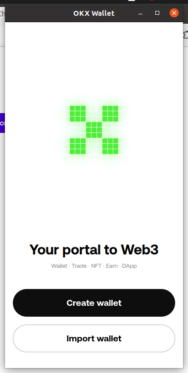

选择"Seed phrase"点击:

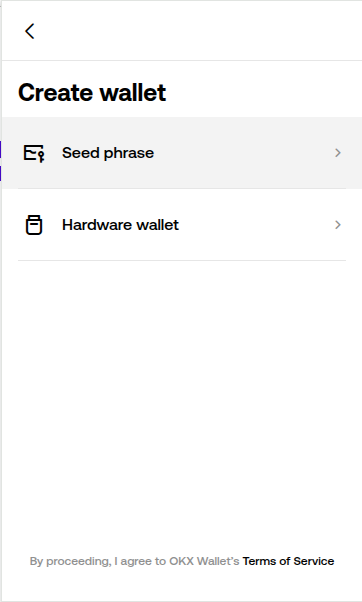

点击"Next":

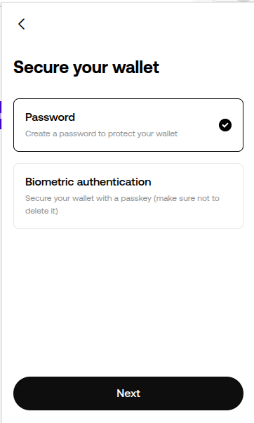

输入当前设备保护密码后，点击"Confirm":

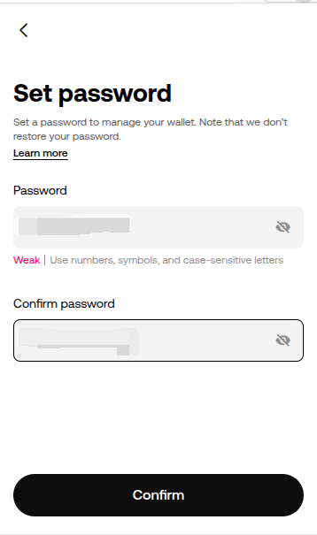

助记词提示，点击"Note down seed phrase":

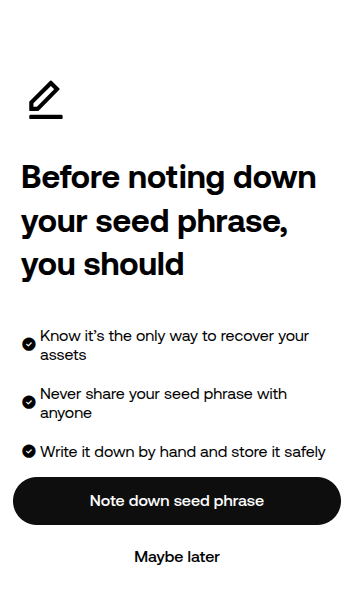

接下来的几个页面，抄写好助记词后，确认登录到钱包，页面如下:

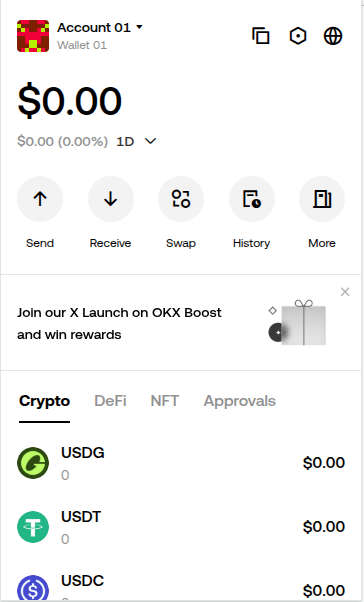

### 切换网络

点击左上角标志:

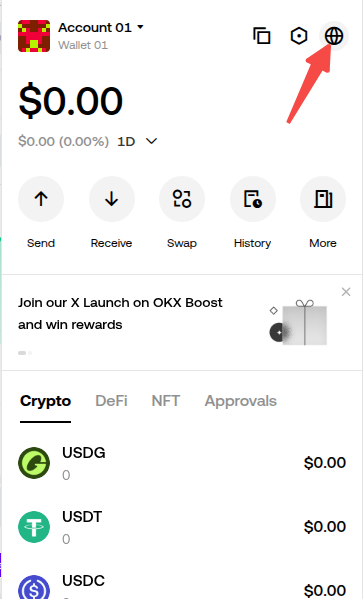

输入 Sepolia 搜索并点击选择:

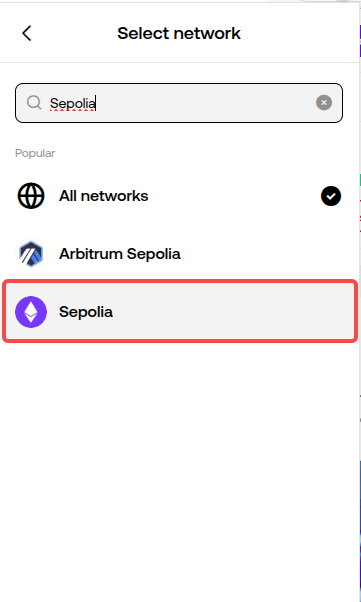

可以看到标志发生了变化:

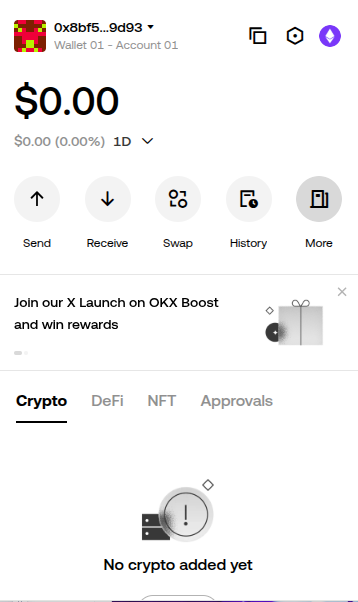

### 发送代币

点击复制账户地址:

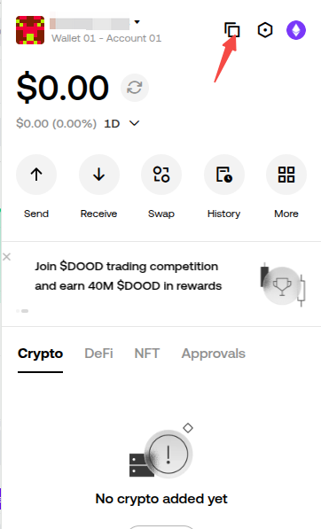

打开下面的[网页](https://cloud.google.com/application/web3/faucet/ethereum/sepolia)，将账户地址粘贴到下面的框中。点击"Receive 0.05 Sepolia ETH":

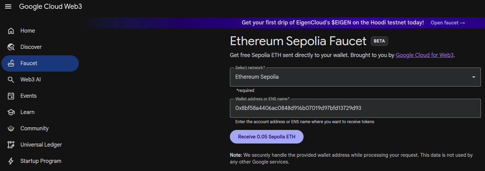

处理中，稍等:

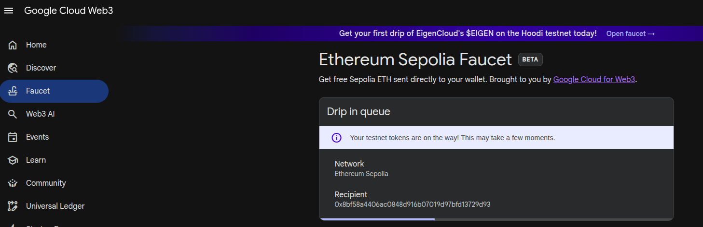

处理完毕:

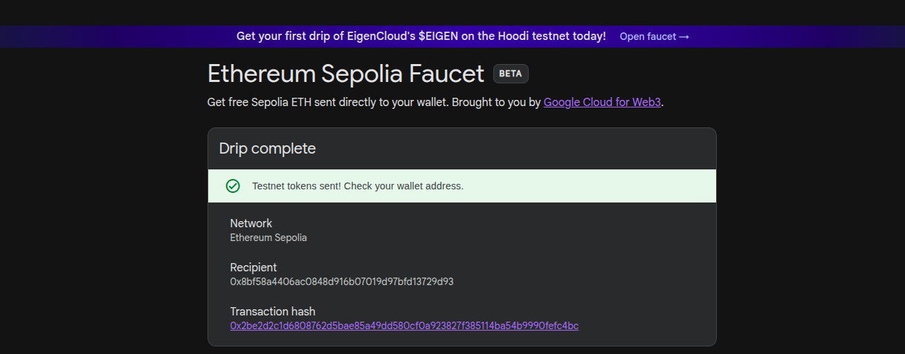

打开钱包，可以看到如下展示:

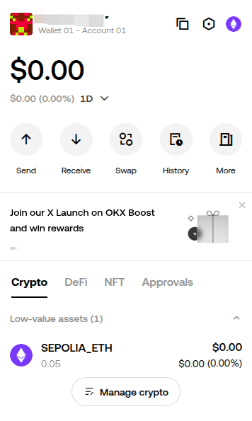

> 你也可以在[这个网站](https://sepolia.etherscan.io/)中根据账户地址查看交易记录。
